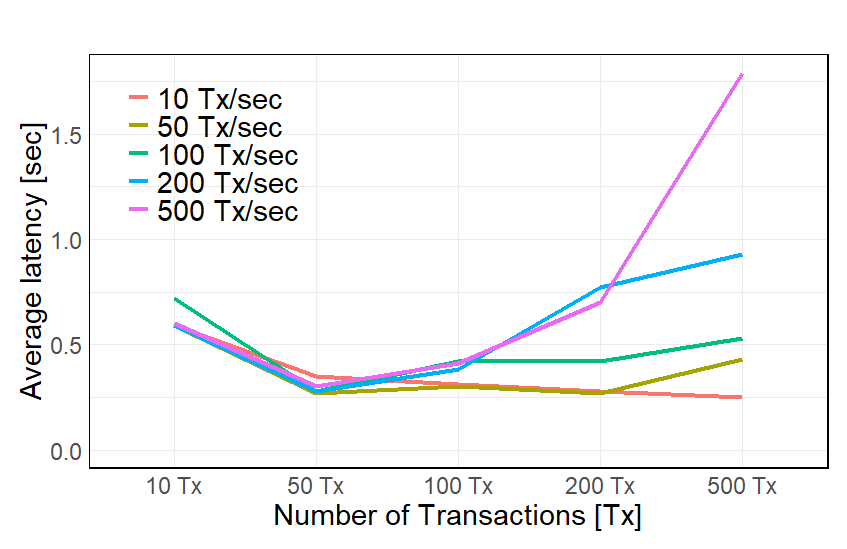
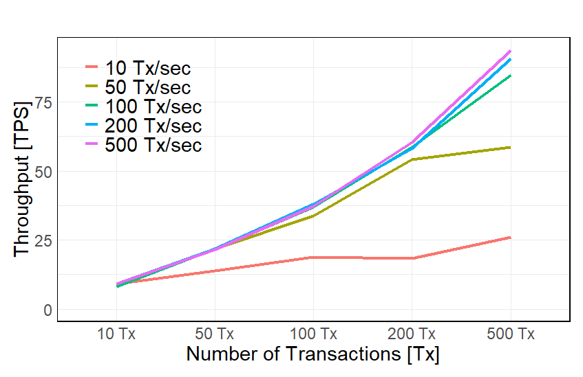
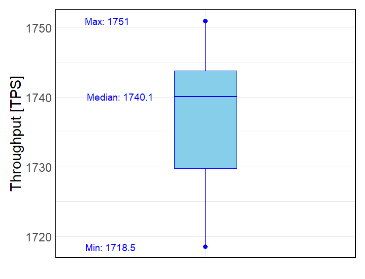

[Main page](../../README.md)

# Organisation Services Chaincode

Organization (ORG) services [chaincode](../01-organisation) is a part of the CMMS solution, which is responsible for keeping and updating records on the ledger of the company employees. These records consist of general employee information and the current status within the company. The current position within the company has a task to show the employee's performance and current competency status.

## Testing platforms
* Hyperledger Fabric `test-network` with `Caliper` benchmarking testing framework ([`Caliper Testing`](#caliper-testing) & [`Test Network`](#test-network)).
* Hyperledger Fabric on the `Kaleido` Web3 BaaS platform, [`Kaleido Testing`](#kaleido-testing).
* REST API testing with the [`k6`](../../02-benchmarking-files/k6/k6-linux/README.md) load testing framework.

## Spin up the `test-network`

Follow the instructions from the `caliper`` testing repository.

Cleanup the terminal:

```bash
PS1='\e[1;32m\u@\H:\e[0m\e[1;34m\W\e[0m\e[1;33m $:\e[0m '
```

Before we start installing the test-network, we have to ensure that Docker is up and running, and then we navigate to the test-network folder.

```bash
cd ~/go/src/github.com/hyperledger/fabric-samples/test-network/
```

Spin up the `test-network`:

```bash
./network.sh up createChannel -ca -s couchdb
```

Install the `Organisational` Smart Contract:

```bash
./network.sh deployCC -ccn organisation -ccv 1.0 -ccp /[path-to-the-chaincode]/01-organisation -ccl go
```

To test the installed `Organizational Processes Services Smart Contract`, navigate to `fabric-samples/test-network` and define all necessary environment variables for `Org1MSP`. Note that TLS is enabled in `test-network`.
Run the following command:

```bash
cd $HOME/go/src/github.com/hyperledger/fabric-samples/test-network
```

```bash
export FABRIC_CFG_PATH=$PWD/../config/
```

```bash
export PATH=${PWD}/../bin:$PATH
```

#### Environmental set-up for `Org1MSP`:

```bash
export CORE_PEER_TLS_ENABLED=true
export CORE_PEER_LOCALMSPID="Org1MSP"
export CORE_PEER_TLS_ROOTCERT_FILE=${PWD}/organizations/peerOrganizations/org1.example.com/peers/peer0.org1.example.com/tls/ca.crt
export CORE_PEER_MSPCONFIGPATH=${PWD}/organizations/peerOrganizations/org1.example.com/users/Admin@org1.example.com/msp
export CORE_PEER_ADDRESS=localhost:7051
```

During the development environment setup phase, we downloaded Hyperledger Fabric
binaries including peer. They are located in the `fabric-samples/bin` folder and utilize
configurations stored in `fabric-samples/config. Therefore, we can update the `PATH variable
and set `FABRIC_CFG_PATH` to simplify `peer binary usage.

```bash
export PATH=${PWD}/../bin:$PATH
```

```bash
export FABRIC_CFG_PATH=$PWD/../config/
```

### Environmental variables for `Org2MSP`.

```bash
cd $HOME/go/src/github.com/hyperledger/fabric-samples/test-network
```

```bash
export CORE_PEER_TLS_ENABLED=true
export CORE_PEER_LOCALMSPID="Org2MSP"
export CORE_PEER_TLS_ROOTCERT_FILE=${PWD}/organizations/peerOrganizations/org2.example.com/peers/peer0.org2.example.com/tls/ca.crt
export CORE_PEER_MSPCONFIGPATH=${PWD}/organizations/peerOrganizations/org2.example.com/users/Admin@org2.example.com/msp
export CORE_PEER_ADDRESS=localhost:9051
```

```bash
export PATH=${PWD}/../bin:$PATH
```

```bash
export FABRIC_CFG_PATH=$PWD/../config/
```

Now, in the Org1MSP terminal window, we can run a peer channel list command to confirm that we are able to use the peer binary without further adjustments.

```bash
peer channel list
```

Response:

```bash
Channels peers has joined:
mychannel
```

The commit transaction is submitted to peers of both `Org1MSP` and `Org2MSP`. The Smart Contract definition is committed to the channel if all targeted peers return successful responses. To confirm this, use the peer lifecycle chaincode `querycommitted` command.

```bash
peer lifecycle chaincode querycommitted --channelID mychannel --name organisation --cafile ${PWD}/organizations/ordererOrganizations/example.com/orderers/orderer.example.com/msp/tlscacerts/tlsca.example.com-cert.pem
```

Response:

```bash
Committed chaincode definition for chaincode 'organization' on channel 'mychannel':
Version: 1.0, Sequence: 1, Endorsement Plugin: escc, Validation Plugin: vscc, Approvals: [Org1MSP: true, Org2MSP: true]
```
# Test Network

## Smart contract function `AddNewEmployee`

The function `AddNewEmployee` is used to create a new purchase order.

```bash
peer chaincode invoke -o localhost:7050 --ordererTLSHostnameOverride orderer.example.com --tls --cafile /home/vodenica/go/src/github.com/hyperledger/fabric-samples/test-network/organizations/ordererOrganizations/example.com/orderers/orderer.example.com/msp/tlscacerts/tlsca.example.com-cert.pem -C mychannel -n organisation --peerAddresses localhost:7051 --tlsRootCertFiles /home/vodenica/go/src/github.com/hyperledger/fabric-samples/test-network/organizations/peerOrganizations/org1.example.com/peers/peer0.org1.example.com/tls/ca.crt --peerAddresses localhost:9051 --tlsRootCertFiles /home/vodenica/go/src/github.com/hyperledger/fabric-samples/test-network/organizations/peerOrganizations/org2.example.com/peers/peer0.org2.example.com/tls/ca.crt -c '{"function":"AddNewEmployee","Args":["Macao","001","Name","Last Name","Gender", "Position entry","Current position", "Level FT/PT","Birthday", "Contract Signed Date","Starting Date", "Years in service","Employee review", "Completed custom training", "100000","Address","Cell-phone-number","Working visa Yes/No"]}'
```

_The composite key is _used for _the _READEmployee__ function__

```json
{
  "_id": "001",
  "_rev": "1-87b9e10ffab1740cce5a4e02ed19d14f",
  "Address": "Address",
  "Birthday": "Birthday",
  "Cell": "Cell-phone-number",
  "CompanySite": "Macao",
  "CompletedCustomTrining": "Completed custom training",
  "ContractSigned": "Contract Signed Date",
  "CurrentPosition": "Current position",
  "EmployeeReview": "Employee review",
  "Gender": "Gender",
  "ID": "001",
  "LastName": "Last Name",
  "LevelPT": "Level FT/PT",
  "Name": "Name",
  "PositionEntry": "Position entry",
  "Salary": 100000,
  "StartingDate": "Starting Date",
  "StatusTrainingModuleOne": "Open",
  "StatusTrainingModuleThree": "Open",
  "StatusTrainingModuleTwo": "Open",
  "WorkVisa": "Working visa Yes/No",
  "YearsInService": "Years in service",
  "employee": "employee",
  "~version": "CgMBBgA="
}
```

## Smart contract function `ReadEmployee`

The function `ReadEmployee` is used to read the employee data from the ledger. The function takes 1 argument so-called `composite-key`. The first argument is the ID of the employee in the form of the composite key.

```bash
peer chaincode invoke -o localhost:7050 --ordererTLSHostnameOverride orderer.example.com --tls --cafile /home/vodenica/go/src/github.com/hyperledger/fabric-samples/test-network/organizations/ordererOrganizations/example.com/orderers/orderer.example.com/msp/tlscacerts/tlsca.example.com-cert.pem -C mychannel -n organization --peerAddresses localhost:7051 --tlsRootCertFiles /home/vodenica/go/src/github.com/hyperledger/fabric-samples/test-network/organizations/peerOrganizations/org1.example.com/peers/peer0.org1.example.com/tls/ca.crt --peerAddresses localhost:9051 --tlsRootCertFiles /home/vodenica/go/src/github.com/hyperledger/fabric-samples/test-network/organizations/peerOrganizations/org2.example.com/peers/peer0.org2.example.com/tls/ca.crt -c '{"function":"ReadEmployee","Args":["001"]}'
```

Response body in `JSON` format:

```json
{
  "employee": "employee",
  "CompanySite": "Macao",
  "ID": "001",
  "Name": "Name",
  "LastName": "Last Name",
  "Gender": "Gender",
  "PositionEntry": "Position entry",
  "CurrentPosition": "Current position",
  "LevelPT": "Level FT/PT",
  "Birthday": "Birthday",
  "ContractSigned": "Contract Signed Date",
  "StartingDate": "Starting Date",
  "YearsInService": "Years in service",
  "EmployeeReview": "Employee review",
  "CompletedCustomTrining": "Completed custom training",
  "StatusTrainingModuleOne": "Open",
  "StatusTrainingModuleTwo": "Open",
  "StatusTrainingModuleThree": "Open",
  "Salary": 100000,
  "Address": "Address",
  "Cell": "Cell-phone-number",
  "WorkVisa": "Working visa Yes/No"
}
```

## Smart contract function `UpdateEmployeeStatusForModuleOneTrainingInProgress`:

The function `UpdateEmployeeStatusForModuleOneTrainingInProgress` is used to update the employee status for module one training in progress. The function takes 1 argument so-called `composite-key`. The first argument is the ID of the employee in the form of the composite key.

```bash
peer chaincode invoke -o localhost:7050 --ordererTLSHostnameOverride orderer.example.com --tls --cafile /home/vodenica/go/src/github.com/hyperledger/fabric-samples/test-network/organizations/ordererOrganizations/example.com/orderers/orderer.example.com/msp/tlscacerts/tlsca.example.com-cert.pem -C mychannel -n organization --peerAddresses localhost:7051 --tlsRootCertFiles /home/vodenica/go/src/github.com/hyperledger/fabric-samples/test-network/organizations/peerOrganizations/org1.example.com/peers/peer0.org1.example.com/tls/ca.crt --peerAddresses localhost:9051 --tlsRootCertFiles /home/vodenica/go/src/github.com/hyperledger/fabric-samples/test-network/organizations/peerOrganizations/org2.example.com/peers/peer0.org2.example.com/tls/ca.crt -c '{"function":"UpdateEmployeeStatusForModuleOneTrainingInProgress","Args":["001", "In Progress"]}'
```

Response body in `JSON` format after using the function `ReadEmployee`:

```json
{
  "employee": "employee",
  "CompanySite": "Macao",
  "ID": "001",
  "Name": "Name",
  "LastName": "Last Name",
  "Gender": "Gender",
  "PositionEntry": "Position entry",
  "CurrentPosition": "Current position",
  "LevelPT": "Level FT/PT",
  "Birthday": "Birthday",
  "ContractSigned": "Contract Signed Date",
  "StartingDate": "Starting Date",
  "YearsInService": "Years in service",
  "EmployeeReview": "Employee review",
  "CompletedCustomTrining": "Completed custom training",
  "StatusTrainingModuleOne": "In Progress",
  "StatusTrainingModuleTwo": "Open",
  "StatusTrainingModuleThree": "Open",
  "Salary": 100000,
  "Address": "Address",
  "Cell": "Cell-phone-number",
  "WorkVisa": "Working visa Yes/No"
}
```

## Smart contract function `UpdateEmployeeStatusForModuleOneTrainingCompleted`:

The function `UpdateEmployeeStatusForModuleOneTrainingCompleted` is used to update the employee status for module one training completed. The function takes 1 argument so-called `composite-key`. The first argument is the ID of the employee in the form of the composite key.

```bash
peer chaincode invoke -o localhost:7050 --ordererTLSHostnameOverride orderer.example.com --tls --cafile /home/vodenica/go/src/github.com/hyperledger/fabric-samples/test-network/organizations/ordererOrganizations/example.com/orderers/orderer.example.com/msp/tlscacerts/tlsca.example.com-cert.pem -C mychannel -n organization --peerAddresses localhost:7051 --tlsRootCertFiles /home/vodenica/go/src/github.com/hyperledger/fabric-samples/test-network/organizations/peerOrganizations/org1.example.com/peers/peer0.org1.example.com/tls/ca.crt --peerAddresses localhost:9051 --tlsRootCertFiles /home/vodenica/go/src/github.com/hyperledger/fabric-samples/test-network/organizations/peerOrganizations/org2.example.com/peers/peer0.org2.example.com/tls/ca.crt -c '{"function":"UpdateEmployeeStatusForModuleOneTrainingCompleted","Args":["001", "Completed"]}'
```

Response in the `JSON` format when using the function `ReadEmployee`

```json
{
  "employee": "employee",
  "CompanySite": "Macao",
  "ID": "001",
  "Name": "Name",
  "LastName": "Last Name",
  "Gender": "Gender",
  "PositionEntry": "Position entry",
  "CurrentPosition": "Current position",
  "LevelPT": "Level FT/PT",
  "Birthday": "Birthday",
  "ContractSigned": "Contract Signed Date",
  "StartingDate": "Starting Date",
  "YearsInService": "Years in service",
  "EmployeeReview": "Employee review",
  "CompletedCustomTrining": "Completed custom training",
  "StatusTrainingModuleOne": "Completed",
  "StatusTrainingModuleTwo": "Open",
  "StatusTrainingModuleThree": "Open",
  "Salary": 100000,
  "Address": "Address",
  "Cell": "Cell-phone-number",
  "WorkVisa": "Working visa Yes/No"
}
```

## Smart contract function `PromoteEmployee`:

```bash
peer chaincode invoke -o localhost:7050 --ordererTLSHostnameOverride orderer.example.com --tls --cafile /home/vodenica/go/src/github.com/hyperledger/fabric-samples/test-network/organizations/ordererOrganizations/example.com/orderers/orderer.example.com/msp/tlscacerts/tlsca.example.com-cert.pem -C mychannel -n organization --peerAddresses localhost:7051 --tlsRootCertFiles /home/vodenica/go/src/github.com/hyperledger/fabric-samples/test-network/organizations/peerOrganizations/org1.example.com/peers/peer0.org1.example.com/tls/ca.crt --peerAddresses localhost:9051 --tlsRootCertFiles /home/vodenica/go/src/github.com/hyperledger/fabric-samples/test-network/organizations/peerOrganizations/org2.example.com/peers/peer0.org2.example.com/tls/ca.crt -c '{"function":"PromoteEmployee","Args":["001", "General Manager"]}'
```

Response in the `JSON` format:

```json
{
  "_id": "001",
  "_rev": "4-c3eeb247d2a48a339516be970a1b88b7",
  "Address": "Address",
  "Birthday": "Birthday",
  "Cell": "Cell-phone-number",
  "CompanySite": "Macao",
  "CompletedCustomTrining": "Completed custom training",
  "ContractSigned": "Contract Signed Date",
  "CurrentPosition": "General Manager",
  "EmployeeReview": "Employee review",
  "Gender": "Gender",
  "ID": "001",
  "LastName": "Last Name",
  "LevelPT": "Level FT/PT",
  "Name": "Name",
  "PositionEntry": "Position entry",
  "Salary": 100000,
  "StartingDate": "Starting Date",
  "StatusTrainingModuleOne": "Completed",
  "StatusTrainingModuleThree": "Open",
  "StatusTrainingModuleTwo": "Open",
  "WorkVisa": "Working visa Yes/No",
  "YearsInService": "Years in service",
  "employee": "employee",
  "~version": "CgMBDQA="
}
```

## Smart contract function `GetEmployeeHistory`:

```bash
peer chaincode invoke -o localhost:7050 --ordererTLSHostnameOverride orderer.example.com --tls --cafile /home/vodenica/go/src/github.com/hyperledger/fabric-samples/test-network/organizations/ordererOrganizations/example.com/orderers/orderer.example.com/msp/tlscacerts/tlsca.example.com-cert.pem -C mychannel -n organization --peerAddresses localhost:7051 --tlsRootCertFiles /home/vodenica/go/src/github.com/hyperledger/fabric-samples/test-network/organizations/peerOrganizations/org1.example.com/peers/peer0.org1.example.com/tls/ca.crt --peerAddresses localhost:9051 --tlsRootCertFiles /home/vodenica/go/src/github.com/hyperledger/fabric-samples/test-network/organizations/peerOrganizations/org2.example.com/peers/peer0.org2.example.com/tls/ca.crt -c '{"function":"GetEmployeeHistory","Args":["001"]}'
```

Response body in `JSON` format:

```json
[
  {
    "record": {
      "employee": "employee",
      "CompanySite": "Macao",
      "ID": "001",
      "Name": "Name",
      "LastName": "Last Name",
      "Gender": "Gender",
      "PositionEntry": "Position entry",
      "CurrentPosition": "General Manager",
      "LevelPT": "Level FT/PT",
      "Birthday": "Birthday",
      "ContractSigned": "Contract Signed Date",
      "StartingDate": "Starting Date",
      "YearsInService": "Years in service",
      "EmployeeReview": "Employee review",
      "CompletedCustomTrining": "Completed custom training",
      "StatusTrainingModuleOne": "Completed",
      "StatusTrainingModuleTwo": "Open",
      "StatusTrainingModuleThree": "Open",
      "Salary": 100000,
      "Address": "Address",
      "Cell": "Cell-phone-number",
      "WorkVisa": "Working visa Yes/No"
    },
    "txId": "2ded9bcd3898c9427482ead0fe054acd88017886f9f0455b741fac001c10f634",
    "timestamp": "2023-09-27T16:39:44.011802975Z",
    "isDelete": false
  },
  {
    "record": {
      "employee": "employee",
      "CompanySite": "Macao",
      "ID": "001",
      "Name": "Name",
      "LastName": "Last Name",
      "Gender": "Gender",
      "PositionEntry": "Position entry",
      "CurrentPosition": "Current position",
      "LevelPT": "Level FT/PT",
      "Birthday": "Birthday",
      "ContractSigned": "Contract Signed Date",
      "StartingDate": "Starting Date",
      "YearsInService": "Years in service",
      "EmployeeReview": "Employee review",
      "CompletedCustomTrining": "Completed custom training",
      "StatusTrainingModuleOne": "Completed",
      "StatusTrainingModuleTwo": "Open",
      "StatusTrainingModuleThree": "Open",
      "Salary": 100000,
      "Address": "Address",
      "Cell": "Cell-phone-number",
      "WorkVisa": "Working visa Yes/No"
    },
    "txId": "ba0ea57704bafefc7b1c0254dea38e7983a34d332554410a673722985a3485c0",
    "timestamp": "2023-09-27T16:33:16.122827068Z",
    "isDelete": false
  },
  {
    "record": {
      "employee": "employee",
      "CompanySite": "Macao",
      "ID": "001",
      "Name": "Name",
      "LastName": "Last Name",
      "Gender": "Gender",
      "PositionEntry": "Position entry",
      "CurrentPosition": "Current position",
      "LevelPT": "Level FT/PT",
      "Birthday": "Birthday",
      "ContractSigned": "Contract Signed Date",
      "StartingDate": "Starting Date",
      "YearsInService": "Years in service",
      "EmployeeReview": "Employee review",
      "CompletedCustomTrining": "Completed custom training",
      "StatusTrainingModuleOne": "In Progress",
      "StatusTrainingModuleTwo": "Open",
      "StatusTrainingModuleThree": "Open",
      "Salary": 100000,
      "Address": "Address",
      "Cell": "Cell-phone-number",
      "WorkVisa": "Working visa Yes/No"
    },
    "txId": "3f53ad78b478cfc4401bc5e1bdeb1ffa3ce394d2b9791de84f95c4ff6496ff42",
    "timestamp": "2023-09-27T16:29:56.301450796Z",
    "isDelete": false
  },
  {
    "record": {
      "employee": "employee",
      "CompanySite": "Macao",
      "ID": "001",
      "Name": "Name",
      "LastName": "Last Name",
      "Gender": "Gender",
      "PositionEntry": "Position entry",
      "CurrentPosition": "Current position",
      "LevelPT": "Level FT/PT",
      "Birthday": "Birthday",
      "ContractSigned": "Contract Signed Date",
      "StartingDate": "Starting Date",
      "YearsInService": "Years in service",
      "EmployeeReview": "Employee review",
      "CompletedCustomTrining": "Completed custom training",
      "StatusTrainingModuleOne": "Open",
      "StatusTrainingModuleTwo": "Open",
      "StatusTrainingModuleThree": "Open",
      "Salary": 100000,
      "Address": "Address",
      "Cell": "Cell-phone-number",
      "WorkVisa": "Working visa Yes/No"
    },
    "txId": "345a5d1a3f04acd9b4f7018463239066123e3d8a29e16fa60d341e189d32053d",
    "timestamp": "2023-09-27T16:23:26.591092394Z",
    "isDelete": false
  }
]
```
## Test network measurement results

The measurement results are shown below:



_**Figure 1**_ - Organisational chaincode benchmarking parameters: Impact the number of transactions on average latency.



_**Figure 2**_ - Organisational chaincode benchmarking parameters: Impact the number of transactions on throughput.



_**Figure 3**_ - Organisational chaincode benchmarking parameters: Impact the number of transactions on throughput put for the “Read” function.

[Back to top](#organisation-services-chaincode)

# Kaleido Testing

## Kaleido platform
For Golang binary chaincodes, build Golang chaincode implementation and make a note of the resulting binary. We must make sure the target OS for the compiler is set to Linux, and the target architecture is set to amd64.
From a terminal, navigate to the subdirectory where the chaincode is and build the binary. Below is a sample build command:
```
GOOS=linux GOARCH=amd64 go build -o [chaincode-name].bin
```

## Smart contract function `AddNewEmployee`

The function `AddNewEmployee` is used to create a new purchase order.

```json
{
  "headers": {
    "type": "SendTransaction",
    "signer": "Operations Supervisor",
    "channel": "default-channel",
    "chaincode": "orgemployee"
  },
  "func": "AddNewEmployee",
  "args": [
    "Macao",
    "1001",
    "Name",
    "Last Name",
    "Gender",
    "Position entry",
    "Current position",
    "Level FT/PT",
    "Birthday",
    "Contract Signed Date",
    "Starting Date",
    "Years in service",
    "Employee review",
    "Completed custom training",
    "100000",
    "Address",
    "Cell-phone-number",
    "Working visa Yes/No"
  ],
  "init": false
}
```
	
Response body:
```json
{
  "headers": {
    "id": "2dea88ce-7174-45db-65c9-605ae7f65e63",
    "type": "TransactionSuccess",
    "timeReceived": "2023-09-27T18:10:52.512993259Z",
    "timeElapsed": 0.259940983,
    "requestOffset": "",
    "requestId": ""
  },
  "blockNumber": 1377,
  "signerMSP": "u0mk35n6yh",
  "signer": "Operations Supervisor",
  "transactionID": "e810ed73d3db81ea804e0b0a5ac0999278de63f19497f38fe157fb6e7d75dbc9",
  "status": "VALID"
}
```
[Back to top](#organisation-services-chaincode)

# Caliper testing

The certificate must be adjusted after running the test network. The code below is shown where we can take the MSP credentials, and adjust them into the [`test-network.yaml`](../../02-benchmarking-files/hyperledger-caliper/caliper-benchmarks/networks/fabric/test-network.yaml) file.

Cleanup, and open a new terminal:

```bash
PS1='\e[1;32m\u@\H:\e[0m\e[1;34m\W\e[0m\e[1;33m $:\e[0m '
```

The location of the `test-network.yaml` file can be reached by the command:

```bash
cd /home/vodenica/go/src/github.com/hyperledger/caliper-benchmarks/networks/fabric
```

The credentials to be picked up from this directory for `User1` using `ls` command:

```bash
cd /home/vodenica/go/src/github.com/hyperledger/fabric-samples/test-network/organizations/peerOrganizations/org1.example.com/users/User1@org1.example.com/msp/keystore
```

Ensure you are in the `caliper-benchmarks` directory. If not, navigate to the `caliper-benchmarks` directory:

```bash
cd /home/vodenica/go/src/github.com/hyperledger/caliper-benchmarks
```

Execution:

```bash
npx caliper launch manager --caliper-workspace ./ --caliper-networkconfig networks/fabric/test-network.yaml --caliper-benchconfig benchmarks/samples/fabric/organisation/config.yaml --caliper-flow-only-test --caliper-fabric-gateway-enabled
```
[Back to top](#organisation-services-chaincode)

### the end of the file.
