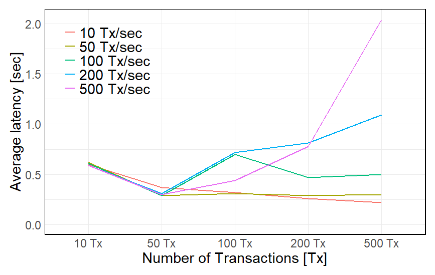
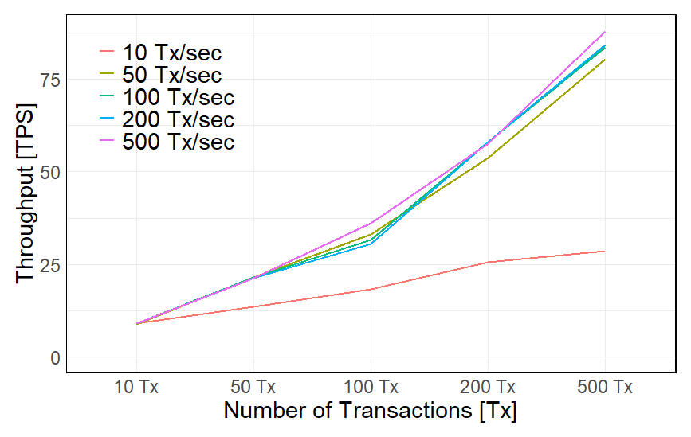
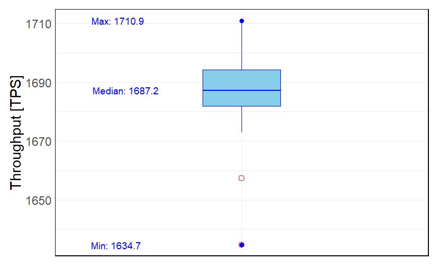

[Main page](../../README.md)

# Operations Services Chaincode

The Operations (OPS) services [chaincode](../02-operations) is a part of the CMMS solution, which is responsible for keeping and updating records on the ledger of the daily operations, also called the `Daily Operations Log`. The `Daily Operations Log` is a record of the daily operations of the ropeway. The `Daily Operations Log` is created by the `Shift Manager` and is validated by the `Maintenance Supervisor`. The `Daily Operations Log` is created at the beginning of the shift and is updated at the end of the shift. The `Daily Operations Log` is updated with the following information:

## Testing platforms
* Hyperledger Fabric `test-network` with `Caliper` benchmarking testing framework ([`Caliper Testing`](#caliper-testing) & [`Test Network`](#test-network)).
* Hyperledger Fabric on the `Kaleido` Web3 BaaS platform, [`Kaleido Testing`](#kaleido-testing).
* REST API testing with the [`k6`](../../02-benchmarking-files/k6/k6-linux/README.md) load testing framework.

## Spin up the `test-network`

Follow the instructions from the `caliper`` repository.

Cleanup the terminal:

```bash
PS1='\e[1;32m\u@\H:\e[0m\e[1;34m\W\e[0m\e[1;33m $:\e[0m '
```

Before we start installing the test-network, we have to ensure that Docker is up and running, and then we navigate to the test-network folder.

```bash
cd ~/go/src/github.com/hyperledger/fabric-samples/test-network/
```

Spin up the `test-network`:

```bash
./network.sh up createChannel -ca -s couchdb
```

Install the `Daily Operational Log` Smart Contract:

```bash
./network.sh deployCC -ccn daily_ops_log -ccv 1.0 -ccp /[path-to-the-chaincode]/02-operations -ccl go
```

To test the installed `Daily Operational Log Smart Contract`, navigate to `fabric-samples/test-network` and define all necessary environment variables for `Org1MSP`. Note that TLS is enabled in `test-network`.
Run the following command:

```bash
cd $HOME/go/src/github.com/hyperledger/fabric-samples/test-network
```

```bash
export FABRIC_CFG_PATH=$PWD/../config/
```

```bash
export PATH=${PWD}/../bin:$PATH
```

#### Environmental set-up for `Org1MSP`:

```bash
export CORE_PEER_TLS_ENABLED=true
export CORE_PEER_LOCALMSPID="Org1MSP"
export CORE_PEER_TLS_ROOTCERT_FILE=${PWD}/organizations/peerOrganizations/org1.example.com/peers/peer0.org1.example.com/tls/ca.crt
export CORE_PEER_MSPCONFIGPATH=${PWD}/organizations/peerOrganizations/org1.example.com/users/Admin@org1.example.com/msp
export CORE_PEER_ADDRESS=localhost:7051
```

During the development environment setup phase, we downloaded Hyperledger Fabric
binaries including peer. They are located in the `fabric-samples/bin` folder and utilize
configurations stored in `fabric-samples/config. Therefore, we can update the `PATH variable
and set `FABRIC_CFG_PATH` to simplify `peer binary usage.

```bash
export PATH=${PWD}/../bin:$PATH
```

```bash
export FABRIC_CFG_PATH=$PWD/../config/
```

### Environmental variables for `Org2MSP`.

```bash
cd $HOME/go/src/github.com/hyperledger/fabric-samples/test-network
```

```bash
export CORE_PEER_TLS_ENABLED=true
export CORE_PEER_LOCALMSPID="Org2MSP"
export CORE_PEER_TLS_ROOTCERT_FILE=${PWD}/organizations/peerOrganizations/org2.example.com/peers/peer0.org2.example.com/tls/ca.crt
export CORE_PEER_MSPCONFIGPATH=${PWD}/organizations/peerOrganizations/org2.example.com/users/Admin@org2.example.com/msp
export CORE_PEER_ADDRESS=localhost:9051
```

```bash
export PATH=${PWD}/../bin:$PATH
```

```bash
export FABRIC_CFG_PATH=$PWD/../config/
```

Now, in the Org1MSP terminal window, we can run a peer channel list command to confirm that we are able to use the peer binary without further adjustments.

```bash
peer channel list
```

Response:

```bash
Channels peers has joined:
mychannel
```

The commit transaction is submitted to peers of both `Org1MSP` and `Org2MSP`. The Smart Contract definition is committed to the channel if all targeted peers return successful responses. To confirm this, use the peer lifecycle chaincode `querycommitted` command.

```bash
peer lifecycle chaincode querycommitted --channelID mychannel --name daily_ops_log --cafile ${PWD}/organizations/ordererOrganizations/example.com/orderers/orderer.example.com/msp/tlscacerts/tlsca.example.com-cert.pem
```

Response:

```bash
Committed chaincode definition for chaincode 'daily_ops_log' on channel 'mychannel':
Version: 1.0, Sequence: 1, Endorsement Plugin: escc, Validation Plugin: vscc, Approvals: [Org1MSP: true, Org2MSP: true]
```
# Test Network

## Smart contract function `CreateNewDailyOperationsLog`

The function `CreateNewDailyOperationsLog` is used to create daily operational logs. The function takes 13 arguments. The first argument is the ID of the risk assessment. The remaining 12 arguments are the values of the risk assessment. The function returns the ID of the risk assessment.

```bash
peer chaincode invoke -o localhost:7050 --ordererTLSHostnameOverride orderer.example.com --tls --cafile ${PWD}/organizations/ordererOrganizations/example.com/orderers/orderer.example.com/msp/tlscacerts/tlsca.example.com-cert.pem -C mychannel -n daily_ops_log --peerAddresses localhost:7051 --tlsRootCertFiles ${PWD}/organizations/peerOrganizations/org1.example.com/peers/peer0.org1.example.com/tls/ca.crt --peerAddresses localhost:9051 --tlsRootCertFiles ${PWD}/organizations/peerOrganizations/org2.example.com/peers/peer0.org2.example.com/tls/ca.crt -c '{"function":"CreateNewDailyOperationsLog","Args":["daily-ops-log-ID-0001", "createdBy", "{\"weather_drive_station_condition\": \"condition\", \"weather_drive_station_temperature\": \"temperature\", \"weather_drive_station_humidity\": \"humidity\"}", "{\"weather_return_station_condition\": \"condition\", \"weather_return_station_temperature\": \"temperature\", \"weather_return_station_humidity\": \"humidity\"}", "{\"personnel_on_duty_drive_station_shift_manager\": \"Shift Manager\", \"personnel_on_duty_drive_station_maintenance_technician_one\": \"Technician-1\", \"personnel_on_duty_drive_station_maintenance_technician_two\": \"Technician-2\",\"personnel_on_duty_drive_station_system_operator_one\": \"Operator-1\", \"personnel_on_duty_drive_station_system_operator_two\": \"Operator-2\"}","{\"personnel_on_duty_return_station_maintenance_technician\": \"Technician\", \"personnel_on_duty_return_station_system_operator\": \"Operator\"}", "operations-start-time", "operations-end-time","10", "35", "2500", "25010", "no-comments"]}'
```

## Smart contract function `ReadDailyOperationsLog`

```bash
peer chaincode invoke -o localhost:7050 --ordererTLSHostnameOverride orderer.example.com --tls --cafile ${PWD}/organizations/ordererOrganizations/example.com/orderers/orderer.example.com/msp/tlscacerts/tlsca.example.com-cert.pem -C mychannel -n daily_ops_log --peerAddresses localhost:7051 --tlsRootCertFiles ${PWD}/organizations/peerOrganizations/org1.example.com/peers/peer0.org1.example.com/tls/ca.crt --peerAddresses localhost:9051 --tlsRootCertFiles ${PWD}/organizations/peerOrganizations/org2.example.com/peers/peer0.org2.example.com/tls/ca.crt -c '{"function":"ReadDailyOperationsLog","Args":["daily-ops-log-ID-0001"]}'
```

## Smart contract function `ReadDailyOperationsLogHistory`

```bash
peer chaincode invoke -o localhost:7050 --ordererTLSHostnameOverride orderer.example.com --tls --cafile ${PWD}/organizations/ordererOrganizations/example.com/orderers/orderer.example.com/msp/tlscacerts/tlsca.example.com-cert.pem -C mychannel -n daily_ops_log --peerAddresses localhost:7051 --tlsRootCertFiles ${PWD}/organizations/peerOrganizations/org1.example.com/peers/peer0.org1.example.com/tls/ca.crt --peerAddresses localhost:9051 --tlsRootCertFiles ${PWD}/organizations/peerOrganizations/org2.example.com/peers/peer0.org2.example.com/tls/ca.crt -c '{"function":"GetDailyOperationsLogHistory","Args":["daily-ops-log-ID-0001"]}'
```

Response body:

```json
[
  {
    "recordops": {
      "dailyopslog": "dailyopslog",
      "daily_ops_log_id": "daily-ops-log-ID-0001",
      "owner": "createdBy",
      "weather_drive_station": {
        "weather_drive_station_condition": "good",
        "weather_drive_station_temperature": "+32 C",
        "weather_drive_station_humidity": "91%"
      },
      "weather_return": {
        "weather_return_station_condition": "good",
        "weather_return_station_temperature": "+31 C",
        "weather_return_station_humidity": "91%"
      },
      "personnel_on_duty_drive_station": {
        "personnel_on_duty_drive_station_shift_manager": "Shift Manager",
        "personnel_on_duty_drive_station_maintenance_technician_one": "Technician-1",
        "personnel_on_duty_drive_station_maintenance_technician_two": "Technician-2",
        "personnel_on_duty_drive_station_system_operator_one": "Operator-1",
        "personnel_on_duty_drive_station_system_operator_two": "Operator-2"
      },
      "personnel_on_duty_return_station": {
        "personnel_on_duty_return_station_maintenance_technician": "Technician",
        "personnel_on_duty_return_station_system_operator": "Operator"
      },
      "operations_start": "10:00 am",
      "operations_end": "00:00 am",
      "operation_hours": 14,
      "dailyopslog_validation": "validated",
      "number_of_carriers": 30,
      "number_of_passengers": 3000,
      "total_operating_hours": 26000,
      "additional_comments": "no-comments"
    },
    "txId": "e66834d61a6d3361537cbd50552dc72a96d96abf36e1c78108b6675f224ce846",
    "timestamp": "2023-09-07T01:51:10.813286474Z",
    "isDelete": false
  },
  {
    "recordops": {
      "dailyopslog": "dailyopslog",
      "daily_ops_log_id": "daily-ops-log-ID-0001",
      "owner": "createdBy",
      "weather_drive_station": {
        "weather_drive_station_condition": "condition",
        "weather_drive_station_temperature": "temperature",
        "weather_drive_station_humidity": "humidity"
      },
      "weather_return": {
        "weather_return_station_condition": "condition",
        "weather_return_station_temperature": "temperature",
        "weather_return_station_humidity": "humidity"
      },
      "personnel_on_duty_drive_station": {
        "personnel_on_duty_drive_station_shift_manager": "Shift Manager",
        "personnel_on_duty_drive_station_maintenance_technician_one": "Technician-1",
        "personnel_on_duty_drive_station_maintenance_technician_two": "Technician-2",
        "personnel_on_duty_drive_station_system_operator_one": "Operator-1",
        "personnel_on_duty_drive_station_system_operator_two": "Operator-2"
      },
      "personnel_on_duty_return_station": {
        "personnel_on_duty_return_station_maintenance_technician": "Technician",
        "personnel_on_duty_return_station_system_operator": "Operator"
      },
      "operations_start": "operations-start-time",
      "operations_end": "operations-end-time",
      "operation_hours": 10,
      "dailyopslog_validation": "not-validated",
      "number_of_carriers": 35,
      "number_of_passengers": 2500,
      "total_operating_hours": 25010,
      "additional_comments": "no-comments"
    },
    "txId": "afa2be131d62d8ff11c7068bc30119139a646621468929429093822fce0702eb",
    "timestamp": "2023-09-07T01:48:18.399094999Z",
    "isDelete": false
  }
]
```

## Smart contract function `GetAllDailyOperationsLogs`

```bash
peer chaincode invoke -o localhost:7050 --ordererTLSHostnameOverride orderer.example.com --tls --cafile ${PWD}/organizations/ordererOrganizations/example.com/orderers/orderer.example.com/msp/tlscacerts/tlsca.example.com-cert.pem -C mychannel -n daily_ops_log --peerAddresses localhost:7051 --tlsRootCertFiles ${PWD}/organizations/peerOrganizations/org1.example.com/peers/peer0.org1.example.com/tls/ca.crt --peerAddresses localhost:9051 --tlsRootCertFiles ${PWD}/organizations/peerOrganizations/org2.example.com/peers/peer0.org2.example.com/tls/ca.crt -c '{"function":"GetAllDailyOperationsLogs","Args":[]}'
```

## Smart contract function `QueryDailyOperationsLog`

```bash
peer chaincode invoke -o localhost:7050 --ordererTLSHostnameOverride orderer.example.com --tls --cafile ${PWD}/organizations/ordererOrganizations/example.com/orderers/orderer.example.com/msp/tlscacerts/tlsca.example.com-cert.pem -C mychannel -n daily_ops_log --peerAddresses localhost:7051 --tlsRootCertFiles ${PWD}/organizations/peerOrganizations/org1.example.com/peers/peer0.org1.example.com/tls/ca.crt --peerAddresses localhost:9051 --tlsRootCertFiles ${PWD}/organizations/peerOrganizations/org2.example.com/peers/peer0.org2.example.com/tls/ca.crt -c '{"Args":["QueryDailyOperationsLog","{\"selector\":{\"owner\":\"createdBy\"}}" ]}'
```

## Smart contract function `UpdateDailyOperationsLog`

```bash
peer chaincode invoke -o localhost:7050 --ordererTLSHostnameOverride orderer.example.com --tls --cafile ${PWD}/organizations/ordererOrganizations/example.com/orderers/orderer.example.com/msp/tlscacerts/tlsca.example.com-cert.pem -C mychannel -n daily_ops_log --peerAddresses localhost:7051 --tlsRootCertFiles ${PWD}/organizations/peerOrganizations/org1.example.com/peers/peer0.org1.example.com/tls/ca.crt --peerAddresses localhost:9051 --tlsRootCertFiles ${PWD}/organizations/peerOrganizations/org2.example.com/peers/peer0.org2.example.com/tls/ca.crt -c '{"function":"UpdateDailyOperationsLog","Args":["daily-ops-log-ID-0001", "createdBy", "{\"weather_drive_station_condition\": \"good\", \"weather_drive_station_temperature\": \"+32 C\", \"weather_drive_station_humidity\": \"91%\"}", "{\"weather_return_station_condition\": \"good\", \"weather_return_station_temperature\": \"+31 C\", \"weather_return_station_humidity\": \"91%\"}", "{\"personnel_on_duty_drive_station_shift_manager\": \"Shift Manager\", \"personnel_on_duty_drive_station_maintenance_technician_one\": \"Technician-1\", \"personnel_on_duty_drive_station_maintenance_technician_two\": \"Technician-2\",\"personnel_on_duty_drive_station_system_operator_one\": \"Operator-1\", \"personnel_on_duty_drive_station_system_operator_two\": \"Operator-2\"}","{\"personnel_on_duty_return_station_maintenance_technician\": \"Technician\", \"personnel_on_duty_return_station_system_operator\": \"Operator\"}", "10:00 am", "00:00 am","14", "30", "3000", "26000", "no-comments"]}'
```
[Back on top](#operations-services-chaincode)

# Kaleido testing

## Kaleido platform
For Golang binary chaincodes, build Golang chaincode implementation and make a note of the resulting binary. We must make sure the target OS for the compiler is set to Linux, and the target architecture is set to amd64.
From a terminal, navigate to the subdirectory where the chaincode is and build the binary. Below is a sample build command:
```
GOOS=linux GOARCH=amd64 go build -o [chaincode-name].bin
```

Request body:

```json
{
  "headers": {
    "type": "SendTransaction",
    "signer": "userTEST3",
    "channel": "default-channel",
    "chaincode": "opsoperations"
  },
  "func": "CreateNewDailyOperationsLog",
  "args": [
    "daily-ops-log-test-id-00001",
    "Creator of the Daily Operational Log",
    "{\"weather_drive_station_condition\":\"Sunny\", \"weather_drive_station_temperature\":\"+25 C\", \"weather_drive_station_humidity\":\"95 %\"}",
    "{\"weather_return_station_condition\":\"Cloudy\", \"weather_return_station_temperature\":\"+24 C\", \"weather_return_station_humidity\":\"95 %\"}",
    "{\"personnel_on_duty_drive_station_shift_manager\":\"Shift Manager\", \"personnel_on_duty_drive_station_maintenance_technician_one\":\"Maintenance Technician\", \"personnel_on_duty_drive_station_maintenance_technician_two\":\"Maintenance Technician\", \"personnel_on_duty_drive_station_system_operator_one\":\"System Operator\", \"personnel_on_duty_drive_station_system_operator_two\":\"System Operator\"}",
    "{\"personnel_on_duty_return_station_maintenance_technician\":\"Maintenance Technician\", \"personnel_on_duty_return_station_system_operator\":\"System Operator\"}",
    "Operations start",
    "Operations end",
    "10000",
    "35",
    "2500",
    "No comments so far."
  ],
  "init": false
}
```
Tx id:
```
ad53a65cb24d3863f2893544892100aefe667bf6e9b90f03d2961941a2ae8b59
```
JSON file of the created Daily Operation Log:
```json
{
	"headers": {
		"type": "SendTransaction",
		"signer": "Maintenance Supervisor",
		"channel": "default -channel",
		"chaincode": "opsoperations"
	},
	"func": "CreateNewDailyOperationsLog",
	"args": [
		"daily - ops - log - id - 00001",
		"Creator of the Daily Operational Log", {
			"weather_drive_station_condition ": "Sunny ",
			"weather_drive_station_temperature": "+25 C",
			"weather_drive_station_humidity": "95 %"
		}, {
			"weather_return_station_condition": "Cloudy",
			"weather_return_station_temperature": "+24 C",
			"weather_return_station_humidity": "95 %"
		}, {

			"personnel_on_duty_drive_station_shift_manager": "Shift Manager",
			"personnel_on_duty_drive_station_maintenance_technician_one": "Maintenance Technician",
			"personnel_on_duty_drive_station_maintenance_technician_two": "Maintenance Technician",
			"personnel_on_duty_drive_station_system_operator_one": "System Operator",
			"personnel_on_duty_drive_station_system_operator_two": "System Operator"
		}, {
			"personnel_on_duty_return_station_maintenance_technician": "Maintenance Technician",
			"personnel_on_duty_return_station_system_operator": "System Operator"
		},
		"Operations start",
		"Operations end",
		"10000.000000",
		"35.000000",
		"2500.000000",
		"No comments so far."
	],
	"init": false
}
```
[Back on top](#operations-services-chaincode)

# Caliper testing

Just to let you know, the certificate must be adjusted after running the test network. The code below is shown where we can take the MSP credentials, and adjust them into the [`test-network.yaml`](../../02-benchmarking-files/hyperledger-caliper/caliper-benchmarks/networks/fabric/test-network.yaml) file.

Cleanup the terminal:

```bash
PS1='\e[1;32m\u@\H:\e[0m\e[1;34m\W\e[0m\e[1;33m $:\e[0m '
```

The location of the `test-network.yaml` file can be reached by the command:

```bash
cd /home/vodenica/go/src/github.com/hyperledger/caliper-benchmarks/networks/fabric
```

The credentials to be picked up from this directory for `User1` using `ls` command:

```bash
cd /home/vodenica/go/src/github.com/hyperledger/fabric-samples/test-network/organizations/peerOrganizations/org1.example.com/users/User1@org1.example.com/msp/keystore
```

Ensure you are in the `caliper-benchmarks` directory. If not, navigate to the `caliper-benchmarks` directory:

```bash
cd /home/vodenica/go/src/github.com/hyperledger/caliper-benchmarks
```

Go to the folder where workload files are stored and open the folder in IDE with the command `code .`:
  
  ```bash
  cd /home/vodenica/go/src/github.com/hyperledger/caliper-benchmarks/benchmarks/samples/fabric/daily-ops-log
  ```

Execution:

```bash
npx caliper launch manager --caliper-workspace ./ --caliper-networkconfig networks/fabric/test-network.yaml --caliper-benchconfig benchmarks/samples/fabric/daily-ops-log/config.yaml --caliper-flow-only-test --caliper-fabric-gateway-enabled
```

The report will be generated in the `caliper-benchmarks` directory as `report.html`.

```bash
cd /home/vodenica/go/src/github.com/hyperledger/caliper-benchmarks
```
[Back on top](#operations-services-chaincode)

## Test network measurement results

The measurement results are shown below for the function `CreateNewDailyOperationsLog`:



_**Figure 1**_ - Operational chaincode benchmarking parameters: Impact of the number of transactions per second on average latency.



_**Figure 2**_ - Operational chaincode benchmarking parameters: Impact of the number of transactions per second on throughput.



_**Figure 3**_ - Operational chaincode benchmarking parameters: Impact of the number of transactions per second on throughput put for the “Read” function.

[Back to top](#operations-services-chaincode)

