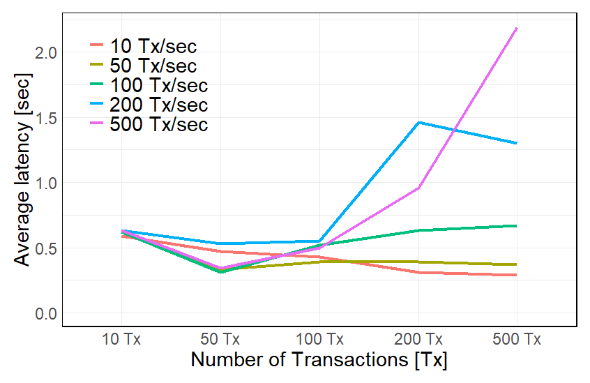
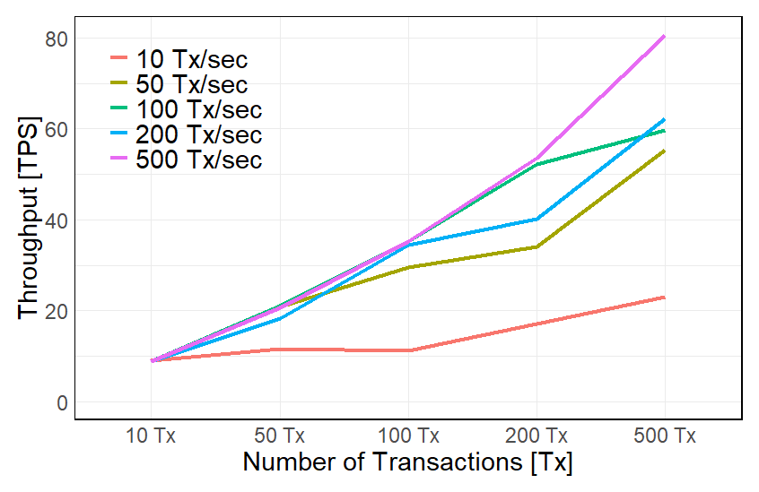
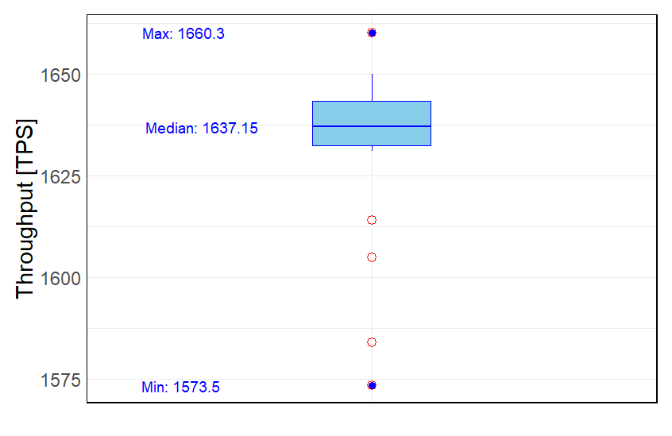
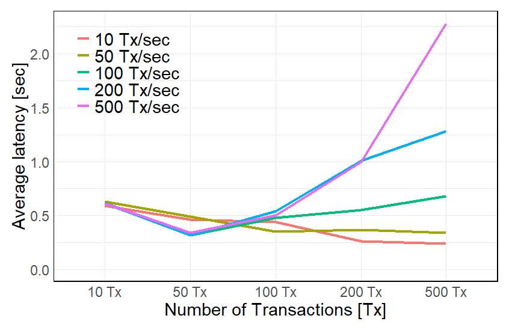
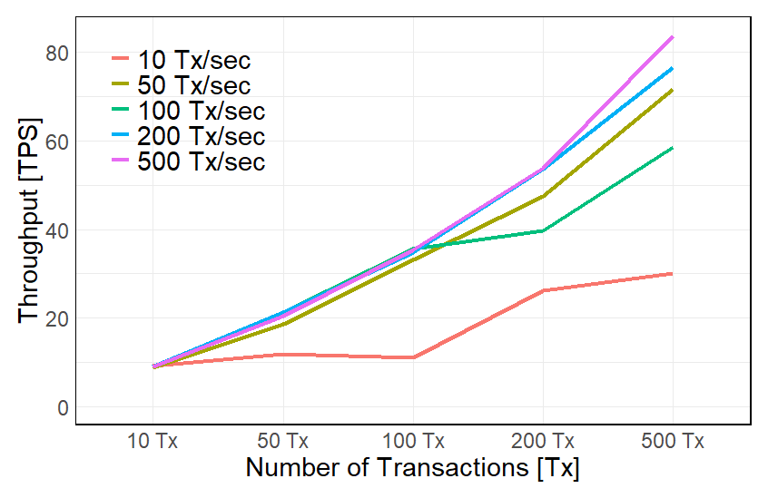
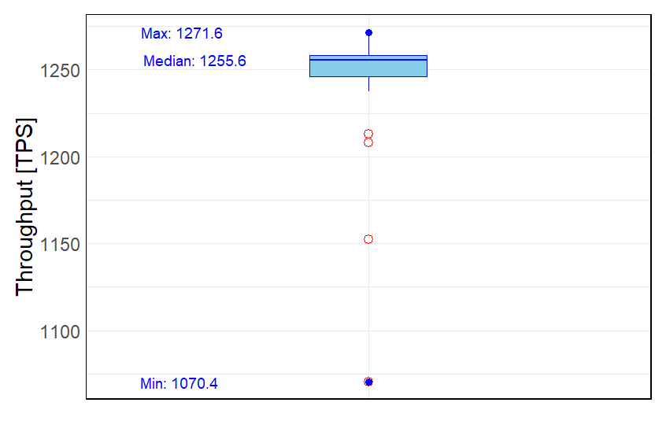

[Main page](../../README.md)

# Maintenance Services Chaincode

The maintenance (MTE) business process [chaincode](../03-maintenance) is a part of the CMMS solution, which is responsible for keeping and updating records on the ledger of the daily maintenance operations, which will include `preventive`, `corrective` and `failure` maintenance work orders.

- [Preventive maintenance work orders](#preventive-maintenance-work-orders) - Preventive maintenance triggered by date or by operating hours.
- [Corrective maintenance work orders](#corrective-maintenance-work-orders) - Corrective maintenance triggered by fault or request followed by findings.
- [Failure maintenance work orders](#failure-maintenance-work-orders) -A downtime event triggers failure maintenance.

## Testing platforms
* Hyperledger Fabric `test-network` with `Caliper` benchmarking testing framework ([`Caliper Testing`](#caliper-testing) & [`Test Network`](#test-network)).
* The benchmarking parameters and measuring results can be observed [here](#test-network-measurement-results).
* Hyperledger Fabric on the `Kaleido` Web3 BaaS platform, [`Kaleido Testing`](#kaleido-testing).
* REST API testing with the [`k6`](../../02-benchmarking-files/k6/k6-linux/README.md) load testing framework.

## Spin up the `test-network`

Follow the instructions from the `caliper`` testing folder in your repository.

Cleanup the terminal:

```bash
PS1='\e[1;32m\u@\H:\e[0m\e[1;34m\W\e[0m\e[1;33m $:\e[0m '
```

Before we start installing the test-network, we have to ensure that Docker is up and running, and then we navigate to the test-network folder.

```bash
cd ~/go/src/github.com/hyperledger/fabric-samples/test-network/
```

Spin up the `test-network`:

```bash
./network.sh up createChannel -ca -s couchdb
```

Install the `Maintenance Operations` Smart Contract:

```bash
./network.sh deployCC -ccn maintenance -ccv 1.0 -ccp /home/vodenica/Desktop/test-network-smart-contracts/03-MTE-maintenance -ccl go
```

The new version of the smart contract is deployed to the `test-network` and the `test-network` is ready for testing. It is important to update the version in the `main.go` file before deploying the smart contract.

```bash
./network.sh deployCC -ccn maintenance -ccv 2.0 -ccp /home/vodenica/Desktop/test-network-smart-contracts/03-MTE-maintenance -ccl go
```

To test the installed `Maintenance Operations Smart Contract`, navigate to `fabric-samples/test-network` and define all necessary environment variables for `Org1MSP`. Note that TLS is enabled in `test-network`.
Run the following command:

```bash
cd $HOME/go/src/github.com/hyperledger/fabric-samples/test-network
```

```bash
export FABRIC_CFG_PATH=$PWD/../config/
```

```bash
export PATH=${PWD}/../bin:$PATH
```

#### Environmental set-up for `Org1MSP`:

```bash
export CORE_PEER_TLS_ENABLED=true
export CORE_PEER_LOCALMSPID="Org1MSP"
export CORE_PEER_TLS_ROOTCERT_FILE=${PWD}/organizations/peerOrganizations/org1.example.com/peers/peer0.org1.example.com/tls/ca.crt
export CORE_PEER_MSPCONFIGPATH=${PWD}/organizations/peerOrganizations/org1.example.com/users/Admin@org1.example.com/msp
export CORE_PEER_ADDRESS=localhost:7051
```

During the development environment setup phase, we downloaded Hyperledger Fabric
binaries including peer. They are located in the `fabric-samples/bin` folder and utilize
configurations stored in `fabric-samples/config`. Therefore, we can update the `PATH` variable
and set `FABRIC_CFG_PATH` to simplify `peer binary usage.

```bash
export PATH=${PWD}/../bin:$PATH
```

```bash
export FABRIC_CFG_PATH=$PWD/../config/
```

### Environmental variables for `Org2MSP`.

```bash
cd $HOME/go/src/github.com/hyperledger/fabric-samples/test-network
```

```bash
export CORE_PEER_TLS_ENABLED=true
export CORE_PEER_LOCALMSPID="Org2MSP"
export CORE_PEER_TLS_ROOTCERT_FILE=${PWD}/organizations/peerOrganizations/org2.example.com/peers/peer0.org2.example.com/tls/ca.crt
export CORE_PEER_MSPCONFIGPATH=${PWD}/organizations/peerOrganizations/org2.example.com/users/Admin@org2.example.com/msp
export CORE_PEER_ADDRESS=localhost:9051
```

```bash
export PATH=${PWD}/../bin:$PATH
```

```bash
export FABRIC_CFG_PATH=$PWD/../config/
```

Now, in the Org1MSP terminal window, we can run a peer channel list command to confirm that we are able to use the peer binary without further adjustments.

```bash
peer channel list
```

Response:

```bash
Channels peers has joined:
mychannel
```

The commit transaction is submitted to peers of both `Org1MSP` and `Org2MSP`. The Smart Contract definition is committed to the channel if all targeted peers return successful responses. To confirm this, use the peer lifecycle chaincode `querycommitted` command.

```bash
peer lifecycle chaincode querycommitted --channelID mychannel --name maintenance --cafile ${PWD}/organizations/ordererOrganizations/example.com/orderers/orderer.example.com/msp/tlscacerts/tlsca.example.com-cert.pem
```

Response:

```bash
Committed chaincode definition for chaincode 'maintenance' on channel 'mychannel':
Version: 1.0, Sequence: 1, Endorsement Plugin: escc, Validation Plugin: vscc, Approvals: [Org1MSP: true, Org2MSP: true]
```

# Test Network

## Preventive maintenance work orders

### Smart contract function `CreatePreventiveWorkOrder`

The function `CreatePreventiveWorkOrder` is used to create a preventive work order. The function takes 12 arguments. The first argument is the ID of the work order. The remaining 11 arguments are the values of the work order.

```bash
peer chaincode invoke -o localhost:7050 --ordererTLSHostnameOverride orderer.example.com --tls --cafile ${PWD}/organizations/ordererOrganizations/example.com/orderers/orderer.example.com/msp/tlscacerts/tlsca.example.com-cert.pem -C mychannel -n maintenance --peerAddresses localhost:7051 --tlsRootCertFiles ${PWD}/organizations/peerOrganizations/org1.example.com/peers/peer0.org1.example.com/tls/ca.crt --peerAddresses localhost:9051 --tlsRootCertFiles ${PWD}/organizations/peerOrganizations/org2.example.com/peers/peer0.org2.example.com/tls/ca.crt -c '{"function":"CreatePreventiveWorkOrder","Args":["preventive-work-order-ID-0001", "preventive", "description", "preventive work orders general instructions", "{\"maintenance_supervisor\": \"Supervisor\", \"maintenance_technician_one\": \"Technician 01\", \"maintenance_technician_two\": \"Technician 02\", \"maintenance_technician_three\":\"Technician 03\", \"system_operator\":\"System Operator\"}", "{\"maintenance_process_step_one\": \"Step one\", \"maintenance_process_step_two\": \"Step two\", \"maintenance_process_step_three\": \"Step three\", \"maintenance_process_step_four\":\"Step four\", \"maintenance_process_step_five\":\"Step five\"}", "{\"maintenance_part_one\": \"Part one\", \"maintenance_part_two\": \"Part two\", \"maintenance_part_three\": \"Part three\",\"maintenance_part_four\": \"Part four\", \"maintenance_part_five\": \"Part five\", \"maintenance_part_six\":\"Part six\", \"maintenance_part_seven\":\"Part seven\", \"maintenance_part_eight\":\"Part eight\", \"maintenance_part_nine\":\"Part nine\", \"maintenance_part_ten\":\"Part ten\"}"]}'
```

### Smart contract function `ReadPreventiveWorkOrder`

```bash
peer chaincode invoke -o localhost:7050 --ordererTLSHostnameOverride orderer.example.com --tls --cafile ${PWD}/organizations/ordererOrganizations/example.com/orderers/orderer.example.com/msp/tlscacerts/tlsca.example.com-cert.pem -C mychannel -n maintenance --peerAddresses localhost:7051 --tlsRootCertFiles ${PWD}/organizations/peerOrganizations/org1.example.com/peers/peer0.org1.example.com/tls/ca.crt --peerAddresses localhost:9051 --tlsRootCertFiles ${PWD}/organizations/peerOrganizations/org2.example.com/peers/peer0.org2.example.com/tls/ca.crt -c '{"function":"ReadPreventiveWorkOrder","Args":["preventive-work-order-ID-0001"]}'
```

### Smart contract function `GetPreventiveWorkOrderHistory`

```bash
peer chaincode invoke -o localhost:7050 --ordererTLSHostnameOverride orderer.example.com --tls --cafile ${PWD}/organizations/ordererOrganizations/example.com/orderers/orderer.example.com/msp/tlscacerts/tlsca.example.com-cert.pem -C mychannel -n maintenance --peerAddresses localhost:7051 --tlsRootCertFiles ${PWD}/organizations/peerOrganizations/org1.example.com/peers/peer0.org1.example.com/tls/ca.crt --peerAddresses localhost:9051 --tlsRootCertFiles ${PWD}/organizations/peerOrganizations/org2.example.com/peers/peer0.org2.example.com/tls/ca.crt -c '{"function":"GetPreventiveWorkOrderHistory","Args":["preventive-work-order-ID-0001"]}'
```

Response body:

```json
[
  {
    "record": {
      "docType": "prevmtewo",
      "prev_work_order_id": "preventive-work-order-ID-0001",
      "prev_work_order_timestamp": "2023-09-11 22:07:31",
      "prev_work_order_creator": "Org1MSP",
      "prev_work_order_type": "preventive",
      "prev_work_order_description": "description",
      "prev_general_instructions": "preventive work orders general instructions",
      "prev_planned_labour": {
        "maintenance_supervisor": "Supervisor",
        "maintenance_technician_one": "Technician 01",
        "maintenance_technician_two": "Technician 02",
        "maintenance_technician_three": "Technician 03",
        "system_operator": "System Operator"
      },
      "prev_maintenance_process_steps": {
        "maintenance_process_step_one": "Step one",
        "maintenance_process_step_two": "Step two",
        "maintenance_process_step_three": "Step three",
        "maintenance_process_step_four": "Step four",
        "maintenance_process_step_five": "Step five"
      },
      "prev_spare_parts_used": {
        "maintenance_part_one": "Part one",
        "maintenance_part_two": "Part two",
        "maintenance_part_three": "Part three",
        "maintenance_part_four": "Part four",
        "maintenance_part_five": "Part five",
        "maintenance_part_six": "Part six",
        "maintenance_part_seven": "Part seven",
        "maintenance_part_eight": "Part eight",
        "maintenance_part_nine": "Part nine",
        "maintenance_part_ten": "Part ten"
      },
      "prev_condition": "not-set",
      "prev_validation": "not-set"
    },
    "txId": "d89c45123529d6a03904bc9ee1dc2e1e523266356fd6de2c3fa9e6377bc830ec",
    "timestamp": "2023-09-11T22:07:31.602391709Z",
    "isDelete": false
  }
]
```

### Smart contract function `QueryPreventiveWorkOrderByID` and `QueryPreventiveWorkOrderByValidation`

Request body:

```bash
peer chaincode query -C mychannel -n maintenance -c '{"Args":["QueryPreventiveWorkOrderByID", "preventive-work-order-ID-0001"]}'
```

and

```bash
peer chaincode query -C mychannel -n maintenance -c '{"Args":["QueryPreventiveWorkOrderByValidation", "not-set"]}'
```

Response body in `bash` and `JSON` format:

```bash
peer chaincode query -C mychannelpeer chaincode query -C mychannel -n maintenance -c '{"Args":["QueryPreventiveWorkOrderByID", "preventive-work-order-ID-0001"]}'
[{"docType":"prevmtewo","prev_work_order_id":"preventive-work-order-ID-0001","prev_work_order_timestamp":"2023-09-11 22:07:31","prev_work_order_creator":"Org1MSP","prev_work_order_type":"preventive","prev_work_order_description":"description","prev_general_instructions":"preventive work orders general instructions","prev_planned_labour":{"maintenance_supervisor":"Supervisor","maintenance_technician_one":"Technician 01","maintenance_technician_two":"Technician 02","maintenance_technician_three":"Technician 03","system_operator":"System Operator"},"prev_maintenance_process_steps":{"maintenance_process_step_one":"Step one","maintenance_process_step_two":"Step two","maintenance_process_step_three":"Step three","maintenance_process_step_four":"Step four","maintenance_process_step_five":"Step five"},"prev_spare_parts_used":{"maintenance_part_one":"Part one","maintenance_part_two":"Part two","maintenance_part_three":"Part three","maintenance_part_four":"Part four","maintenance_part_five":"Part five","maintenance_part_six":"Part six","maintenance_part_seven":"Part seven","maintenance_part_eight":"Part eight","maintenance_part_nine":"Part nine","maintenance_part_ten":"Part ten"},"prev_condition":"not-set","prev_validation":"not-set"}]
```

JSON format:

```json
[
  {
    "docType": "prevmtewo",
    "prev_work_order_id": "preventive-work-order-ID-0001",
    "prev_work_order_timestamp": "2023-09-11 22:07:31",
    "prev_work_order_creator": "Org1MSP",
    "prev_work_order_type": "preventive",
    "prev_work_order_description": "description",
    "prev_general_instructions": "preventive work orders general instructions",
    "prev_planned_labour": {
      "maintenance_supervisor": "Supervisor",
      "maintenance_technician_one": "Technician 01",
      "maintenance_technician_two": "Technician 02",
      "maintenance_technician_three": "Technician 03",
      "system_operator": "System Operator"
    },
    "prev_maintenance_process_steps": {
      "maintenance_process_step_one": "Step one",
      "maintenance_process_step_two": "Step two",
      "maintenance_process_step_three": "Step three",
      "maintenance_process_step_four": "Step four",
      "maintenance_process_step_five": "Step five"
    },
    "prev_spare_parts_used": {
      "maintenance_part_one": "Part one",
      "maintenance_part_two": "Part two",
      "maintenance_part_three": "Part three",
      "maintenance_part_four": "Part four",
      "maintenance_part_five": "Part five",
      "maintenance_part_six": "Part six",
      "maintenance_part_seven": "Part seven",
      "maintenance_part_eight": "Part eight",
      "maintenance_part_nine": "Part nine",
      "maintenance_part_ten": "Part ten"
    },
    "prev_condition": "not-set",
    "prev_validation": "not-set"
  }
]
```

### Smart contract function `UpdateWorkOrder`

Request body:

```bash
peer chaincode invoke -o localhost:7050 --ordererTLSHostnameOverride orderer.example.com --tls --cafile ${PWD}/organizations/ordererOrganizations/example.com/orderers/orderer.example.com/msp/tlscacerts/tlsca.example.com-cert.pem -C mychannel -n maintenance --peerAddresses localhost:7051 --tlsRootCertFiles ${PWD}/organizations/peerOrganizations/org1.example.com/peers/peer0.org1.example.com/tls/ca.crt --peerAddresses localhost:9051 --tlsRootCertFiles ${PWD}/organizations/peerOrganizations/org2.example.com/peers/peer0.org2.example.com/tls/ca.crt -c '{"function":"UpdateWorkOrder","Args":["preventive-work-order-ID-0001", "preventive", "description", "Preventive work orders general instructions", "{\"maintenance_supervisor\": \"Supervisor\", \"maintenance_technician_one\": \"Technician 01\", \"maintenance_technician_two\": \"Technician 02\", \"maintenance_technician_three\":\"Technician 03\", \"system_operator\":\"System Operator\"}", "{\"maintenance_process_step_one\": \"Step one\", \"maintenance_process_step_two\": \"Step two\", \"maintenance_process_step_three\": \"Step three\", \"maintenance_process_step_four\":\"Step four\", \"maintenance_process_step_five\":\"Step five\"}", "{\"maintenance_part_one\": \"Part one\", \"maintenance_part_two\": \"Part two\", \"maintenance_part_three\": \"Part three\",\"maintenance_part_four\": \"Part four\", \"maintenance_part_five\": \"Part five\", \"maintenance_part_six\":\"Part six\", \"maintenance_part_seven\":\"Part seven\", \"maintenance_part_eight\":\"Part eight\", \"maintenance_part_nine\":\"Part nine\", \"maintenance_part_ten\":\"Part ten\"}"]}'
```

Response body:

```bash
2023-09-12 07:02:33.326 CST [chaincodeCmd] chaincodeInvokeOrQuery -> INFO 001 Chaincode invoke successful. result: status:200
```

If we query the `history` of the preventive work order, we will get the following response:

```json
[
  {
    "record": {
      "docType": "prevmtewo",
      "prev_work_order_id": "preventive-work-order-ID-0001",
      "prev_work_order_timestamp": "",
      "prev_work_order_creator": "",
      "prev_work_order_type": "preventive",
      "prev_work_order_description": "description",
      "prev_general_instructions": "Preventive work orders general instructions",
      "prev_planned_labour": {
        "maintenance_supervisor": "Supervisor",
        "maintenance_technician_one": "Technician 01",
        "maintenance_technician_two": "Technician 02",
        "maintenance_technician_three": "Technician 03",
        "system_operator": "System Operator"
      },
      "prev_maintenance_process_steps": {
        "maintenance_process_step_one": "Step one",
        "maintenance_process_step_two": "Step two",
        "maintenance_process_step_three": "Step three",
        "maintenance_process_step_four": "Step four",
        "maintenance_process_step_five": "Step five"
      },
      "prev_spare_parts_used": {
        "maintenance_part_one": "Part one",
        "maintenance_part_two": "Part two",
        "maintenance_part_three": "Part three",
        "maintenance_part_four": "Part four",
        "maintenance_part_five": "Part five",
        "maintenance_part_six": "Part six",
        "maintenance_part_seven": "Part seven",
        "maintenance_part_eight": "Part eight",
        "maintenance_part_nine": "Part nine",
        "maintenance_part_ten": "Part ten"
      },
      "prev_condition": "good",
      "prev_validation": "validated"
    },
    "txId": "61b7cbbd9440785e21ccb6bbb3514251b090b557712362edc19c6d5f2a5da3e2",
    "timestamp": "2023-09-11T23:02:33.319243785Z",
    "isDelete": false
  },
  {
    "record": {
      "docType": "prevmtewo",
      "prev_work_order_id": "preventive-work-order-ID-0001",
      "prev_work_order_timestamp": "2023-09-11 22:07:31",
      "prev_work_order_creator": "Org1MSP",
      "prev_work_order_type": "preventive",
      "prev_work_order_description": "description",
      "prev_general_instructions": "preventive work orders general instructions",
      "prev_planned_labour": {
        "maintenance_supervisor": "Supervisor",
        "maintenance_technician_one": "Technician 01",
        "maintenance_technician_two": "Technician 02",
        "maintenance_technician_three": "Technician 03",
        "system_operator": "System Operator"
      },
      "prev_maintenance_process_steps": {
        "maintenance_process_step_one": "Step one",
        "maintenance_process_step_two": "Step two",
        "maintenance_process_step_three": "Step three",
        "maintenance_process_step_four": "Step four",
        "maintenance_process_step_five": "Step five"
      },
      "prev_spare_parts_used": {
        "maintenance_part_one": "Part one",
        "maintenance_part_two": "Part two",
        "maintenance_part_three": "Part three",
        "maintenance_part_four": "Part four",
        "maintenance_part_five": "Part five",
        "maintenance_part_six": "Part six",
        "maintenance_part_seven": "Part seven",
        "maintenance_part_eight": "Part eight",
        "maintenance_part_nine": "Part nine",
        "maintenance_part_ten": "Part ten"
      },
      "prev_condition": "not-set",
      "prev_validation": "not-set"
    },
    "txId": "d89c45123529d6a03904bc9ee1dc2e1e523266356fd6de2c3fa9e6377bc830ec",
    "timestamp": "2023-09-11T22:07:31.602391709Z",
    "isDelete": false
  }
]
```
[Back to top](#maintenance-services-chaincode)

## Corrective Maintenance Work Orders

### Smart contract function `CreateCorrectiveWorkOrder`

The function `CreateCorrectiveWorkOrder` does exactly that, creating a digital asset on the ledger so-called corrective work order. The function takes 12 arguments. The first argument is the ID of the work order. The remaining 11 arguments are the values of the work order.

```bash
peer chaincode invoke -o localhost:7050 --ordererTLSHostnameOverride orderer.example.com --tls --cafile ${PWD}/organizations/ordererOrganizations/example.com/orderers/orderer.example.com/msp/tlscacerts/tlsca.example.com-cert.pem -C mychannel -n maintenance --peerAddresses localhost:7051 --tlsRootCertFiles ${PWD}/organizations/peerOrganizations/org1.example.com/peers/peer0.org1.example.com/tls/ca.crt --peerAddresses localhost:9051 --tlsRootCertFiles ${PWD}/organizations/peerOrganizations/org2.example.com/peers/peer0.org2.example.com/tls/ca.crt -c '{"function":"CreateCorrectiveWorkOrder","Args":["corrective-work-order-ID-0001", "corrective", "description", "Corrective work order general maintenance instructions", "{\"maintenance_supervisor\": \"Supervisor\", \"maintenance_technician_one\": \"Technician 01\", \"maintenance_technician_two\": \"Technician 02\", \"maintenance_technician_three\":\"Technician 03\", \"system_operator\":\"System Operator\"}", "{\"maintenance_process_step_one\": \"Step one\", \"maintenance_process_step_two\": \"Step two\", \"maintenance_process_step_three\": \"Step three\", \"maintenance_process_step_four\":\"Step four\", \"maintenance_process_step_five\":\"Step five\"}", "{\"maintenance_part_one\": \"Part one\", \"maintenance_part_two\": \"Part two\", \"maintenance_part_three\": \"Part three\",\"maintenance_part_four\": \"Part four\", \"maintenance_part_five\": \"Part five\", \"maintenance_part_six\":\"Part six\", \"maintenance_part_seven\":\"Part seven\", \"maintenance_part_eight\":\"Part eight\", \"maintenance_part_nine\":\"Part nine\", \"maintenance_part_ten\":\"Part ten\"}"]}'
```

### Smart contract function `ReadCorrectiveWorkOrder`

```bash
peer chaincode invoke -o localhost:7050 --ordererTLSHostnameOverride orderer.example.com --tls --cafile ${PWD}/organizations/ordererOrganizations/example.com/orderers/orderer.example.com/msp/tlscacerts/tlsca.example.com-cert.pem -C mychannel -n maintenance --peerAddresses localhost:7051 --tlsRootCertFiles ${PWD}/organizations/peerOrganizations/org1.example.com/peers/peer0.org1.example.com/tls/ca.crt --peerAddresses localhost:9051 --tlsRootCertFiles ${PWD}/organizations/peerOrganizations/org2.example.com/peers/peer0.org2.example.com/tls/ca.crt -c '{"function":"ReadCorrectiveWorkOrder","Args":["corrective-work-order-ID-0001"]}'
```

### Smart contract function `UpdateCorrectiveWorkOrder`

```bash
peer chaincode invoke -o localhost:7050 --ordererTLSHostnameOverride orderer.example.com --tls --cafile ${PWD}/organizations/ordererOrganizations/example.com/orderers/orderer.example.com/msp/tlscacerts/tlsca.example.com-cert.pem -C mychannel -n maintenance --peerAddresses localhost:7051 --tlsRootCertFiles ${PWD}/organizations/peerOrganizations/org1.example.com/peers/peer0.org1.example.com/tls/ca.crt --peerAddresses localhost:9051 --tlsRootCertFiles ${PWD}/organizations/peerOrganizations/org2.example.com/peers/peer0.org2.example.com/tls/ca.crt -c '{"function":"UpdateCorrectiveWorkOrder","Args":["corrective-work-order-ID-0001", "corrective", "description", "Corrective work orders general instructions", "{\"maintenance_supervisor\": \"Supervisor\", \"maintenance_technician_one\": \"Technician 01\", \"maintenance_technician_two\": \"Technician 02\", \"maintenance_technician_three\":\"Technician 03\", \"system_operator\":\"System Operator\"}", "{\"maintenance_process_step_one\": \"Step one\", \"maintenance_process_step_two\": \"Step two\", \"maintenance_process_step_three\": \"Step three\", \"maintenance_process_step_four\":\"Step four\", \"maintenance_process_step_five\":\"Step five\"}", "{\"maintenance_part_one\": \"Part one\", \"maintenance_part_two\": \"Part two\", \"maintenance_part_three\": \"Part three\",\"maintenance_part_four\": \"Part four\", \"maintenance_part_five\": \"Part five\", \"maintenance_part_six\":\"Part six\", \"maintenance_part_seven\":\"Part seven\", \"maintenance_part_eight\":\"Part eight\", \"maintenance_part_nine\":\"Part nine\", \"maintenance_part_ten\":\"Part ten\"}"]}'
```

### Smart contract function `GetCorrectiveWorkOrderHistory`

Request body:

```bash
peer chaincode invoke -o localhost:7050 --ordererTLSHostnameOverride orderer.example.com --tls --cafile ${PWD}/organizations/ordererOrganizations/example.com/orderers/orderer.example.com/msp/tlscacerts/tlsca.example.com-cert.pem -C mychannel -n maintenance --peerAddresses localhost:7051 --tlsRootCertFiles ${PWD}/organizations/peerOrganizations/org1.example.com/peers/peer0.org1.example.com/tls/ca.crt --peerAddresses localhost:9051 --tlsRootCertFiles ${PWD}/organizations/peerOrganizations/org2.example.com/peers/peer0.org2.example.com/tls/ca.crt -c '{"function":"GetCorrectiveWorkOrderHistory","Args":["corrective-work-order-ID-0001"]}'
```

Response body:

```json
[
  {
    "record": {
      "docType": "corrmtewo",
      "corr_work_order_id": "corrective-work-order-ID-0001",
      "corr_work_order_timestamp": "",
      "corr_work_order_creator": "",
      "corr_work_order_type": "corrective",
      "corr_work_order_description": "description",
      "corr_general_instructions": "Corrective work orders general instructions",
      "corr_planned_labour": {
        "maintenance_supervisor": "Supervisor",
        "maintenance_technician_one": "Technician 01",
        "maintenance_technician_two": "Technician 02",
        "maintenance_technician_three": "Technician 03",
        "system_operator": "System Operator"
      },
      "corr_maintenance_process_steps": {
        "maintenance_process_step_one": "Step one",
        "maintenance_process_step_two": "Step two",
        "maintenance_process_step_three": "Step three",
        "maintenance_process_step_four": "Step four",
        "maintenance_process_step_five": "Step five"
      },
      "corr_spare_parts_used": {
        "maintenance_part_one": "Part one",
        "maintenance_part_two": "Part two",
        "maintenance_part_three": "Part three",
        "maintenance_part_four": "Part four",
        "maintenance_part_five": "Part five",
        "maintenance_part_six": "Part six",
        "maintenance_part_seven": "Part seven",
        "maintenance_part_eight": "Part eight",
        "maintenance_part_nine": "Part nine",
        "maintenance_part_ten": "Part ten"
      },
      "corr_condition": "good",
      "corr_validation": "validated"
    },
    "txId": "32ba8d753d2587315eaaf51afea90d7a9a0a4cbb16a2b54946d519cece902237",
    "timestamp": "2023-09-12T22:05:37.539995776Z",
    "isDelete": false
  },
  {
    "record": {
      "docType": "corrmtewo",
      "corr_work_order_id": "corrective-work-order-ID-0001",
      "corr_work_order_timestamp": "2023-09-12 21:55:28",
      "corr_work_order_creator": "Org1MSP",
      "corr_work_order_type": "corrective",
      "corr_work_order_description": "description",
      "corr_general_instructions": "Corrective work order general maintenance instructions",
      "corr_planned_labour": {
        "maintenance_supervisor": "Supervisor",
        "maintenance_technician_one": "Technician 01",
        "maintenance_technician_two": "Technician 02",
        "maintenance_technician_three": "Technician 03",
        "system_operator": "System Operator"
      },
      "corr_maintenance_process_steps": {
        "maintenance_process_step_one": "Step one",
        "maintenance_process_step_two": "Step two",
        "maintenance_process_step_three": "Step three",
        "maintenance_process_step_four": "Step four",
        "maintenance_process_step_five": "Step five"
      },
      "corr_spare_parts_used": {
        "maintenance_part_one": "Part one",
        "maintenance_part_two": "Part two",
        "maintenance_part_three": "Part three",
        "maintenance_part_four": "Part four",
        "maintenance_part_five": "Part five",
        "maintenance_part_six": "Part six",
        "maintenance_part_seven": "Part seven",
        "maintenance_part_eight": "Part eight",
        "maintenance_part_nine": "Part nine",
        "maintenance_part_ten": "Part ten"
      },
      "corr_condition": "not-good",
      "corr_validation": "not-validated"
    },
    "txId": "9b7b4af231e49bba257a6f1656f5f770c5e01fb4a05361f8dc50b0427208e7de",
    "timestamp": "2023-09-12T21:55:28.134950611Z",
    "isDelete": false
  }
]
```

### Smart contract function `QueryCorrectiveWorkOrderByID` and `QueryCorrectiveWorkOrderByValidation`

Request body:

```bash
peer chaincode query -C mychannel -n maintenance -c '{"Args":["QueryCorrectiveWorkOrderByID", "corrective-work-order-ID-0001"]}'
```

or

```bash
peer chaincode query -C mychannel -n maintenance -c '{"Args":["QueryCorrectiveWorkOrderByValidation", "not-validated"]}'
```
[Back to top](#maintenance-services-chaincode)

## Failure Maintenance Work Orders

### Smart contract function `CreateFailureWorkOrder`

The function `CreateFailureWorkOrder` does exactly that, creating digital assets on the ledger so-called failure work order. The function takes 13 arguments. The first argument is the ID of the work order. The remaining 12 arguments are the values of the work order, including the `fault-ID`.

Request body:

```bash
peer chaincode invoke -o localhost:7050 --ordererTLSHostnameOverride orderer.example.com --tls --cafile ${PWD}/organizations/ordererOrganizations/example.com/orderers/orderer.example.com/msp/tlscacerts/tlsca.example.com-cert.pem -C mychannel -n maintenance --peerAddresses localhost:7051 --tlsRootCertFiles ${PWD}/organizations/peerOrganizations/org1.example.com/peers/peer0.org1.example.com/tls/ca.crt --peerAddresses localhost:9051 --tlsRootCertFiles ${PWD}/organizations/peerOrganizations/org2.example.com/peers/peer0.org2.example.com/tls/ca.crt -c '{"function":"CreateFailureWorkOrder","Args":["failure-work-order-ID-0001", "corrective", "Fault-ID-0001-Emergency Stop","description", "Failure work order general maintenance instructions", "{\"maintenance_supervisor\": \"Supervisor\", \"maintenance_technician_one\": \"Technician 01\", \"maintenance_technician_two\": \"Technician 02\", \"maintenance_technician_three\":\"Technician 03\", \"system_operator\":\"System Operator\"}", "{\"maintenance_process_step_one\": \"Step one\", \"maintenance_process_step_two\": \"Step two\", \"maintenance_process_step_three\": \"Step three\", \"maintenance_process_step_four\":\"Step four\", \"maintenance_process_step_five\":\"Step five\"}", "{\"maintenance_part_one\": \"Part one\", \"maintenance_part_two\": \"Part two\", \"maintenance_part_three\": \"Part three\",\"maintenance_part_four\": \"Part four\", \"maintenance_part_five\": \"Part five\", \"maintenance_part_six\":\"Part six\", \"maintenance_part_seven\":\"Part seven\", \"maintenance_part_eight\":\"Part eight\", \"maintenance_part_nine\":\"Part nine\", \"maintenance_part_ten\":\"Part ten\"}"]}'
```

Response body:

```json
{
  "_id": "failure-work-order-ID-0001",
  "_rev": "1-1fb72261cb3b3131ec2b96f1ea539352",
  "docType": "failmtewo",
  "fail_condition": "not-good",
  "fail_general_H&S_instructions": "Failure work order general maintenance instructions",
  "fail_maintenance_process_steps": {
    "maintenance_process_step_five": "Step five",
    "maintenance_process_step_four": "Step four",
    "maintenance_process_step_one": "Step one",
    "maintenance_process_step_three": "Step three",
    "maintenance_process_step_two": "Step two"
  },
  "fail_planned_labour": {
    "maintenance_supervisor": "Supervisor",
    "maintenance_technician_one": "Technician 01",
    "maintenance_technician_three": "Technician 03",
    "maintenance_technician_two": "Technician 02",
    "system_operator": "System Operator"
  },
  "fail_spare_parts_used": {
    "maintenance_part_eight": "Part eight",
    "maintenance_part_five": "Part five",
    "maintenance_part_four": "Part four",
    "maintenance_part_nine": "Part nine",
    "maintenance_part_one": "Part one",
    "maintenance_part_seven": "Part seven",
    "maintenance_part_six": "Part six",
    "maintenance_part_ten": "Part ten",
    "maintenance_part_three": "Part three",
    "maintenance_part_two": "Part two"
  },
  "fail_validation": "not-validated",
  "fail_work_order_creator": "Org1MSP",
  "fail_work_order_description": "description",
  "fail_work_order_id": "failure-work-order-ID-0001",
  "fail_work_order_timestamp": "2023-09-12 22:23:26",
  "fail_work_order_type": "corrective",
  "fault_id": "Fault-ID-0001-Emergency Stop",
  "~version": "CgMBCwA="
}
```

### Smart contract function `ReadFailureWorkOrder`

Request body:

```bash
peer chaincode invoke -o localhost:7050 --ordererTLSHostnameOverride orderer.example.com --tls --cafile ${PWD}/organizations/ordererOrganizations/example.com/orderers/orderer.example.com/msp/tlscacerts/tlsca.example.com-cert.pem -C mychannel -n maintenance --peerAddresses localhost:7051 --tlsRootCertFiles ${PWD}/organizations/peerOrganizations/org1.example.com/peers/peer0.org1.example.com/tls/ca.crt --peerAddresses localhost:9051 --tlsRootCertFiles ${PWD}/organizations/peerOrganizations/org2.example.com/peers/peer0.org2.example.com/tls/ca.crt -c '{"function":"ReadFailureWorkOrder","Args":["failure-work-order-ID-0001"]}'
```

### Smart contract function `UpdateFailureWorkOrder`

```bash
peer chaincode invoke -o localhost:7050 --ordererTLSHostnameOverride orderer.example.com --tls --cafile ${PWD}/organizations/ordererOrganizations/example.com/orderers/orderer.example.com/msp/tlscacerts/tlsca.example.com-cert.pem -C mychannel -n maintenance --peerAddresses localhost:7051 --tlsRootCertFiles ${PWD}/organizations/peerOrganizations/org1.example.com/peers/peer0.org1.example.com/tls/ca.crt --peerAddresses localhost:9051 --tlsRootCertFiles ${PWD}/organizations/peerOrganizations/org2.example.com/peers/peer0.org2.example.com/tls/ca.crt -c '{"function":"UpdateFailureWorkOrder","Args":["failure-work-order-ID-0001", "corrective", "Fault-ID-0001-Emergency Stop","description", "Failure work order general maintenance instructions", "{\"maintenance_supervisor\": \"Supervisor\", \"maintenance_technician_one\": \"Technician 01\", \"maintenance_technician_two\": \"Technician 02\", \"maintenance_technician_three\":\"Technician 03\", \"system_operator\":\"System Operator\"}", "{\"maintenance_process_step_one\": \"Step one\", \"maintenance_process_step_two\": \"Step two\", \"maintenance_process_step_three\": \"Step three\", \"maintenance_process_step_four\":\"Step four\", \"maintenance_process_step_five\":\"Step five\"}", "{\"maintenance_part_one\": \"Part one\", \"maintenance_part_two\": \"Part two\", \"maintenance_part_three\": \"Part three\",\"maintenance_part_four\": \"Part four\", \"maintenance_part_five\": \"Part five\", \"maintenance_part_six\":\"Part six\", \"maintenance_part_seven\":\"Part seven\", \"maintenance_part_eight\":\"Part eight\", \"maintenance_part_nine\":\"Part nine\", \"maintenance_part_ten\":\"Part ten\"}"]}'
```

### Smart contract function `GetFailureWorkOrderHistory`

Request body:

```bash
peer chaincode invoke -o localhost:7050 --ordererTLSHostnameOverride orderer.example.com --tls --cafile ${PWD}/organizations/ordererOrganizations/example.com/orderers/orderer.example.com/msp/tlscacerts/tlsca.example.com-cert.pem -C mychannel -n maintenance --peerAddresses localhost:7051 --tlsRootCertFiles ${PWD}/organizations/peerOrganizations/org1.example.com/peers/peer0.org1.example.com/tls/ca.crt --peerAddresses localhost:9051 --tlsRootCertFiles ${PWD}/organizations/peerOrganizations/org2.example.com/peers/peer0.org2.example.com/tls/ca.crt -c '{"function":"GetFailureWorkOrderHistory","Args":["failure-work-order-ID-0001"]}'
```

Response body:

```json
[
  {
    "record": {
      "docType": "failmtewo",
      "fail_work_order_id": "failure-work-order-ID-0001",
      "fail_work_order_timestamp": "",
      "fail_work_order_creator": "",
      "fail_work_order_type": "corrective",
      "fault_id": "Fault-ID-0001-Emergency Stop",
      "fail_work_order_description": "description",
      "fail_general_Hu0026S_instructions": "Failure work order general maintenance instructions",
      "fail_planned_labour": {
        "maintenance_supervisor": "Supervisor",
        "maintenance_technician_one": "Technician 01",
        "maintenance_technician_two": "Technician 02",
        "maintenance_technician_three": "Technician 03",
        "system_operator": "System Operator"
      },
      "fail_maintenance_process_steps": {
        "maintenance_process_step_one": "Step one",
        "maintenance_process_step_two": "Step two",
        "maintenance_process_step_three": "Step three",
        "maintenance_process_step_four": "Step four",
        "maintenance_process_step_five": "Step five"
      },
      "fail_spare_parts_used": {
        "maintenance_part_one": "Part one",
        "maintenance_part_two": "Part two",
        "maintenance_part_three": "Part three",
        "maintenance_part_four": "Part four",
        "maintenance_part_five": "Part five",
        "maintenance_part_six": "Part six",
        "maintenance_part_seven": "Part seven",
        "maintenance_part_eight": "Part eight",
        "maintenance_part_nine": "Part nine",
        "maintenance_part_ten": "Part ten"
      },
      "fail_condition": "good",
      "fail_validation": "validated"
    },
    "txId": "f28892656d0168bd0a6aeb4d08a77b150950f8b65254a1680923a37b4823d26c",
    "timestamp": "2023-09-12T22:33:40.319476258Z",
    "isDelete": false
  },
  {
    "record": {
      "docType": "failmtewo",
      "fail_work_order_id": "failure-work-order-ID-0001",
      "fail_work_order_timestamp": "2023-09-12 22:23:26",
      "fail_work_order_creator": "Org1MSP",
      "fail_work_order_type": "corrective",
      "fault_id": "Fault-ID-0001-Emergency Stop",
      "fail_work_order_description": "description",
      "fail_general_Hu0026S_instructions": "Failure work order general maintenance instructions",
      "fail_planned_labour": {
        "maintenance_supervisor": "Supervisor",
        "maintenance_technician_one": "Technician 01",
        "maintenance_technician_two": "Technician 02",
        "maintenance_technician_three": "Technician 03",
        "system_operator": "System Operator"
      },
      "fail_maintenance_process_steps": {
        "maintenance_process_step_one": "Step one",
        "maintenance_process_step_two": "Step two",
        "maintenance_process_step_three": "Step three",
        "maintenance_process_step_four": "Step four",
        "maintenance_process_step_five": "Step five"
      },
      "fail_spare_parts_used": {
        "maintenance_part_one": "Part one",
        "maintenance_part_two": "Part two",
        "maintenance_part_three": "Part three",
        "maintenance_part_four": "Part four",
        "maintenance_part_five": "Part five",
        "maintenance_part_six": "Part six",
        "maintenance_part_seven": "Part seven",
        "maintenance_part_eight": "Part eight",
        "maintenance_part_nine": "Part nine",
        "maintenance_part_ten": "Part ten"
      },
      "fail_condition": "not-good",
      "fail_validation": "not-validated"
    },
    "txId": "7508639092b014553b82061f244e9f5247984e1561439fed134cb00d30c06516",
    "timestamp": "2023-09-12T22:23:26.087071406Z",
    "isDelete": false
  }
]
```

### Smart contract function `QueryFailureWorkOrderByID` and `QueryFailureWorkOrderByValidation` and `QueryFailureWorkOrderByFaultID`

Request body:

```bash
peer chaincode query -C mychannel -n maintenance -c '{"Args":["QueryFailureWorkOrderByID", "failure-work-order-ID-0001"]}'
```

or

```bash
peer chaincode query -C mychannel -n maintenance -c '{"Args":["QueryFailureWorkOrderByValidation", "not-validated"]}'
```

or

```bash
peer chaincode query -C mychannel -n maintenance -c '{"Args":["QueryFailureWorkOrderByFaultID", "Fault-ID-0001-Emergency Stop"]}'
```

### Smart contract function `QueryFailureWorkOrders` by `query` string

Request body:

```bash
peer chaincode invoke -o localhost:7050 --ordererTLSHostnameOverride orderer.example.com --tls --cafile ${PWD}/organizations/ordererOrganizations/example.com/orderers/orderer.example.com/msp/tlscacerts/tlsca.example.com-cert.pem -C mychannel -n maintenance --peerAddresses localhost:7051 --tlsRootCertFiles ${PWD}/organizations/peerOrganizations/org1.example.com/peers/peer0.org1.example.com/tls/ca.crt --peerAddresses localhost:9051 --tlsRootCertFiles ${PWD}/organizations/peerOrganizations/org2.example.com/peers/peer0.org2.example.com/tls/ca.crt -c '{"function":"QueryFailureWorkOrders","Args":["{\"selector\":{\"fault_id\":\"Fault-ID-0001-Emergency Stop\"}}"]}'
```

Response body:

```bash
Chaincode invoke successful. result: status:200 payload:"[{\"docType\":\"failmtewo\",\"fail_work_order_id\":\"failure-work-order-ID-0001\",\"fail_work_order_timestamp\":\"\",\"fail_work_order_creator\":\"\",\"fail_work_order_type\":\"corrective\",\"fault_id\":\"Fault-ID-0001-Emergency Stop\",\"fail_work_order_description\":\"description\",\"fail_general_H\\u0026S_instructions\":\"Failure work order general maintenance instructions\",\"fail_planned_labour\":{\"maintenance_supervisor\":\"Supervisor\",\"maintenance_technician_one\":\"Technician 01\",\"maintenance_technician_two\":\"Technician 02\",\"maintenance_technician_three\":\"Technician 03\",\"system_operator\":\"System Operator\"},\"fail_maintenance_process_steps\":{\"maintenance_process_step_one\":\"Step one\",\"maintenance_process_step_two\":\"Step two\",\"maintenance_process_step_three\":\"Step three\",\"maintenance_process_step_four\":\"Step four\",\"maintenance_process_step_five\":\"Step five\"},\"fail_spare_parts_used\":{\"maintenance_part_one\":\"Part one\",\"maintenance_part_two\":\"Part two\",\"maintenance_part_three\":\"Part three\",\"maintenance_part_four\":\"Part four\",\"maintenance_part_five\":\"Part five\",\"maintenance_part_six\":\"Part six\",\"maintenance_part_seven\":\"Part seven\",\"maintenance_part_eight\":\"Part eight\",\"maintenance_part_nine\":\"Part nine\",\"maintenance_part_ten\":\"Part ten\"},\"fail_condition\":\"good\",\"fail_validation\":\"validated\"}]"
```

or in JSON format

```json
[
  {
    "docType": "failmtewo",
    "fail_work_order_id": "failure-work-order-ID-0001",
    "fail_work_order_timestamp": "",
    "fail_work_order_creator": "",
    "fail_work_order_type": "corrective",
    "fault_id": "Fault-ID-0001-Emergency Stop",
    "fail_work_order_description": "description",
    "fail_general_Hu0026S_instructions": "Failure work order general maintenance instructions",
    "fail_planned_labour": {
      "maintenance_supervisor": "Supervisor",
      "maintenance_technician_one": "Technician 01",
      "maintenance_technician_two": "Technician 02",
      "maintenance_technician_three": "Technician 03",
      "system_operator": "System Operator"
    },
    "fail_maintenance_process_steps": {
      "maintenance_process_step_one": "Step one",
      "maintenance_process_step_two": "Step two",
      "maintenance_process_step_three": "Step three",
      "maintenance_process_step_four": "Step four",
      "maintenance_process_step_five": "Step five"
    },
    "fail_spare_parts_used": {
      "maintenance_part_one": "Part one",
      "maintenance_part_two": "Part two",
      "maintenance_part_three": "Part three",
      "maintenance_part_four": "Part four",
      "maintenance_part_five": "Part five",
      "maintenance_part_six": "Part six",
      "maintenance_part_seven": "Part seven",
      "maintenance_part_eight": "Part eight",
      "maintenance_part_nine": "Part nine",
      "maintenance_part_ten": "Part ten"
    },
    "fail_condition": "good",
    "fail_validation": "validated"
  }
]
```
[Back to top](#maintenance-services-chaincode) 

# Kaleido Testing

## Kaleido platform
For Golang binary chaincodes, build Golang chaincode implementation and make a note of the resulting binary. We must make sure the target OS for the compiler is set to Linux, and the target architecture is set to amd64.
From a terminal, navigate to the subdirectory where the chaincode is and build the binary. Below is a sample build command:
```
GOOS=linux GOARCH=amd64 go build -o [chaincode-name].bin
```

Request body:

```json
{
  "headers": {
    "type": "SendTransaction",
    "signer": "Maintenance Supervisor",
    "channel": "default-channel",
    "chaincode": "mtemaintenance"
  },
  "func": "CreatePreventiveWorkOrder",
  "args": [
    "D-MTE-2200",
    "Preventive Maintenance Work Order",
    "Description of the preventive maintenance work order",
    "General Health and Safety instructions: Lorem ipsum dolor sit amet, consectetur adipiscing elit. Ut at molestie tortor. Phasellus iaculis id enim ac bibendum. Nullam gravida quam eget lacus dictum, vel ullamcorper eros condimentum. Aenean laoreet elit ut magna gravida dapibus. Ut scelerisque sit amet justo eget auctor. Donec fringilla, eros pharetra molestie tristique, urna felis maximus turpis, sed interdum velit turpis ut leo. Nam commodo, est sed congue malesuada, neque lorem elementum odio, ut tempus dui neque non ex. Aliquam semper faucibus ante, eget feugiat erat ullamcorper a. Aenean sagittis lacus mi, a egestas nibh luctus et. Sed congue nisl et nunc tincidunt, eu tincidunt nunc vehicula. Donec dui lorem, vehicula ac lectus at, venenatis mattis odio.",
    "{\"maintenance_supervisor\":\"Maintenance Supervisor\",\"maintenance_technician_one\":\"Maintenance Technician 1\",\"maintenance_technician_two\":\"Maintenance Technician 2\", \"maintenance_technician_three\": \"Maintenance Technician 3\",\"system_operator\":\" System Operator\"}",
    "{\"maintenance_process_step_one\":\"Maintenance Process Step 1\", \"maintenance_process_step_two\":\"Maintenance Process Step 2\", \"maintenance_process_step_three\":\"Maintenance Process Step 3\", \"maintenance_process_step_four\":\"Maintenance Process Step 4\", \"maintenance_process_step_five\":\"Maintenance Process Step 5\"}",
    "{\"maintenance_part_one\":\"Part-ID-15467\", \"maintenance_part_two\":\"Part-ID-15468\", \"maintenance_part_three\":\"Part-ID-15469\", \"maintenance_part_four\":\"Part-ID-15470\", \"maintenance_part_five\":\"Part-ID-15471\", \"maintenance_part_six\":\"Part-ID-15472\", \"maintenance_part_seven\":\"Part-ID-15473\", \"maintenance_part_eight\":\"Part-ID-15474\", \"maintenance_part_nine\":\"Part-ID-15475\", \"maintenance_part_ten\":\"Part-ID-15476\"}"
  ],
  "init": false
}
```
[Back to top](#testing-platforms) 

# Caliper Testing

Just to let you know, the certificate must be adjusted after running the test network. The code below is shown where we can take the MSP credentials, and adjust them into the [`test-network.yaml`](../../02-benchmarking-files/hyperledger-caliper/caliper-benchmarks/networks/fabric/test-network.yaml) file.

Cleanup the terminal:

```bash
PS1='\e[1;32m\u@\H:\e[0m\e[1;34m\W\e[0m\e[1;33m $:\e[0m '
```

The location of the `test-network.yaml` file can be reached by the command:

```bash
cd /home/vodenica/go/src/github.com/hyperledger/caliper-benchmarks/networks/fabric
```

The credentials to be picked up from this directory for `User1` using `ls` command:

```bash
cd /home/vodenica/go/src/github.com/hyperledger/fabric-samples/test-network/organizations/peerOrganizations/org1.example.com/users/User1@org1.example.com/msp/keystore
```

Ensure you are in the `caliper-benchmarks` directory. If not, navigate to the `caliper-benchmarks` directory:

```bash
cd /home/vodenica/go/src/github.com/hyperledger/caliper-benchmarks
```

Execution:

```bash
npx caliper launch manager --caliper-workspace ./ --caliper-networkconfig networks/fabric/test-network.yaml --caliper-benchconfig benchmarks/samples/fabric/maintenance/config.yaml --caliper-flow-only-test --caliper-fabric-gateway-enabled
```

Response in `Hyperledger Caliper` for the function `ReadPreventiveWorkOrder`, actually it is shown below how `Hyperledger Caliper` is creating the asset:

```json
[
  "1_4",
  "Preventive Work Order",
  "Description: Lorem ipsum dolor sit amet, consectetur adipiscing elit.Integer pellentesque convallis est a commodo.Nulla sit amet vehicula justo.Sed at arcu placerat, dignissim ante.",
  "Health & Safety Instructions: Lorem ipsum dolor sit amet, consectetur adipiscing elit.Ut at molestie tortor.Phasellus iaculis id enim ac bibendum.Nullam gravida quam eget lacus dictum, vel ullamcorper eros condimentum.Aenean laoreet elit ut magna gravida dapibus.Ut scelerisque sit amet justo eget auctor.Donec fringilla, eros pharetra molestie tristique, urna felis maximus turpis, sed interdum velit turpis ut leo.Nam commodo, est sed congue malesuada, neque lorem elementum odio, ut tempus dui neque non ex.Aliquam semper faucibus ante, eget feugiat erat ullamcorper a.Aenean sagittis lacus mi, a egestas nibh luctus et.Sed congue nisl et nunc tincidunt, eu tincidunt nunc vehicula.Donec dui lorem, vehicula ac lectus at, venenatis mattis odio.",
  {
    "maintenance_supervisor": "Maintenance Supervisor",
    "maintenance_technician_one": "Maintenance Technician Tier 1",
    "maintenance_technician_two": "Maintenance Technician Tier 2",
    "maintenance_technician_three": "Maintenance Technician Tier 2",
    "system_operator": "System Operator Tier 3"
  },
  {
    "maintenance_process_step_one": "Process Step N: Lorem ipsum dolor sit amet, consectetur adipiscing elit. Integer pellentesque convallis est a commodo. Nulla sit amet vehicula justo. Sed at arcu placerat, dignissim ante.",
    "maintenance_process_step_two": "Process Step N: Lorem ipsum dolor sit amet, consectetur adipiscing elit. Integer pellentesque convallis est a commodo. Nulla sit amet vehicula justo. Sed at arcu placerat, dignissim ante.",
    "maintenance_process_step_three": "Process Step N: Lorem ipsum dolor sit amet, consectetur adipiscing elit. Integer pellentesque convallis est a commodo. Nulla sit amet vehicula justo. Sed at arcu placerat, dignissim ante.",
    "maintenance_process_step_four": "Process Step N: Lorem ipsum dolor sit amet, consectetur adipiscing elit. Integer pellentesque convallis est a commodo. Nulla sit amet vehicula justo. Sed at arcu placerat, dignissim ante.",
    "maintenance_process_step_five": "Process Step N: Lorem ipsum dolor sit amet, consectetur adipiscing elit. Integer pellentesque convallis est a commodo. Nulla sit amet vehicula justo. Sed at arcu placerat, dignissim ante."
  },
  {
    "maintenance_part_one": "Maintenance Part 4",
    "maintenance_part_two": "Maintenance Part 4",
    "maintenance_part_three": "Maintenance Part 1",
    "maintenance_part_four": "Maintenance Part 10",
    "maintenance_part_five": "Maintenance Part 1",
    "maintenance_part_six": "Maintenance Part 4",
    "maintenance_part_seven": "Maintenance Part 8",
    "maintenance_part_eight": "Maintenance Part 3",
    "maintenance_part_nine": "Maintenance Part 9",
    "maintenance_part_ten": "Maintenance Part 6"
  },
  "Alice",
  "1694726052706",
  "not - good",
  "not - validated"
]
```
[Back to top](#testing-platforms) 

## Test network measurement results

The measurement results are shown below:

### Preventive Maintenance Work Orders



**Figure 1** - Maintenance services chaincode benchmarking parameters: Impact of the number of transactions per second on average latency.



**Figure 2** - Maintenance services chaincode benchmarking parameters: Impact of the number of transactions per second on throughput.



**Figure 3** - Maintenance services chaincode benchmarking parameters: Impact of the number of transactions per second on throughput put for the “Read” function.

[Back to top](#testing-platforms)

### Corrective Maintenance Work Orders



**Figure 4** - Maintenance services chaincode benchmarking parameters: Impact of the number of transactions per second on average latency.



**Figure 5** - Maintenance services chaincode benchmarking parameters: Impact of the number of transactions per second on throughput.



**Figure 6** - Maintenance services chaincode benchmarking parameters: Impact of the number of transactions per second on throughput put for the “Read” function.

[Back to top](#testing-platforms)

#### End of the page.
