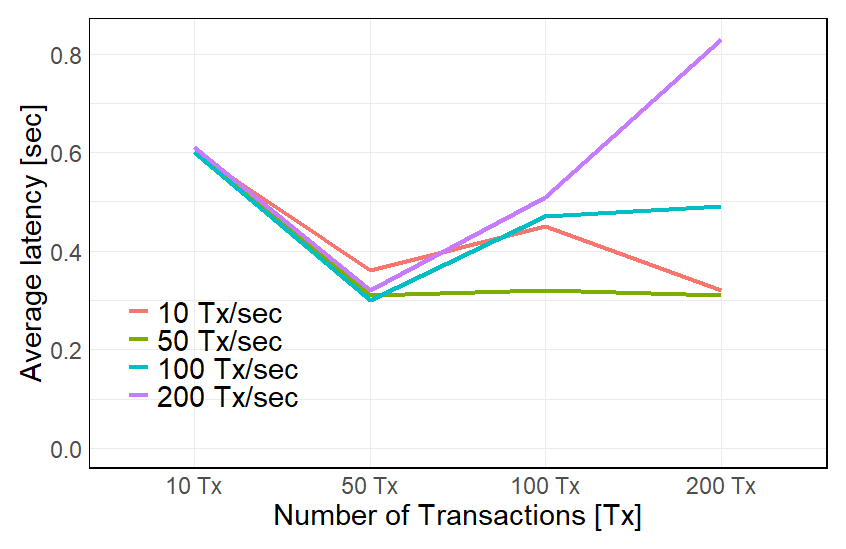
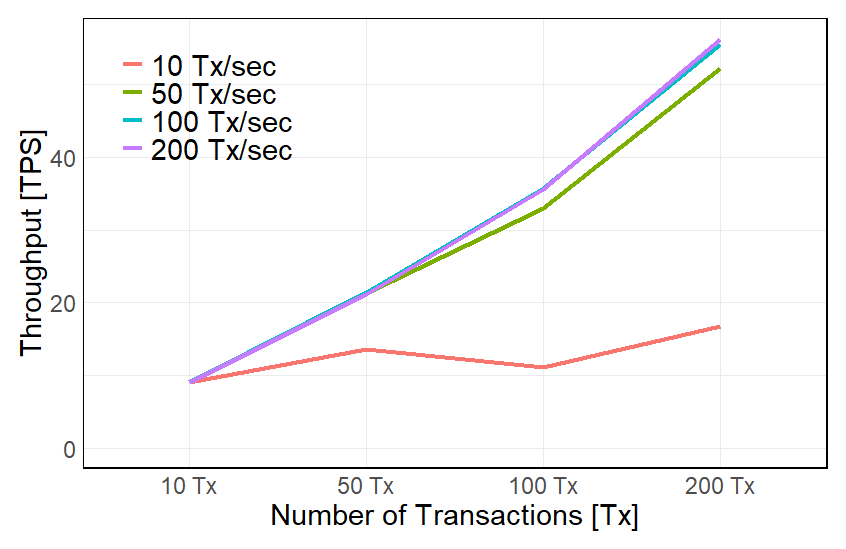
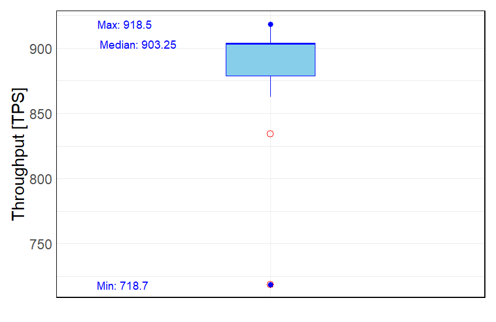
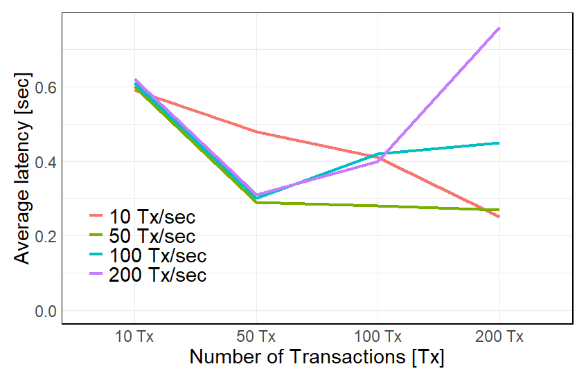
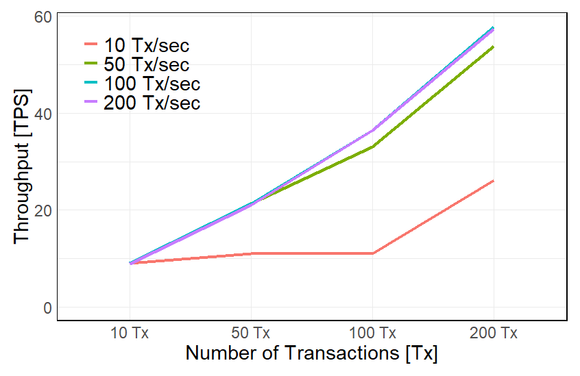

[Main page](../../README.md)

# Health and Safety Management Processes Chaincode

An enterprise's Health and Safety management processes are generally called a Health and Safety Management System (HSMS). It is a set of processes and procedures that help an organization manage its health and safety risks. It can identify, assess, control and monitor health and safety risks. While an HSMS aims to prevent workplace injuries, illnesses, and deaths, the processes and procedures used can vary between enterprises based on their needs and requirements.

The `chaincode` for Health & Safet processess can be accessed [here](../05-safety-management)

### Repo `fabric-contract-api-go`
[For the **fabric-contract-api-go** details on this link](https://github.com/hyperledger/fabric-contract-api-go/tree/main/tutorials)

### Health and Safety Records required by NEBOSH

[NEBOSH](https://www.nebosh.org.uk/documents/ng-guide-for-lp/) (National Examination Board in Occupational Safety and Health) is an internationally recognized qualification for health and safety professionals. Per the search results, a NEBOSH Health and Safety Audit is a key tool to assess workplace safety and identify potential hazards. It helps gather evidence through interviews, inspections, and audits by qualified health and safety auditors. NEBOSH qualifications are essential for any small business from a health and safety point of view. Pursuing a NEBOSH qualification can demonstrate an individual's commitment to health and safety and assist employers in monitoring, auditing, and evaluating health and safety performance in the workplace.

In this Health and Safety module, some of the key records that an organization must have according to NEBOSH include:

1. **Risk Assessments:** These records help to identify and evaluate potential hazards in the workplace, prioritize them, and implement measures to control them.

2. **Incident and Accident Reports:** These records are important to track the number and types of accidents, near-misses, and incidents that occur in the workplace, and to identify trends and patterns that can help to prevent future incidents.

3. **Training Records:** These records help to ensure that all employees have received the necessary training to perform their job safely and to comply with health and safety regulations.

4. **Safety Inspections and Audits:** These records provide evidence that regular safety inspections and audits have been carried out to identify hazards and ensure compliance with health and safety regulations.

5. **Emergency Response Plans:** These records outline the procedures and protocols to be followed in the event of an emergency, such as a fire or chemical spill.

6. **Occupational Health Records:** These records provide information about the physical and mental health of employees, including any injuries or illnesses they may have sustained on the job.

7. **Permits to Work:** These records are required for high-risk activities and help to ensure that proper procedures are followed and that all necessary precautions are taken.

It is important to note that the specific records required may vary depending on the industry and the specific hazards and risks associated with the workplace.

## Testing platforms
* Hyperledger Fabric `test-network` with `Caliper` benchmarking testing framework ([`Caliper Testing`](#caliper-testing) & [`Test Network`](#test-network)).
* Hyperledger Fabric on the `Kaleido` Web3 BaaS platform, [`Kaleido Testing`](#kaleido-testing).
* REST API testing with the [`k6`](../../02-benchmarking-files/k6/k6-linux/README.md) load testing framework.

# Health & Safety Chaincode for test network:

Follow the instructions from the `caliper` testing repository.

Cleanup the terminal:

```bash
PS1='\e[1;32m\u@\H:\e[0m\e[1;34m\W\e[0m\e[1;33m $:\e[0m '
```

Before we start installing the test-network, we have to ensure that Docker is up and running, and then we navigate to the test-network folder.

```bash
cd ~/go/src/github.com/hyperledger/fabric-samples/test-network/
```

Spin up the `test-network`:

```bash
./network.sh up createChannel -ca -s couchdb
```

Install the `Health & Safety Smart ContractSmart Contract`

```bash
./network.sh deployCC -ccn health_and_safety_smart_contract -ccv 1.0 -ccp /home/vodenica/Desktop/test-network-smart-contracts/06-SMS-safety-management-for-test-network -ccl go
```

To test the installed `Health & Safety Smart COntract`, navigate to `fabric-samples/test-network` and define all necessary environment variables for `Org1MSP`. Note that TLS is enabled in `test-network`.
Run the following command:

```bash
cd $HOME/go/src/github.com/hyperledger/fabric-samples/test-network
```

```bash
export FABRIC_CFG_PATH=$PWD/../config/
```

```bash
export PATH=${PWD}/../bin:$PATH
```

#### Environmental set-up for `Org1MSP`:

```bash
export CORE_PEER_TLS_ENABLED=true
export CORE_PEER_LOCALMSPID="Org1MSP"
export CORE_PEER_TLS_ROOTCERT_FILE=${PWD}/organizations/peerOrganizations/org1.example.com/peers/peer0.org1.example.com/tls/ca.crt
export CORE_PEER_MSPCONFIGPATH=${PWD}/organizations/peerOrganizations/org1.example.com/users/Admin@org1.example.com/msp
export CORE_PEER_ADDRESS=localhost:7051
```

During the development environment setup phase, we downloaded Hyperledger Fabric
binaries including peer. They are located in the `fabric-samples/bin` folder and utilize
configurations stored in `fabric-samples/config. Therefore, we can update the `PATH variable
and set `FABRIC_CFG_PATH` to simplify `peer binary usage.

```bash
export PATH=${PWD}/../bin:$PATH
```

```bash
export FABRIC_CFG_PATH=$PWD/../config/
```

### Environmental variables for `Org2MSP`.

```bash
cd $HOME/go/src/github.com/hyperledger/fabric-samples/test-network
```

```bash
export CORE_PEER_TLS_ENABLED=true
export CORE_PEER_LOCALMSPID="Org2MSP"
export CORE_PEER_TLS_ROOTCERT_FILE=${PWD}/organizations/peerOrganizations/org2.example.com/peers/peer0.org2.example.com/tls/ca.crt
export CORE_PEER_MSPCONFIGPATH=${PWD}/organizations/peerOrganizations/org2.example.com/users/Admin@org2.example.com/msp
export CORE_PEER_ADDRESS=localhost:9051
```

```bash
export PATH=${PWD}/../bin:$PATH
```

```bash
export FABRIC_CFG_PATH=$PWD/../config/
```

Now, in the Org1MSP terminal window we can run a peer channel list command to confirm that we are able to use the peer binary without further adjustments.

```bash
peer channel list
```

Response:

```bash
Channels peers has joined:
mychannel
```

The commit transaction is submitted to peers of both `Org1MSP` and `Org2MSP`. The Smart Contract definition is committed to the channel if all targeted peers return successful responses. To confirm this, use the peer lifecycle chaincode `querycommitted` command.

```bash
peer lifecycle chaincode querycommitted --channelID mychannel --name health_and_safety_smart_contract --cafile ${PWD}/organizations/ordererOrganizations/example.com/orderers/orderer.example.com/msp/tlscacerts/tlsca.example.com-cert.pem
```

Response:

```bash
Committed chaincode definition for chaincode 'health_and_safety_smart_contract' on channel 'mychannel':
Version: 1.0, Sequence: 1, Endorsement Plugin: escc, Validation Plugin: vscc, Approvals: [Org1MSP: true, Org2MSP: true]
```
# Test Network

## Risk assessments

### Smart contract function `CreateRiskAssessment`

The function `CreateRiskAssessment` is used to create a risk assessment. The function takes 13 arguments. The first argument is the ID of the risk assessment. The remaining 12 arguments are the values of the risk assessment. The function returns the ID of the risk assessment.

```bash
peer chaincode invoke -o localhost:7050 --ordererTLSHostnameOverride orderer.example.com --tls --cafile ${PWD}/organizations/ordererOrganizations/example.com/orderers/orderer.example.com/msp/tlscacerts/tlsca.example.com-cert.pem -C mychannel -n health_and_safety_smart_contract --peerAddresses localhost:7051 --tlsRootCertFiles ${PWD}/organizations/peerOrganizations/org1.example.com/peers/peer0.org1.example.com/tls/ca.crt --peerAddresses localhost:9051 --tlsRootCertFiles ${PWD}/organizations/peerOrganizations/org2.example.com/peers/peer0.org2.example.com/tls/ca.crt -c '{"function":"CreateRiskAssessment","Args":["","not-set", "not-set", "not-set", "not-set", "not-set","not-set", "not-set", "not-set","not-set", "not-set", "not-set", "not-set"]}'
```
or with `Working on towers`

```bash
peer chaincode invoke -o localhost:7050 --ordererTLSHostnameOverride orderer.example.com --tls --cafile ${PWD}/organizations/ordererOrganizations/example.com/orderers/orderer.example.com/msp/tlscacerts/tlsca.example.com-cert.pem -C mychannel -n health_and_safety_smart_contract --peerAddresses localhost:7051 --tlsRootCertFiles ${PWD}/organizations/peerOrganizations/org1.example.com/peers/peer0.org1.example.com/tls/ca.crt --peerAddresses localhost:9051 --tlsRootCertFiles ${PWD}/organizations/peerOrganizations/org2.example.com/peers/peer0.org2.example.com/tls/ca.crt -c '{"function":"CreateRiskAssessment","Args":["", "Risk-Assessment ID - RA-12345", "2023-09-01", "2024-03-01", "Working on towers", "Alice", "Bob", "Charley", "Lorem ipsum dolor sit amet, consectetur adipiscing elit. In varius.", "Lorem ipsum dolor sit amet, consectetur adipiscing elit. In varius.", "Lorem ipsum dolor sit amet, consectetur adipiscing elit. In varius.", "Lorem ipsum dolor sit amet, consectetur adipiscing elit. In varius.", "Lorem ipsum dolor sit amet, consectetur adipiscing elit. In varius."]}'
```
or with `Working on cable car cabins`

```bash
peer chaincode invoke -o localhost:7050 --ordererTLSHostnameOverride orderer.example.com --tls --cafile ${PWD}/organizations/ordererOrganizations/example.com/orderers/orderer.example.com/msp/tlscacerts/tlsca.example.com-cert.pem -C mychannel -n health_and_safety_smart_contract --peerAddresses localhost:7051 --tlsRootCertFiles ${PWD}/organizations/peerOrganizations/org1.example.com/peers/peer0.org1.example.com/tls/ca.crt --peerAddresses localhost:9051 --tlsRootCertFiles ${PWD}/organizations/peerOrganizations/org2.example.com/peers/peer0.org2.example.com/tls/ca.crt -c '{"function":"CreateRiskAssessment","Args":["", "Risk-Assessment ID - RA-12350", "2023-09-01", "2024-03-01", "Working on cable car cabins", "Alice", "Bob", "Tom", "Lorem ipsum dolor sit amet, consectetur adipiscing elit. In varius.", "Lorem ipsum dolor sit amet, consectetur adipiscing elit. In varius.", "Lorem ipsum dolor sit amet, consectetur adipiscing elit. In varius.", "Lorem ipsum dolor sit amet, consectetur adipiscing elit. In varius.", "Lorem ipsum dolor sit amet, consectetur adipiscing elit. In varius."]}'
```
### Smart contract function `ReadRiskAssessment`

```bash
peer chaincode invoke -o localhost:7050 --ordererTLSHostnameOverride orderer.example.com --tls --cafile ${PWD}/organizations/ordererOrganizations/example.com/orderers/orderer.example.com/msp/tlscacerts/tlsca.example.com-cert.pem -C mychannel -n health_and_safety_smart_contract --peerAddresses localhost:7051 --tlsRootCertFiles ${PWD}/organizations/peerOrganizations/org1.example.com/peers/peer0.org1.example.com/tls/ca.crt --peerAddresses localhost:9051 --tlsRootCertFiles ${PWD}/organizations/peerOrganizations/org2.example.com/peers/peer0.org2.example.com/tls/ca.crt -c '{"function":"ReadRiskAssessment","Args":["Risk-Assessment ID - RA-12345"]}'
```
### Smart contract function `UpdateRiskAssessmentActivity`

```bash
peer chaincode invoke -o localhost:7050 --ordererTLSHostnameOverride orderer.example.com --tls --cafile ${PWD}/organizations/ordererOrganizations/example.com/orderers/orderer.example.com/msp/tlscacerts/tlsca.example.com-cert.pem -C mychannel -n health_and_safety_smart_contract --peerAddresses localhost:7051 --tlsRootCertFiles ${PWD}/organizations/peerOrganizations/org1.example.com/peers/peer0.org1.example.com/tls/ca.crt --peerAddresses localhost:9051 --tlsRootCertFiles ${PWD}/organizations/peerOrganizations/org2.example.com/peers/peer0.org2.example.com/tls/ca.crt -c '{"function":"UpdateRiskAssessmentActivity","Args":["Risk-Assessment ID - RA-12345", "Grip Maintenance"]}'
```
### Smart contract function `QueryRiskAssessments` WORKING!!!

Query risk assessments by who create them:

```bash
peer chaincode invoke -o localhost:7050 --ordererTLSHostnameOverride orderer.example.com --tls --cafile ${PWD}/organizations/ordererOrganizations/example.com/orderers/orderer.example.com/msp/tlscacerts/tlsca.example.com-cert.pem -C mychannel -n health_and_safety_smart_contract --peerAddresses localhost:7051 --tlsRootCertFiles ${PWD}/organizations/peerOrganizations/org1.example.com/peers/peer0.org1.example.com/tls/ca.crt --peerAddresses localhost:9051 --tlsRootCertFiles ${PWD}/organizations/peerOrganizations/org2.example.com/peers/peer0.org2.example.com/tls/ca.crt -c '{"Args":["QueryRiskAssessments","{\"selector\":{\"risk_assessment_created_by\":\"Alice\"}}"]}'

```
Query risk assessments by assessor:

```bash
peer chaincode invoke -o localhost:7050 --ordererTLSHostnameOverride orderer.example.com --tls --cafile ${PWD}/organizations/ordererOrganizations/example.com/orderers/orderer.example.com/msp/tlscacerts/tlsca.example.com-cert.pem -C mychannel -n health_and_safety_smart_contract --peerAddresses localhost:7051 --tlsRootCertFiles ${PWD}/organizations/peerOrganizations/org1.example.com/peers/peer0.org1.example.com/tls/ca.crt --peerAddresses localhost:9051 --tlsRootCertFiles ${PWD}/organizations/peerOrganizations/org2.example.com/peers/peer0.org2.example.com/tls/ca.crt -c '{"Args":["QueryRiskAssessments","{\"selector\":{\"risk_assessment_assessed_by\":\"Bob"}}\"]}'
```
Query risk assessments by approver:

```bash
peer chaincode invoke -o localhost:7050 --ordererTLSHostnameOverride orderer.example.com --tls --cafile ${PWD}/organizations/ordererOrganizations/example.com/orderers/orderer.example.com/msp/tlscacerts/tlsca.example.com-cert.pem -C mychannel -n health_and_safety_smart_contract --peerAddresses localhost:7051 --tlsRootCertFiles ${PWD}/organizations/peerOrganizations/org1.example.com/peers/peer0.org1.example.com/tls/ca.crt --peerAddresses localhost:9051 --tlsRootCertFiles ${PWD}/organizations/peerOrganizations/org2.example.com/peers/peer0.org2.example.com/tls/ca.crt -c '{"Args":["QueryRiskAssessments","{\"selector\":{\"risk_assessment_approved_by\":\"Charley\"}}"]}'
```
Query risk assessments by activity:

```bash
peer chaincode invoke -o localhost:7050 --ordererTLSHostnameOverride orderer.example.com --tls --cafile ${PWD}/organizations/ordererOrganizations/example.com/orderers/orderer.example.com/msp/tlscacerts/tlsca.example.com-cert.pem -C mychannel -n health_and_safety_smart_contract --peerAddresses localhost:7051 --tlsRootCertFiles ${PWD}/organizations/peerOrganizations/org1.example.com/peers/peer0.org1.example.com/tls/ca.crt --peerAddresses localhost:9051 --tlsRootCertFiles ${PWD}/organizations/peerOrganizations/org2.example.com/peers/peer0.org2.example.com/tls/ca.crt -c '{"Args":["QueryRiskAssessments","{"selector":{"risk_assessment_activity":"Grip Maintenance"}}"]}'
```
### Smart contract function `GetRiskAssessmentHistory`

```bash
peer chaincode invoke -o localhost:7050 --ordererTLSHostnameOverride orderer.example.com --tls --cafile ${PWD}/organizations/ordererOrganizations/example.com/orderers/orderer.example.com/msp/tlscacerts/tlsca.example.com-cert.pem -C mychannel -n health_and_safety_smart_contract --peerAddresses localhost:7051 --tlsRootCertFiles ${PWD}/organizations/peerOrganizations/org1.example.com/peers/peer0.org1.example.com/tls/ca.crt --peerAddresses localhost:9051 --tlsRootCertFiles ${PWD}/organizations/peerOrganizations/org2.example.com/peers/peer0.org2.example.com/tls/ca.crt -c '{"function":"GetRiskAssessmentHistory","Args":["Risk-Assessment ID - RA-12345"]}'
```

The response body for the function `GetRiskAssessmentHistory` is:

```json
[
  {
    "record": {
      "docType": "Risk-Assessment",
      "risk_assessment_id": "Risk-Assessment ID - RA-12345",
      "risk_assessment_date": "2023-09-01",
      "risk_assessment_date_next_review": "2023-03-01",
      "risk_assessment_activity": "Grip Maintenance",
      "risk_assessment_created_by": "Alice",
      "risk_assessment_assessed_by": "Bob",
      "risk_assessment_approved_by": "Charley",
      "risk_assessment_hazard_list_one": "Lorem ipsum dolor sit amet, consectetur adipiscing elit. In varius.",
      "risk_assessment_hazard_list_two": "Lorem ipsum dolor sit amet, consectetur adipiscing elit. In varius.",
      "risk_assessment_hazard_list_three": "Lorem ipsum dolor sit amet, consectetur adipiscing elit. In varius.",
      "risk_assessment_hazard_list_four": "Lorem ipsum dolor sit amet, consectetur adipiscing elit. In varius.",
      "risk_assessment_hazard_list_five": "Lorem ipsum dolor sit amet, consectetur adipiscing elit. In varius."
    },
    "txId": "a76b386f9c40c43e85daa7dc5cbe745e56d6098adbcd0910a908440e85689199",
    "timestamp": "2023-09-01T02:32:33.883273069Z",
    "isDelete": false
  },
  {
    "record": {
      "docType": "Risk-Assessment",
      "risk_assessment_id": "Risk-Assessment ID - RA-12345",
      "risk_assessment_date": "2023-09-01",
      "risk_assessment_date_next_review": "2023-03-01",
      "risk_assessment_activity": "Working on towers",
      "risk_assessment_created_by": "Alice",
      "risk_assessment_assessed_by": "Bob",
      "risk_assessment_approved_by": "Charley",
      "risk_assessment_hazard_list_one": "Lorem ipsum dolor sit amet, consectetur adipiscing elit. In varius.",
      "risk_assessment_hazard_list_two": "Lorem ipsum dolor sit amet, consectetur adipiscing elit. In varius.",
      "risk_assessment_hazard_list_three": "Lorem ipsum dolor sit amet, consectetur adipiscing elit. In varius.",
      "risk_assessment_hazard_list_four": "Lorem ipsum dolor sit amet, consectetur adipiscing elit. In varius.",
      "risk_assessment_hazard_list_five": "Lorem ipsum dolor sit amet, consectetur adipiscing elit. In varius."
    },
    "txId": "884a66ae4bfb238552de5aef269b0eb75d61a0575d30acf9ff5873e847e99629",
    "timestamp": "2023-09-01T02:22:17.069621214Z",
    "isDelete": false
  }
]
```
### Smart contract function `GetRiskAssessmentByRange`:

Function:

```bash
peer chaincode invoke -o localhost:7050 --ordererTLSHostnameOverride orderer.example.com --tls --cafile ${PWD}/organizations/ordererOrganizations/example.com/orderers/orderer.example.com/msp/tlscacerts/tlsca.example.com-cert.pem -C mychannel -n health_and_safety_smart_contract --peerAddresses localhost:7051 --tlsRootCertFiles ${PWD}/organizations/peerOrganizations/org1.example.com/peers/peer0.org1.example.com/tls/ca.crt --peerAddresses localhost:9051 --tlsRootCertFiles ${PWD}/organizations/peerOrganizations/org2.example.com/peers/peer0.org2.example.com/tls/ca.crt -c '{"function":"AGetRiskAssessmentByRange","Args":["", ""]}'
```

Response body:

```json
[
  {
    "docType": "Risk-Assessment",
    "risk_assessment_id": "Risk-Assessment ID - RA-12345",
    "risk_assessment_date": "2023-09-01",
    "risk_assessment_date_next_review": "2023-03-01",
    "risk_assessment_activity": "Grip Maintenance",
    "risk_assessment_created_by": "Alice",
    "risk_assessment_assessed_by": "Bob",
    "risk_assessment_approved_by": "Charley",
    "risk_assessment_hazard_list_one": "Lorem ipsum dolor sit amet, consectetur adipiscing elit. In varius.",
    "risk_assessment_hazard_list_two": "Lorem ipsum dolor sit amet, consectetur adipiscing elit. In varius.",
    "risk_assessment_hazard_list_three": "Lorem ipsum dolor sit amet, consectetur adipiscing elit. In varius.",
    "risk_assessment_hazard_list_four": "Lorem ipsum dolor sit amet, consectetur adipiscing elit. In varius.",
    "risk_assessment_hazard_list_five": "Lorem ipsum dolor sit amet, consectetur adipiscing elit. In varius."
  },
  {
    "docType": "Risk-Assessment",
    "risk_assessment_id": "not-set",
    "risk_assessment_date": "not-set",
    "risk_assessment_date_next_review": "not-set",
    "risk_assessment_activity": "not-set",
    "risk_assessment_created_by": "not-set",
    "risk_assessment_assessed_by": "not-set",
    "risk_assessment_approved_by": "not-set",
    "risk_assessment_hazard_list_one": "not-set",
    "risk_assessment_hazard_list_two": "not-set",
    "risk_assessment_hazard_list_three": "not-set",
    "risk_assessment_hazard_list_four": "not-set",
    "risk_assessment_hazard_list_five": "not-set"
  }
]
```
Function when passed by risk assessment IDs:

```bash
peer chaincode invoke -o localhost:7050 --ordererTLSHostnameOverride orderer.example.com --tls --cafile ${PWD}/organizations/ordererOrganizations/example.com/orderers/orderer.example.com/msp/tlscacerts/tlsca.example.com-cert.pem -C mychannel -n health_and_safety_smart_contract --peerAddresses localhost:7051 --tlsRootCertFiles ${PWD}/organizations/peerOrganizations/org1.example.com/peers/peer0.org1.example.com/tls/ca.crt --peerAddresses localhost:9051 --tlsRootCertFiles ${PWD}/organizations/peerOrganizations/org2.example.com/peers/peer0.org2.example.com/tls/ca.crt -c '{"function":"GetRiskAssessmentByRange","Args":["Risk-Assessment ID - RA-12348", "Risk-Assessment ID - RA-12352"]}'
```
Response body:

```json
[
  {
    "docType": "Risk-Assessment",
    "risk_assessment_id": "Risk-Assessment ID - RA-12345",
    "risk_assessment_date": "2023-09-01",
    "risk_assessment_date_next_review": "2023-03-01",
    "risk_assessment_activity": "Grip Maintenance",
    "risk_assessment_created_by": "Alice",
    "risk_assessment_assessed_by": "Bob",
    "risk_assessment_approved_by": "Charley",
    "risk_assessment_hazard_list_one": "Lorem ipsum dolor sit amet, consectetur adipiscing elit. In varius.",
    "risk_assessment_hazard_list_two": "Lorem ipsum dolor sit amet, consectetur adipiscing elit. In varius.",
    "risk_assessment_hazard_list_three": "Lorem ipsum dolor sit amet, consectetur adipiscing elit. In varius.",
    "risk_assessment_hazard_list_four": "Lorem ipsum dolor sit amet, consectetur adipiscing elit. In varius.",
    "risk_assessment_hazard_list_five": "Lorem ipsum dolor sit amet, consectetur adipiscing elit. In varius."
  }
]
```
Function when passed by risk assessment activities:

```bash
peer chaincode query -C mychannel -n health_and_safety_smart_contract -c '{"Args":["GetRiskAssessmentByRange", "", "Working on cable car cabins"]}'
```
Response body:

```json
[
  {
    "docType": "Risk-Assessment",
    "risk_assessment_id": "Risk-Assessment ID - RA-12345",
    "risk_assessment_date": "2023-09-01",
    "risk_assessment_date_next_review": "2023-03-01",
    "risk_assessment_activity": "Grip Maintenance",
    "risk_assessment_created_by": "Alice",
    "risk_assessment_assessed_by": "Bob",
    "risk_assessment_approved_by": "Charley",
    "risk_assessment_hazard_list_one": "Lorem ipsum dolor sit amet, consectetur adipiscing elit. In varius.",
    "risk_assessment_hazard_list_two": "Lorem ipsum dolor sit amet, consectetur adipiscing elit. In varius.",
    "risk_assessment_hazard_list_three": "Lorem ipsum dolor sit amet, consectetur adipiscing elit. In varius.",
    "risk_assessment_hazard_list_four": "Lorem ipsum dolor sit amet, consectetur adipiscing elit. In varius.",
    "risk_assessment_hazard_list_five": "Lorem ipsum dolor sit amet, consectetur adipiscing elit. In varius."
  }
]
```

## Accident / Incident Reports

### Smart contract function `CreateAccidentIncidentReport`

```bash
peer chaincode invoke -o localhost:7050 --ordererTLSHostnameOverride orderer.example.com --tls --cafile ${PWD}/organizations/ordererOrganizations/example.com/orderers/orderer.example.com/msp/tlscacerts/tlsca.example.com-cert.pem -C mychannel -n health_and_safety_smart_contract --peerAddresses localhost:7051 --tlsRootCertFiles ${PWD}/organizations/peerOrganizations/org1.example.com/peers/peer0.org1.example.com/tls/ca.crt --peerAddresses localhost:9051 --tlsRootCertFiles ${PWD}/organizations/peerOrganizations/org2.example.com/peers/peer0.org2.example.com/tls/ca.crt -c '{"function":"CreateAccidentIncidentReport","Args":["", "not-set", "not-set", "not-set", "not-set", "not-set", "not-set", "not-set", "not-set", "not-set", "not-set", "not-set", "not-set", "not-set", "2", "not-set", "not-set", "not-set", "not-set"]}'
```
or with `meta-data`

```bash
peer chaincode invoke -o localhost:7050 --ordererTLSHostnameOverride orderer.example.com --tls --cafile ${PWD}/organizations/ordererOrganizations/example.com/orderers/orderer.example.com/msp/tlscacerts/tlsca.example.com-cert.pem -C mychannel -n health_and_safety_smart_contract --peerAddresses localhost:7051 --tlsRootCertFiles ${PWD}/organizations/peerOrganizations/org1.example.com/peers/peer0.org1.example.com/tls/ca.crt --peerAddresses localhost:9051 --tlsRootCertFiles ${PWD}/organizations/peerOrganizations/org2.example.com/peers/peer0.org2.example.com/tls/ca.crt -c '{
	"function": "CreateAccidentIncidentReport",
	"Args": [
		"",
		"Accident-Incident-Report-ID-00010",
		"Subject: Lorem ipsum dolor sit amet, consectetur adipiscing elit. In varius.",
		"2023-09-01",
		"15:30",
		"15:45",
		"Location: Lorem ipsum dolor sit amet.",
		"H&S aspects: Lorem ipsum dolor sit amet, consectetur adipiscing elit. Phasellus hendrerit erat erat, sit amet egestas ipsum tincidunt sed. Suspendisse nulla tellus, pretium vitae lacinia eu, convallis a odio. Pellentesque vitae consectetur erat. Quisque elementum ac sem at bibendum. In hac habitasse platea dictumst. Curabitur sapien lacus, dignissim et finibus at, tempus consectetur turpis. Ut diam lectus, hendrerit vitae facilisis eget, scelerisque non lacus. Nullam massa orci, tincidunt quis pulvinar nec, lacinia nec odio. Mauris pellentesque leo ac consequat pharetra. Phasellus tempus volutpat risus sed accumsan. Sed tincidunt efficitur diam vel ultrices. Quisque at pulvinar metus.",
		"Accident/Incident",
		"Description: Lorem ipsum dolor sit amet, consectetur adipiscing elit. In in bibendum neque, at accumsan turpis.",
		"Immediate action:  Lorem ipsum dolor sit amet, consectetur adipiscing elit. In in bibendum neque, at accumsan turpis.",
		"Follow_up_actions: Lorem ipsum dolor sit amet, consectetur adipiscing elit. In in bibendum neque, at accumsan turpis.",
		"Alice",
		"not-set",
		"open",
		"2",
		"John, and Trevor",
		"Witnesses Report: Lorem ipsum dolor sit amet, consectetur adipiscing elit. Phasellus hendrerit erat erat, sit amet egestas ipsum tincidunt sed. Suspendisse nulla tellus, pretium vitae lacinia eu, convallis a odio. Pellentesque vitae consectetur erat. Quisque elementum ac sem at bibendum. In hac habitasse platea dictumst. Curabitur sapien lacus, dignissim et finibus at, tempus consectetur turpis. Ut diam lectus, hendrerit vitae facilisis eget, scelerisque non lacus. Nullam massa orci, tincidunt quis pulvinar nec, lacinia nec odio. Mauris pellentesque leo ac consequat pharetra. Phasellus tempus volutpat risus sed accumsan. Sed tincidunt efficitur diam vel ultrices. Quisque at pulvinar metus.",
		"Overview",
		"Alice to Bob"
	]
}'
```
Respons in `JSON` format how it is stored on the ledger:

```json
{
  "_id": "Accident-Incident-Report-ID-00001",
  "_rev": "1-fcec53dc436812b31dfc5d53658934ce",
  "accident_incident_report_classification": "Accident",
  "accident_incident_report_created_by": "Alice",
  "accident_incident_report_date": "2023-09-01",
  "accident_incident_report_description": "Description: Lorem ipsum dolor sit amet, consectetur adipiscing elit. In in bibendum neque, at accumsan turpis.",
  "accident_incident_report_event_overview": "Overview",
  "accident_incident_report_follow_up_actions": "Follow_up_actions: Lorem ipsum dolor sit amet, consectetur adipiscing elit. In in bibendum neque, at accumsan turpis.",
  "accident_incident_report_hs_aspects": "H&S aspects: Lorem ipsum dolor sit amet, consectetur adipiscing elit. Phasellus hendrerit erat erat, sit amet egestas ipsum tincidunt sed. Suspendisse nulla tellus, pretium vitae lacinia eu, convallis a odio. Pellentesque vitae consectetur erat. Quisque elementum ac sem at bibendum. In hac habitasse platea dictumst. Curabitur sapien lacus, dignissim et finibus at, tempus consectetur turpis. Ut diam lectus, hendrerit vitae facilisis eget, scelerisque non lacus. Nullam massa orci, tincidunt quis pulvinar nec, lacinia nec odio. Mauris pellentesque leo ac consequat pharetra. Phasellus tempus volutpat risus sed accumsan. Sed tincidunt efficitur diam vel ultrices. Quisque at pulvinar metus.",
  "accident_incident_report_id": "Accident-Incident-Report-ID-00001",
  "accident_incident_report_immediate_action": "Immediate action:  Lorem ipsum dolor sit amet, consectetur adipiscing elit. In in bibendum neque, at accumsan turpis.",
  "accident_incident_report_line_of_communication": "Alice to Bob",
  "accident_incident_report_location": "Location: Lorem ipsum dolor sit amet.",
  "accident_incident_report_number_of_people_involved": 2,
  "accident_incident_report_person_injured": "1",
  "accident_incident_report_status": "open",
  "accident_incident_report_time_end": "15:30",
  "accident_incident_report_time_start": "",
  "accident_incident_report_validated": "not-set",
  "accident_incident_report_witnesses": "Witnesses Report: Lorem ipsum dolor sit amet, consectetur adipiscing elit. Phasellus hendrerit erat erat, sit amet egestas ipsum tincidunt sed. Suspendisse nulla tellus, pretium vitae lacinia eu, convallis a odio. Pellentesque vitae consectetur erat. Quisque elementum ac sem at bibendum. In hac habitasse platea dictumst. Curabitur sapien lacus, dignissim et finibus at, tempus consectetur turpis. Ut diam lectus, hendrerit vitae facilisis eget, scelerisque non lacus. Nullam massa orci, tincidunt quis pulvinar nec, lacinia nec odio. Mauris pellentesque leo ac consequat pharetra. Phasellus tempus volutpat risus sed accumsan. Sed tincidunt efficitur diam vel ultrices. Quisque at pulvinar metus.",
  "docType": "accident-incident-report",
  "subject_accident_incident_report": "Subject: Lorem ipsum dolor sit amet, consectetur adipiscing elit. In varius.",
  "~version": "CgMBKgA="
}
```
### Smart contract function `ReadAccidentIncidentReport`

```bash
peer chaincode query -C mychannel -n health_and_safety_smart_contract -c '{"Args":["ReadAccidentIncidentReport","Accident-Incident-Report-ID-00001"]}'
```
Response body:

```json
{
  "docType": "accident-incident-report",
  "accident_incident_report_id": "Accident-Incident-Report-ID-00001",
  "subject_accident_incident_report": "Subject: Lorem ipsum dolor sit amet, consectetur adipiscing elit. In varius.",
  "accident_incident_report_date": "2023-09-01",
  "accident_incident_report_time_start": "",
  "accident_incident_report_time_end": "15:30",
  "accident_incident_report_location": "Location: Lorem ipsum dolor sit amet.",
  "accident_incident_report_hs_aspects": "Hu0026S aspects: Lorem ipsum dolor sit amet, consectetur adipiscing elit. Phasellus hendrerit erat erat, sit amet egestas ipsum tincidunt sed. Suspendisse nulla tellus, pretium vitae lacinia eu, convallis a odio. Pellentesque vitae consectetur erat. Quisque elementum ac sem at bibendum. In hac habitasse platea dictumst. Curabitur sapien lacus, dignissim et finibus at, tempus consectetur turpis. Ut diam lectus, hendrerit vitae facilisis eget, scelerisque non lacus. Nullam massa orci, tincidunt quis pulvinar nec, lacinia nec odio. Mauris pellentesque leo ac consequat pharetra. Phasellus tempus volutpat risus sed accumsan. Sed tincidunt efficitur diam vel ultrices. Quisque at pulvinar metus.",
  "accident_incident_report_classification": "Accident",
  "accident_incident_report_description": "Description: Lorem ipsum dolor sit amet, consectetur adipiscing elit. In in bibendum neque, at accumsan turpis.",
  "accident_incident_report_immediate_action": "Immediate action:  Lorem ipsum dolor sit amet, consectetur adipiscing elit. In in bibendum neque, at accumsan turpis.",
  "accident_incident_report_follow_up_actions": "Follow_up_actions: Lorem ipsum dolor sit amet, consectetur adipiscing elit. In in bibendum neque, at accumsan turpis.",
  "accident_incident_report_created_by": "Alice",
  "accident_incident_report_validated": "not-set",
  "accident_incident_report_status": "open",
  "accident_incident_report_number_of_people_involved": 2,
  "accident_incident_report_person_injured": "1",
  "accident_incident_report_witnesses": "Witnesses Report: Lorem ipsum dolor sit amet, consectetur adipiscing elit. Phasellus hendrerit erat erat, sit amet egestas ipsum tincidunt sed. Suspendisse nulla tellus, pretium vitae lacinia eu, convallis a odio. Pellentesque vitae consectetur erat. Quisque elementum ac sem at bibendum. In hac habitasse platea dictumst. Curabitur sapien lacus, dignissim et finibus at, tempus consectetur turpis. Ut diam lectus, hendrerit vitae facilisis eget, scelerisque non lacus. Nullam massa orci, tincidunt quis pulvinar nec, lacinia nec odio. Mauris pellentesque leo ac consequat pharetra. Phasellus tempus volutpat risus sed accumsan. Sed tincidunt efficitur diam vel ultrices. Quisque at pulvinar metus.",
  "accident_incident_report_event_overview": "Overview",
  "accident_incident_report_line_of_communication": "Alice to Bob"
}
```
### Updated smart contract `UpdateAccidentIncidentReportTimeEnd`

```bash
peer chaincode invoke -o localhost:7050 --ordererTLSHostnameOverride orderer.example.com --tls --cafile ${PWD}/organizations/ordererOrganizations/example.com/orderers/orderer.example.com/msp/tlscacerts/tlsca.example.com-cert.pem -C mychannel -n health_and_safety_smart_contract --peerAddresses localhost:7051 --tlsRootCertFiles ${PWD}/organizations/peerOrganizations/org1.example.com/peers/peer0.org1.example.com/tls/ca.crt --peerAddresses localhost:9051 --tlsRootCertFiles ${PWD}/organizations/peerOrganizations/org2.example.com/peers/peer0.org2.example.com/tls/ca.crt -c '{"function":"UpdateAccidentIncidentReportTimeEnd","Args":["Accident-Incident-Report-ID-00001", "2023-09-01 22:55"]}'
```
### Smart contract function `UpdateAccidentIncidentReportValidated`

```bash
peer chaincode invoke -o localhost:7050 --ordererTLSHostnameOverride orderer.example.com --tls --cafile ${PWD}/organizations/ordererOrganizations/example.com/orderers/orderer.example.com/msp/tlscacerts/tlsca.example.com-cert.pem -C mychannel -n health_and_safety_smart_contract --peerAddresses localhost:7051 --tlsRootCertFiles ${PWD}/organizations/peerOrganizations/org1.example.com/peers/peer0.org1.example.com/tls/ca.crt --peerAddresses localhost:9051 --tlsRootCertFiles ${PWD}/organizations/peerOrganizations/org2.example.com/peers/peer0.org2.example.com/tls/ca.crt -c '{"function":"UpdateAccidentIncidentReportValidated","Args":["Accident-Incident-Report-ID-00001"]}'
```

### Samrt contract function `GetAccidentIncidentReportHistory`

```bash
peer chaincode invoke -o localhost:7050 --ordererTLSHostnameOverride orderer.example.com --tls --cafile ${PWD}/organizations/ordererOrganizations/example.com/orderers/orderer.example.com/msp/tlscacerts/tlsca.example.com-cert.pem -C mychannel -n health_and_safety_smart_contract --peerAddresses localhost:7051 --tlsRootCertFiles ${PWD}/organizations/peerOrganizations/org1.example.com/peers/peer0.org1.example.com/tls/ca.crt --peerAddresses localhost:9051 --tlsRootCertFiles ${PWD}/organizations/peerOrganizations/org2.example.com/peers/peer0.org2.example.com/tls/ca.crt -c '{"function":"GetAccidentIncidentReportHistory","Args":["Accident-Incident-Report-ID-00001"]}'
```
The response body:

```json
[
  {
    "record": {
      "docType": "accident-incident-report",
      "accident_incident_report_id": "Accident-Incident-Report-ID-00001",
      "subject_accident_incident_report": "Subject: Lorem ipsum dolor sit amet, consectetur adipiscing elit. In varius.",
      "accident_incident_report_date": "2023-09-01",
      "accident_incident_report_time_start": "",
      "accident_incident_report_time_end": "2023-09-01 22:55",
      "accident_incident_report_location": "Location: Lorem ipsum dolor sit amet.",
      "accident_incident_report_hs_aspects": "Hu0026S aspects: Lorem ipsum dolor sit amet, consectetur adipiscing elit. Phasellus hendrerit erat erat, sit amet egestas ipsum tincidunt sed. Suspendisse nulla tellus, pretium vitae lacinia eu, convallis a odio. Pellentesque vitae consectetur erat. Quisque elementum ac sem at bibendum. In hac habitasse platea dictumst. Curabitur sapien lacus, dignissim et finibus at, tempus consectetur turpis. Ut diam lectus, hendrerit vitae facilisis eget, scelerisque non lacus. Nullam massa orci, tincidunt quis pulvinar nec, lacinia nec odio. Mauris pellentesque leo ac consequat pharetra. Phasellus tempus volutpat risus sed accumsan. Sed tincidunt efficitur diam vel ultrices. Quisque at pulvinar metus.",
      "accident_incident_report_classification": "Accident",
      "accident_incident_report_description": "Description: Lorem ipsum dolor sit amet, consectetur adipiscing elit. In in bibendum neque, at accumsan turpis.",
      "accident_incident_report_immediate_action": "Immediate action:  Lorem ipsum dolor sit amet, consectetur adipiscing elit. In in bibendum neque, at accumsan turpis.",
      "accident_incident_report_follow_up_actions": "Follow_up_actions: Lorem ipsum dolor sit amet, consectetur adipiscing elit. In in bibendum neque, at accumsan turpis.",
      "accident_incident_report_created_by": "Alice",
      "accident_incident_report_validated": "eDUwOTo6Q049b3JnMWFkbWluLE9VPWFkbWluLE89SHlwZXJsZWRnZXIsU1Q9Tm9ydGggQ2Fyb2xpbmEsQz1VUzo6Q049Y2Eub3JnMS5leGFtcGxlLmNvbSxPPW9yZzEuZXhhbXBsZS5jb20sTD1EdXJoYW0sU1Q9Tm9ydGggQ2Fyb2xpbmEsQz1VUw==",
      "accident_incident_report_status": "closed",
      "accident_incident_report_number_of_people_involved": 2,
      "accident_incident_report_person_injured": "1",
      "accident_incident_report_witnesses": "Witnesses Report: Lorem ipsum dolor sit amet, consectetur adipiscing elit. Phasellus hendrerit erat erat, sit amet egestas ipsum tincidunt sed. Suspendisse nulla tellus, pretium vitae lacinia eu, convallis a odio. Pellentesque vitae consectetur erat. Quisque elementum ac sem at bibendum. In hac habitasse platea dictumst. Curabitur sapien lacus, dignissim et finibus at, tempus consectetur turpis. Ut diam lectus, hendrerit vitae facilisis eget, scelerisque non lacus. Nullam massa orci, tincidunt quis pulvinar nec, lacinia nec odio. Mauris pellentesque leo ac consequat pharetra. Phasellus tempus volutpat risus sed accumsan. Sed tincidunt efficitur diam vel ultrices. Quisque at pulvinar metus.",
      "accident_incident_report_event_overview": "Overview",
      "accident_incident_report_line_of_communication": "Alice to Bob"
    },
    "txId": "a8b0024ce1fa7637991d18818da009052a0da74468d75ef0ba34983d5a2a4595",
    "timestamp_accident_incident_report": "2023-09-01T05:37:05.890399403Z",
    "isDelete": false
  },
  {
    "record": {
      "docType": "accident-incident-report",
      "accident_incident_report_id": "Accident-Incident-Report-ID-00001",
      "subject_accident_incident_report": "Subject: Lorem ipsum dolor sit amet, consectetur adipiscing elit. In varius.",
      "accident_incident_report_date": "2023-09-01",
      "accident_incident_report_time_start": "",
      "accident_incident_report_time_end": "2023-09-01 22:55",
      "accident_incident_report_location": "Location: Lorem ipsum dolor sit amet.",
      "accident_incident_report_hs_aspects": "Hu0026S aspects: Lorem ipsum dolor sit amet, consectetur adipiscing elit. Phasellus hendrerit erat erat, sit amet egestas ipsum tincidunt sed. Suspendisse nulla tellus, pretium vitae lacinia eu, convallis a odio. Pellentesque vitae consectetur erat. Quisque elementum ac sem at bibendum. In hac habitasse platea dictumst. Curabitur sapien lacus, dignissim et finibus at, tempus consectetur turpis. Ut diam lectus, hendrerit vitae facilisis eget, scelerisque non lacus. Nullam massa orci, tincidunt quis pulvinar nec, lacinia nec odio. Mauris pellentesque leo ac consequat pharetra. Phasellus tempus volutpat risus sed accumsan. Sed tincidunt efficitur diam vel ultrices. Quisque at pulvinar metus.",
      "accident_incident_report_classification": "Accident",
      "accident_incident_report_description": "Description: Lorem ipsum dolor sit amet, consectetur adipiscing elit. In in bibendum neque, at accumsan turpis.",
      "accident_incident_report_immediate_action": "Immediate action:  Lorem ipsum dolor sit amet, consectetur adipiscing elit. In in bibendum neque, at accumsan turpis.",
      "accident_incident_report_follow_up_actions": "Follow_up_actions: Lorem ipsum dolor sit amet, consectetur adipiscing elit. In in bibendum neque, at accumsan turpis.",
      "accident_incident_report_created_by": "Alice",
      "accident_incident_report_validated": "not-set",
      "accident_incident_report_status": "open",
      "accident_incident_report_number_of_people_involved": 2,
      "accident_incident_report_person_injured": "1",
      "accident_incident_report_witnesses": "Witnesses Report: Lorem ipsum dolor sit amet, consectetur adipiscing elit. Phasellus hendrerit erat erat, sit amet egestas ipsum tincidunt sed. Suspendisse nulla tellus, pretium vitae lacinia eu, convallis a odio. Pellentesque vitae consectetur erat. Quisque elementum ac sem at bibendum. In hac habitasse platea dictumst. Curabitur sapien lacus, dignissim et finibus at, tempus consectetur turpis. Ut diam lectus, hendrerit vitae facilisis eget, scelerisque non lacus. Nullam massa orci, tincidunt quis pulvinar nec, lacinia nec odio. Mauris pellentesque leo ac consequat pharetra. Phasellus tempus volutpat risus sed accumsan. Sed tincidunt efficitur diam vel ultrices. Quisque at pulvinar metus.",
      "accident_incident_report_event_overview": "Overview",
      "accident_incident_report_line_of_communication": "Alice to Bob"
    },
    "txId": "d08284f014d7477b55a338e5b83b7f511fc20858eafc9b5d8f70ec1c94af3993",
    "timestamp_accident_incident_report": "2023-09-01T05:34:46.901067724Z",
    "isDelete": false
  },
  {
    "record": {
      "docType": "accident-incident-report",
      "accident_incident_report_id": "Accident-Incident-Report-ID-00001",
      "subject_accident_incident_report": "Subject: Lorem ipsum dolor sit amet, consectetur adipiscing elit. In varius.",
      "accident_incident_report_date": "2023-09-01",
      "accident_incident_report_time_start": "",
      "accident_incident_report_time_end": "2023-09-01 22:50",
      "accident_incident_report_location": "Location: Lorem ipsum dolor sit amet.",
      "accident_incident_report_hs_aspects": "Hu0026S aspects: Lorem ipsum dolor sit amet, consectetur adipiscing elit. Phasellus hendrerit erat erat, sit amet egestas ipsum tincidunt sed. Suspendisse nulla tellus, pretium vitae lacinia eu, convallis a odio. Pellentesque vitae consectetur erat. Quisque elementum ac sem at bibendum. In hac habitasse platea dictumst. Curabitur sapien lacus, dignissim et finibus at, tempus consectetur turpis. Ut diam lectus, hendrerit vitae facilisis eget, scelerisque non lacus. Nullam massa orci, tincidunt quis pulvinar nec, lacinia nec odio. Mauris pellentesque leo ac consequat pharetra. Phasellus tempus volutpat risus sed accumsan. Sed tincidunt efficitur diam vel ultrices. Quisque at pulvinar metus.",
      "accident_incident_report_classification": "Accident",
      "accident_incident_report_description": "Description: Lorem ipsum dolor sit amet, consectetur adipiscing elit. In in bibendum neque, at accumsan turpis.",
      "accident_incident_report_immediate_action": "Immediate action:  Lorem ipsum dolor sit amet, consectetur adipiscing elit. In in bibendum neque, at accumsan turpis.",
      "accident_incident_report_follow_up_actions": "Follow_up_actions: Lorem ipsum dolor sit amet, consectetur adipiscing elit. In in bibendum neque, at accumsan turpis.",
      "accident_incident_report_created_by": "Alice",
      "accident_incident_report_validated": "not-set",
      "accident_incident_report_status": "open",
      "accident_incident_report_number_of_people_involved": 2,
      "accident_incident_report_person_injured": "1",
      "accident_incident_report_witnesses": "Witnesses Report: Lorem ipsum dolor sit amet, consectetur adipiscing elit. Phasellus hendrerit erat erat, sit amet egestas ipsum tincidunt sed. Suspendisse nulla tellus, pretium vitae lacinia eu, convallis a odio. Pellentesque vitae consectetur erat. Quisque elementum ac sem at bibendum. In hac habitasse platea dictumst. Curabitur sapien lacus, dignissim et finibus at, tempus consectetur turpis. Ut diam lectus, hendrerit vitae facilisis eget, scelerisque non lacus. Nullam massa orci, tincidunt quis pulvinar nec, lacinia nec odio. Mauris pellentesque leo ac consequat pharetra. Phasellus tempus volutpat risus sed accumsan. Sed tincidunt efficitur diam vel ultrices. Quisque at pulvinar metus.",
      "accident_incident_report_event_overview": "Overview",
      "accident_incident_report_line_of_communication": "Alice to Bob"
    },
    "txId": "e765d77e89961f12c8901dd5206be38818b10ac490bbfda8273e4612418cc4c6",
    "timestamp_accident_incident_report": "2023-09-01T05:28:47.382392735Z",
    "isDelete": false
  },
  {
    "record": {
      "docType": "accident-incident-report",
      "accident_incident_report_id": "Accident-Incident-Report-ID-00001",
      "subject_accident_incident_report": "Subject: Lorem ipsum dolor sit amet, consectetur adipiscing elit. In varius.",
      "accident_incident_report_date": "2023-09-01",
      "accident_incident_report_time_start": "",
      "accident_incident_report_time_end": "15:30",
      "accident_incident_report_location": "Location: Lorem ipsum dolor sit amet.",
      "accident_incident_report_hs_aspects": "Hu0026S aspects: Lorem ipsum dolor sit amet, consectetur adipiscing elit. Phasellus hendrerit erat erat, sit amet egestas ipsum tincidunt sed. Suspendisse nulla tellus, pretium vitae lacinia eu, convallis a odio. Pellentesque vitae consectetur erat. Quisque elementum ac sem at bibendum. In hac habitasse platea dictumst. Curabitur sapien lacus, dignissim et finibus at, tempus consectetur turpis. Ut diam lectus, hendrerit vitae facilisis eget, scelerisque non lacus. Nullam massa orci, tincidunt quis pulvinar nec, lacinia nec odio. Mauris pellentesque leo ac consequat pharetra. Phasellus tempus volutpat risus sed accumsan. Sed tincidunt efficitur diam vel ultrices. Quisque at pulvinar metus.",
      "accident_incident_report_classification": "Accident",
      "accident_incident_report_description": "Description: Lorem ipsum dolor sit amet, consectetur adipiscing elit. In in bibendum neque, at accumsan turpis.",
      "accident_incident_report_immediate_action": "Immediate action:  Lorem ipsum dolor sit amet, consectetur adipiscing elit. In in bibendum neque, at accumsan turpis.",
      "accident_incident_report_follow_up_actions": "Follow_up_actions: Lorem ipsum dolor sit amet, consectetur adipiscing elit. In in bibendum neque, at accumsan turpis.",
      "accident_incident_report_created_by": "Alice",
      "accident_incident_report_validated": "not-set",
      "accident_incident_report_status": "open",
      "accident_incident_report_number_of_people_involved": 2,
      "accident_incident_report_person_injured": "1",
      "accident_incident_report_witnesses": "Witnesses Report: Lorem ipsum dolor sit amet, consectetur adipiscing elit. Phasellus hendrerit erat erat, sit amet egestas ipsum tincidunt sed. Suspendisse nulla tellus, pretium vitae lacinia eu, convallis a odio. Pellentesque vitae consectetur erat. Quisque elementum ac sem at bibendum. In hac habitasse platea dictumst. Curabitur sapien lacus, dignissim et finibus at, tempus consectetur turpis. Ut diam lectus, hendrerit vitae facilisis eget, scelerisque non lacus. Nullam massa orci, tincidunt quis pulvinar nec, lacinia nec odio. Mauris pellentesque leo ac consequat pharetra. Phasellus tempus volutpat risus sed accumsan. Sed tincidunt efficitur diam vel ultrices. Quisque at pulvinar metus.",
      "accident_incident_report_event_overview": "Overview",
      "accident_incident_report_line_of_communication": "Alice to Bob"
    },
    "txId": "099f5b35ad34bc7ad3d57ccc3b998029902f05f9df938a73304617e24a499846",
    "timestamp_accident_incident_report": "2023-09-01T05:19:46.725578005Z",
    "isDelete": false
  }
]
```
### Smart contract function `QueryIncidentReports`

Command to query all incident reports by who created them:

```bash
peer chaincode invoke -o localhost:7050 --ordererTLSHostnameOverride orderer.example.com --tls --cafile ${PWD}/organizations/ordererOrganizations/example.com/orderers/orderer.example.com/msp/tlscacerts/tlsca.example.com-cert.pem -C mychannel -n health_and_safety_smart_contract --peerAddresses localhost:7051 --tlsRootCertFiles ${PWD}/organizations/peerOrganizations/org1.example.com/peers/peer0.org1.example.com/tls/ca.crt --peerAddresses localhost:9051 --tlsRootCertFiles ${PWD}/organizations/peerOrganizations/org2.example.com/peers/peer0.org2.example.com/tls/ca.crt -c '{"Args":["QueryIncidentReports","{\"selector\":{\"accident_incident_report_created_by\":\"Alice\"}}"]}'
```

### Smart contract function `QueryIncidentReports`

Command to query all incident reports by status `open` or `close`:

```bash
peer chaincode invoke -o localhost:7050 --ordererTLSHostnameOverride orderer.example.com --tls --cafile ${PWD}/organizations/ordererOrganizations/example.com/orderers/orderer.example.com/msp/tlscacerts/tlsca.example.com-cert.pem -C mychannel -n health_and_safety_smart_contract --peerAddresses localhost:7051 --tlsRootCertFiles ${PWD}/organizations/peerOrganizations/org1.example.com/peers/peer0.org1.example.com/tls/ca.crt --peerAddresses localhost:9051 --tlsRootCertFiles ${PWD}/organizations/peerOrganizations/org2.example.com/peers/peer0.org2.example.com/tls/ca.crt -c '{"Args":["QueryIncidentReports","{\"selector\":{\"accident_incident_report_status\":\"closed\"}}"]}'
```
[Back to top](#testing-platforms)

# Kaleido Testing

:warning: 
> **Note:** The `Kaleido` platform testing data are in `kaleido-meta-data.md` file.

To access the file click [here](../05-safety-management/kaleido-meta-data.md).

[Back on top](#testing-platforms)

# Caliper Testing

The certificate must be adjusted after running the test network. The code below shows where we can take the MSP credentials, and adjust them into the [`test-network.yaml`](../../02-benchmarking-files/hyperledger-caliper/caliper-benchmarks/networks/fabric/test-network.yaml) file.

The location of the `test-network.yaml` file can be reached by the command:

```bash
cd /home/vodenica/go/src/github.com/hyperledger/caliper-benchmarks/networks/fabric
```

The credentials to be picked up from this directory for `User1` using `ls` command:

```bash
cd /home/vodenica/go/src/github.com/hyperledger/fabric-samples/test-network/organizations/peerOrganizations/org1.example.com/users/User1@org1.example.com/msp/keystore
```

Ensure you are in the `caliper-benchmarks` directory. If not, navigate to the `caliper-benchmarks` directory:

```bash
cd /home/vodenica/go/src/github.com/hyperledger/caliper-benchmarks
```

Execute the command to start the test:
```bash
npx caliper launch manager --caliper-workspace ./ --caliper-networkconfig networks/fabric/test-network.yaml --caliper-benchconfig benchmarks/samples/fabric/health-and-safety/config.yaml --caliper-flow-only-test --caliper-fabric-gateway-enabled
```
[Back to top](#testing-platforms)

## Test network measurement results

The measurement results are shown below:

### Risk Assessments



**Figure 1** - Health & Safety services chaincode benchmarking parameters: Impact of the number of transactions per second on average latency.



**Figure 2** - Health & Safety services chaincode benchmarking parameters: Impact of the number of transactions per second on throughput.



**Figure 3** - Health & Safety services chaincode benchmarking parameters: Impact of the number of transactions per second on throughput put for the “Read” function.

### Accident / Incident Reports



**Figure 4** - Health & Safety services chaincode benchmarking parameters: Impact of the number of transactions per second on average latency.



**Figure 5** - Health & Safety services chaincode benchmarking parameters: Impact of the number of transactions per second on throughput.

[Back to top](#testing-platforms)

