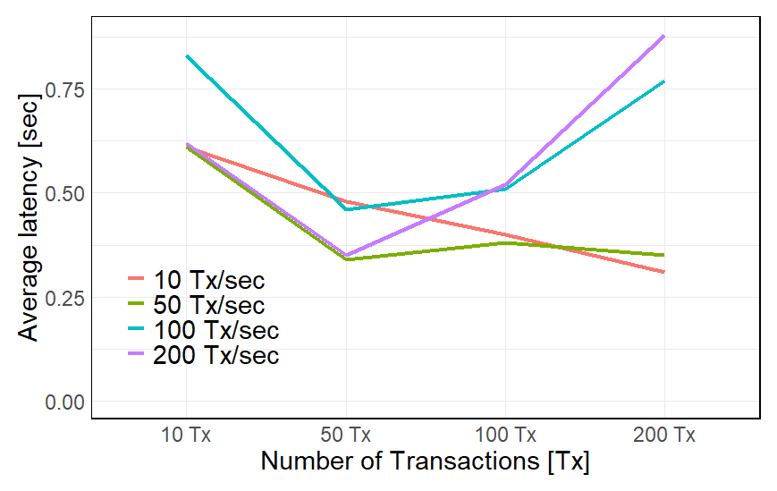
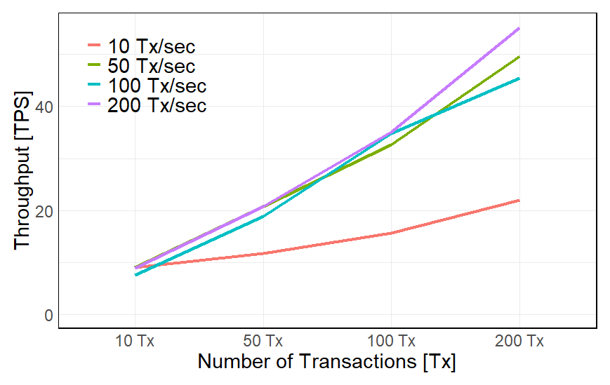
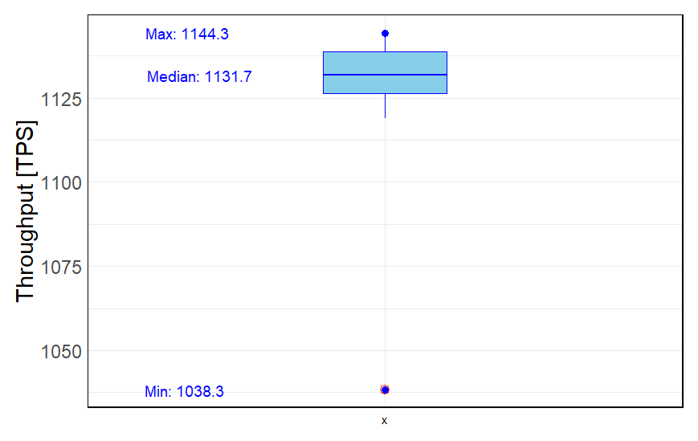
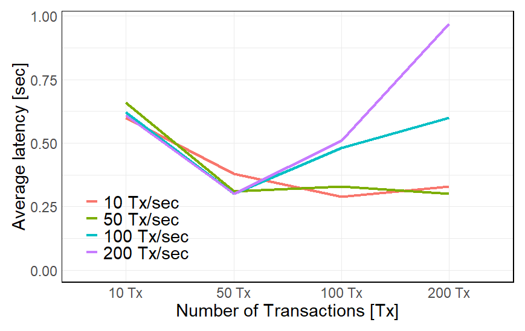
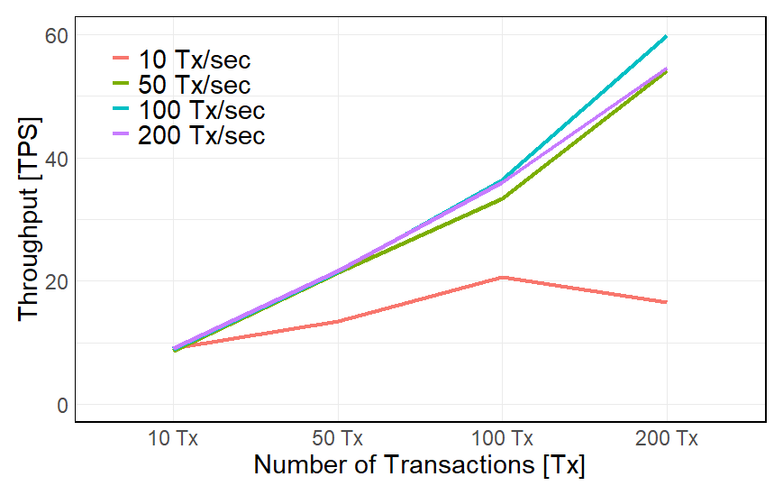
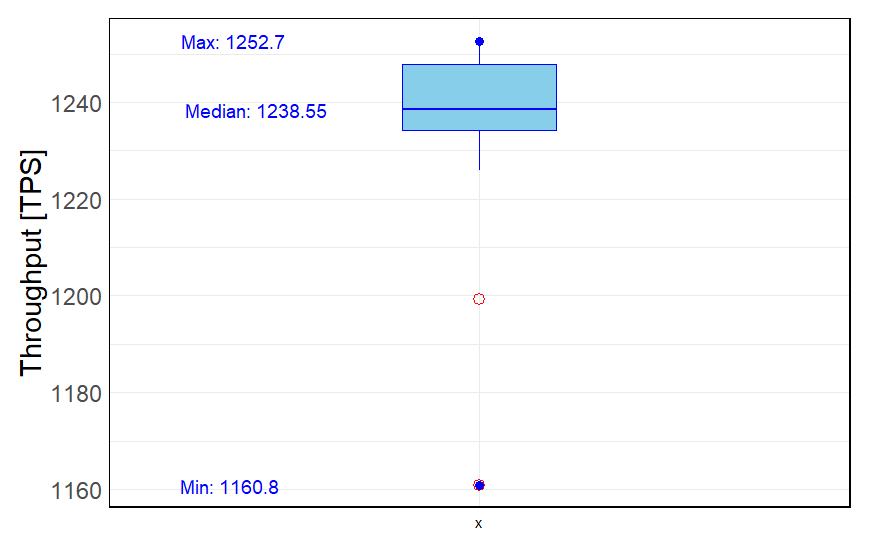
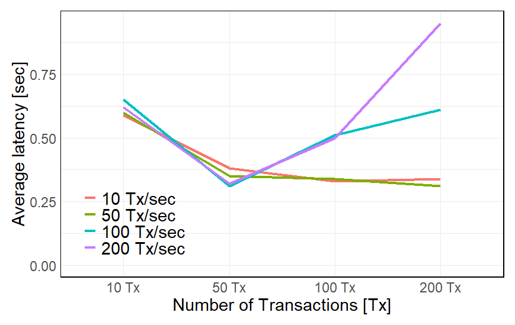
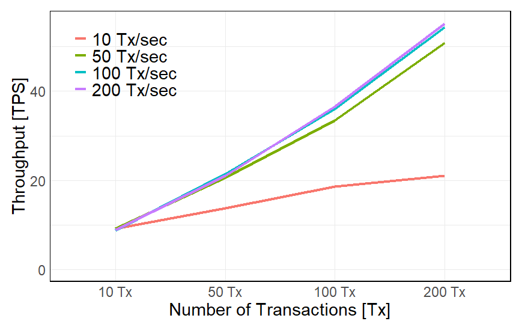
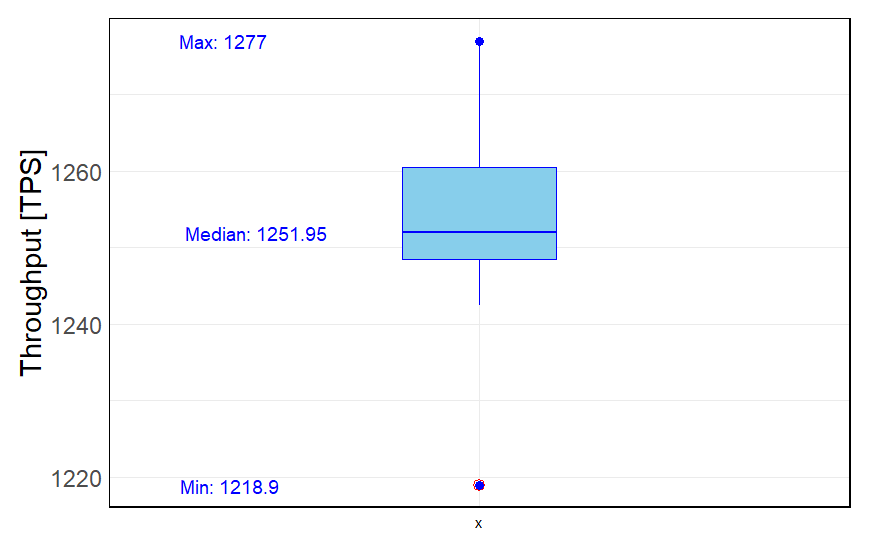

[Main page](../../../README.md)

# Financial Services Chaincode

In this repository, we described and set up Financial services or purchase and Invoice approval processes. Also, a procedural guide for the requisition, ordering, receiving and payment of materials and services.
Creating chaincodes for the financial services of a company shall support the management in doing and making the following:

- The setting of the company’s broad financial strategy.
- Budget and Cost Controlling.
- Data modelling for Financial planning and reporting.
- Decisions on significant capital expenditure on new assets.
- Interpretation and implications of macro and micro economic-financial developments for the enterprise.
- Importance for the company of Government economic and fiscal (tax) legislation and proposals.

The chaincode for the Financial services of an enterprise can be accessed [here](../fin-chaincode).

## Testing platforms
* Hyperledger Fabric `test-network` with `Caliper` benchmarking testing framework ([`Caliper Testing`](#caliper-testing) & [`Test Network`](#test-network)).
* The benchmarking parameters and measuring results can be observed [here](#test-network-measurement-results).
* Hyperledger Fabric on the `Kaleido` Web3 BaaS platform, [`Kaleido Testing`](#kaleido-testing).
* REST API testing with the [`k6`](../../../02-benchmarking-files/k6/k6-linux/README.md) load testing framework.

## Spin up the `test-network`

Follow the instructions from the `caliper` testing repository.

Cleanup the terminal:

```bash
PS1='\e[1;32m\u@\H:\e[0m\e[1;34m\W\e[0m\e[1;33m $:\e[0m '
```

Before we start installing the test-network, we have to ensure that Docker is up and running, and then we navigate to the test-network folder.

```bash
cd ~/go/src/github.com/hyperledger/fabric-samples/test-network/
```

Spin up the `test-network`:

```bash
./network.sh up createChannel -ca -s couchdb
```

Install the `Financial Operations` Smart Contract:

```bash
./network.sh deployCC -ccn finance -ccv 1.0 -ccp //home/vodenica/Desktop/test-network-smart-contracts/08-Financial-Services/fin-chaincode -ccl go
```

The new version of the smart contract is deployed to the `test-network` and the `test-network` is ready for testing. It is important to update the version in the `main.go` file before deploying the smart contract.

```bash
./network.sh deployCC -ccn finance -ccv 1.0 -ccp //home/vodenica/Desktop/test-network-smart-contracts/08-Financial-Services/fin-chaincode -ccl go
```

To test the installed `Financial Operations Services Smart Contract`, navigate to `fabric-samples/test-network` and define all necessary environment variables for `Org1MSP`. Note that TLS is enabled in `test-network`.
Run the following command:

```bash
cd $HOME/go/src/github.com/hyperledger/fabric-samples/test-network
```

```bash
export FABRIC_CFG_PATH=$PWD/../config/
```

```bash
export PATH=${PWD}/../bin:$PATH
```

#### Environmental set-up for `Org1MSP`:

```bash
export CORE_PEER_TLS_ENABLED=true
export CORE_PEER_LOCALMSPID="Org1MSP"
export CORE_PEER_TLS_ROOTCERT_FILE=${PWD}/organizations/peerOrganizations/org1.example.com/peers/peer0.org1.example.com/tls/ca.crt
export CORE_PEER_MSPCONFIGPATH=${PWD}/organizations/peerOrganizations/org1.example.com/users/Admin@org1.example.com/msp
export CORE_PEER_ADDRESS=localhost:7051
```

During the development environment setup phase, we downloaded Hyperledger Fabric
binaries including peer. They are located in the `fabric-samples/bin` folder and utilize
configurations stored in `fabric-samples/config. Therefore, we can update the `PATH variable
and set `FABRIC_CFG_PATH` to simplify `peer binary usage.

```bash
export PATH=${PWD}/../bin:$PATH
```

```bash
export FABRIC_CFG_PATH=$PWD/../config/
```

### Environmental variables for `Org2MSP`.

```bash
cd $HOME/go/src/github.com/hyperledger/fabric-samples/test-network
```

```bash
export CORE_PEER_TLS_ENABLED=true
export CORE_PEER_LOCALMSPID="Org2MSP"
export CORE_PEER_TLS_ROOTCERT_FILE=${PWD}/organizations/peerOrganizations/org2.example.com/peers/peer0.org2.example.com/tls/ca.crt
export CORE_PEER_MSPCONFIGPATH=${PWD}/organizations/peerOrganizations/org2.example.com/users/Admin@org2.example.com/msp
export CORE_PEER_ADDRESS=localhost:9051
```

```bash
export PATH=${PWD}/../bin:$PATH
```

```bash
export FABRIC_CFG_PATH=$PWD/../config/
```

Now, in the Org1MSP terminal window, we can run a peer channel list command to confirm that we are able to use the peer binary without further adjustments.

```bash
peer channel list
```

Response:

```bash
Channels peers has joined:
mychannel
```

The commit transaction is submitted to peers of both `Org1MSP` and `Org2MSP`. The Smart Contract definition is committed to the channel if all targeted peers return successful responses. To confirm this, use the peer lifecycle chaincode `querycommitted` command.

```bash
peer lifecycle chaincode querycommitted --channelID mychannel --name finance --cafile ${PWD}/organizations/ordererOrganizations/example.com/orderers/orderer.example.com/msp/tlscacerts/tlsca.example.com-cert.pem
```

Response:

```bash
Committed chaincode definition for chaincode 'finance' on channel 'mychannel':
Version: 1.0, Sequence: 1, Endorsement Plugin: escc, Validation Plugin: vscc, Approvals: [Org1MSP: true, Org2MSP: true]
```
# Test Network

## Purchase Order

### Smart contract function `NewPurchaseRequestMtncParts`

The function `NewPurchaseRequestMtncParts` is used to create a new purchase order.

```bash
peer chaincode invoke -o localhost:7050 --ordererTLSHostnameOverride orderer.example.com --tls --cafile /home/vodenica/go/src/github.com/hyperledger/fabric-samples/test-network/organizations/ordererOrganizations/example.com/orderers/orderer.example.com/msp/tlscacerts/tlsca.example.com-cert.pem -C mychannel -n finance --peerAddresses localhost:7051 --tlsRootCertFiles /home/vodenica/go/src/github.com/hyperledger/fabric-samples/test-network/organizations/peerOrganizations/org1.example.com/peers/peer0.org1.example.com/tls/ca.crt --peerAddresses localhost:9051 --tlsRootCertFiles /home/vodenica/go/src/github.com/hyperledger/fabric-samples/test-network/organizations/peerOrganizations/org2.example.com/peers/peer0.org2.example.com/tls/ca.crt -c '{"function":"NewPurchaseRequestMtncParts","Args":["purchase-request", "maintenance-parts", "{\"cost_code_item_one\":\"11111\", \"item_description\":\"Maintenance Part\",\"item_one_cost\":100,\"item_one_quantity\":2,\"item_one_total_cost\":200}", "{\"cost_code_item_two\":\"22222\", \"item_description\":\"Maintenance Part\",\"item_two_cost\":100,\"item_two_quantity\":2,\"item_two_total_cost\":200}", "{\"cost_code_item_three\":\"33333\", \"item_description\":\"Maintenance Part\",\"item_three_cost\":100,\"item_three_quantity\":2,\"item_three_total_cost\":200}", "{\"cost_code_item_four\":\"44444\", \"item_description\":\"Maintenance Part\",\"item_four_cost\":100,\"item_four_quantity\":2,\"item_four_total_cost\":200}", "{\"cost_code_item_five\":\"55555\", \"item_description\":\"Maintenance Part\",\"item_five_cost\":100,\"item_five_quantity\":2,\"item_five_total_cost\":200}", "Supplier ID: 123456", "The Purchase Order is issued for the purchase of the maintenance spare parts.", "No remarks"]}'
```
### Smart contract function `UpdatePurchaseOrderToApproved`

The function `UpdatePurchaseOrderToApproved` is used to update the purchase order status to approved. The function takes 3 argument. The first argument is the ID of the purchase order, the second argument is the name of the person who approved the purchase order, and the third argument is the integer which represents the approval status.

```bash
peer chaincode invoke -o localhost:7050 --ordererTLSHostnameOverride orderer.example.com --tls --cafile /home/vodenica/go/src/github.com/hyperledger/fabric-samples/test-network/organizations/ordererOrganizations/example.com/orderers/orderer.example.com/msp/tlscacerts/tlsca.example.com-cert.pem -C mychannel -n finance --peerAddresses localhost:7051 --tlsRootCertFiles /home/vodenica/go/src/github.com/hyperledger/fabric-samples/test-network/organizations/peerOrganizations/org1.example.com/peers/peer0.org1.example.com/tls/ca.crt --peerAddresses localhost:9051 --tlsRootCertFiles /home/vodenica/go/src/github.com/hyperledger/fabric-samples/test-network/organizations/peerOrganizations/org2.example.com/peers/peer0.org2.example.com/tls/ca.crt -c '{"function":"UpdatePurchaseOrderToApproved","Args":["PURCH-20230921-0001", "General Manager", "1"]}'
```

Response:

```json
{
  "_id": "PURCH-20230921-0001",
  "_rev": "2-c5f4dc599068b658dc655e08d4725b30",
  "docType": "purchase-request",
  "purchase_order_approver": "General Manager",
  "purchase_order_created": "2023-09-20",
  "purchase_order_id": "PURCH-20230921-0001",
  "purchase_order_requestor": "Org1MSP",
  "purchase_order_total_cost": 1000,
  "purchase_request_item_five": {
    "cost_code_item_five": "55555",
    "item_description": "Maintenance Part",
    "item_five_cost": 100,
    "item_five_quantity": 2,
    "item_five_total_cost": 200
  },
  "purchase_request_item_four": {
    "cost_code_item_four": "44444",
    "item_description": "Maintenance Part",
    "item_four_cost": 100,
    "item_four_quantity": 2,
    "item_four_total_cost": 200
  },
  "purchase_request_item_one": {
    "cost_code_item_one": "11111",
    "item_description": "Maintenance Part",
    "item_one_cost": 100,
    "item_one_quantity": 2,
    "item_one_total_cost": 200
  },
  "purchase_request_item_three": {
    "cost_code_item_three": "33333",
    "item_description": "Maintenance Part",
    "item_three_cost": 100,
    "item_three_quantity": 2,
    "item_three_total_cost": 200
  },
  "purchase_request_item_two": {
    "cost_code_item_two": "22222",
    "item_description": "Maintenance Part",
    "item_two_cost": 100,
    "item_two_quantity": 2,
    "item_two_total_cost": 200
  },
  "purchase_request_remarks": "No remarks",
  "purchase_request_type": "maintenance-parts",
  "sign_off_received_goods": "not-set",
  "status_of_the_order": "1",
  "status_of_the_urgency": 0,
  "supplier_order_description": "The Purchase Order is issued for the purchase of the maintenance spare parts.",
  "supplier_order_id": "Suplier ID: 123456",
  "verify_condition": 0,
  "verify_delivery": 0,
  "verify_quantity": 0,
  "~version": "CgMBDQA="
}
```
### Smart contract function `GetPurchaseRequestByID`

The function `GetPurchaseOrderByID` is used to get the purchase order by ID. The function takes 1 argument. The first argument is the ID of the purchase order.

Request body:

```bash
peer chaincode invoke -o localhost:7050 --ordererTLSHostnameOverride orderer.example.com --tls --cafile /home/vodenica/go/src/github.com/hyperledger/fabric-samples/test-network/organizations/ordererOrganizations/example.com/orderers/orderer.example.com/msp/tlscacerts/tlsca.example.com-cert.pem -C mychannel -n finance --peerAddresses localhost:7051 --tlsRootCertFiles /home/vodenica/go/src/github.com/hyperledger/fabric-samples/test-network/organizations/peerOrganizations/org1.example.com/peers/peer0.org1.example.com/tls/ca.crt --peerAddresses localhost:9051 --tlsRootCertFiles /home/vodenica/go/src/github.com/hyperledger/fabric-samples/test-network/organizations/peerOrganizations/org2.example.com/peers/peer0.org2.example.com/tls/ca.crt -c '{"function":"GetPurchaseRequestByID","Args":["PURCH-20230921-0001"]}'
```

Response body:

```json
{
  "docType": "purchase-request",
  "purchase_request_type": "maintenance-parts",
  "purchase_order_id": "PURCH-20230921-0001",
  "purchase_order_created": "2023-09-20",
  "purchase_order_requestor": "Org1MSP",
  "purchase_order_approver": "General Manager",
  "purchase_request_item_one": {
    "cost_code_item_one": "11111",
    "item_description": "Maintenance Part",
    "item_one_cost": 100,
    "item_one_quantity": 2,
    "item_one_total_cost": 200
  },
  "purchase_request_item_two": {
    "cost_code_item_two": "22222",
    "item_description": "Maintenance Part",
    "item_two_cost": 100,
    "item_two_quantity": 2,
    "item_two_total_cost": 200
  },
  "purchase_request_item_three": {
    "cost_code_item_three": "33333",
    "item_description": "Maintenance Part",
    "item_three_cost": 100,
    "item_three_quantity": 2,
    "item_three_total_cost": 200
  },
  "purchase_request_item_four": {
    "cost_code_item_four": "44444",
    "item_description": "Maintenance Part",
    "item_four_cost": 100,
    "item_four_quantity": 2,
    "item_four_total_cost": 200
  },
  "purchase_request_item_five": {
    "cost_code_item_five": "55555",
    "item_description": "Maintenance Part",
    "item_five_cost": 100,
    "item_five_quantity": 2,
    "item_five_total_cost": 200
  },
  "supplier_order_id": "Suplier ID: 123456",
  "supplier_order_description": "The Purchase Order is issued for the purchase of the maintenance spare parts.",
  "purchase_order_total_cost": 1000,
  "status_of_the_urgency": 0,
  "status_of_the_order": "1",
  "verify_delivery": 0,
  "verify_quantity": 0,
  "verify_condition": 0,
  "sign_off_received_goods": "not-set",
  "purchase_request_remarks": "No remarks"
}
```
### Smart contract function `UpdateSignOffReceivedGoods`

The function `UpdateSignOffReceivedGoods` is used to update the purchase order status to approved. The function takes 3 argument. The first argument is the ID of the purchase order, the second argument is the name of the person who approved the purchase order, and the third argument is the integer which represents the approval status.

```bash
peer chaincode invoke -o localhost:7050 --ordererTLSHostnameOverride orderer.example.com --tls --cafile /home/vodenica/go/src/github.com/hyperledger/fabric-samples/test-network/organizations/ordererOrganizations/example.com/orderers/orderer.example.com/msp/tlscacerts/tlsca.example.com-cert.pem -C mychannel -n finance --peerAddresses localhost:7051 --tlsRootCertFiles /home/vodenica/go/src/github.com/hyperledger/fabric-samples/test-network/organizations/peerOrganizations/org1.example.com/peers/peer0.org1.example.com/tls/ca.crt --peerAddresses localhost:9051 --tlsRootCertFiles /home/vodenica/go/src/github.com/hyperledger/fabric-samples/test-network/organizations/peerOrganizations/org2.example.com/peers/peer0.org2.example.com/tls/ca.crt -c '{"function":"UpdateSignOffReceivedGoods","Args":["PURCH-20230921-0001", "Maintenance Supervisor"]}'
```

Response `JSON` format data:

```json
{
  "docType": "purchase-request",
  "purchase_request_type": "maintenance-parts",
  "purchase_order_id": "PURCH-20230921-0001",
  "purchase_order_created": "2023-09-20",
  "purchase_order_requestor": "Org1MSP",
  "purchase_order_approver": "General Manager",
  "purchase_request_item_one": {
    "cost_code_item_one": "11111",
    "item_description": "Maintenance Part",
    "item_one_cost": 100,
    "item_one_quantity": 2,
    "item_one_total_cost": 200
  },
  "purchase_request_item_two": {
    "cost_code_item_two": "22222",
    "item_description": "Maintenance Part",
    "item_two_cost": 100,
    "item_two_quantity": 2,
    "item_two_total_cost": 200
  },
  "purchase_request_item_three": {
    "cost_code_item_three": "33333",
    "item_description": "Maintenance Part",
    "item_three_cost": 100,
    "item_three_quantity": 2,
    "item_three_total_cost": 200
  },
  "purchase_request_item_four": {
    "cost_code_item_four": "44444",
    "item_description": "Maintenance Part",
    "item_four_cost": 100,
    "item_four_quantity": 2,
    "item_four_total_cost": 200
  },
  "purchase_request_item_five": {
    "cost_code_item_five": "55555",
    "item_description": "Maintenance Part",
    "item_five_cost": 100,
    "item_five_quantity": 2,
    "item_five_total_cost": 200
  },
  "supplier_order_id": "Suplier ID: 123456",
  "supplier_order_description": "The Purchase Order is issued for the purchase of the maintenance spare parts.",
  "purchase_order_total_cost": 1000,
  "status_of_the_urgency": 0,
  "status_of_the_order": "1",
  "verify_delivery": 0,
  "verify_quantity": 0,
  "verify_condition": 0,
  "sign_off_received_goods": "Maintenance Supervisor",
  "purchase_request_remarks": "No remarks"
}
```

### Smart contract function `GetPurchaseRequestHistory`

The function `GetPurchaseRequestHistory` is used to get the history of the purchase request. The function takes 1 argument. The first argument is the ID of the purchase request.

Request body:

```bash
peer chaincode invoke -o localhost:7050 --ordererTLSHostnameOverride orderer.example.com --tls --cafile /home/vodenica/go/src/github.com/hyperledger/fabric-samples/test-network/organizations/ordererOrganizations/example.com/orderers/orderer.example.com/msp/tlscacerts/tlsca.example.com-cert.pem -C mychannel -n finance --peerAddresses localhost:7051 --tlsRootCertFiles /home/vodenica/go/src/github.com/hyperledger/fabric-samples/test-network/organizations/peerOrganizations/org1.example.com/peers/peer0.org1.example.com/tls/ca.crt --peerAddresses localhost:9051 --tlsRootCertFiles /home/vodenica/go/src/github.com/hyperledger/fabric-samples/test-network/organizations/peerOrganizations/org2.example.com/peers/peer0.org2.example.com/tls/ca.crt -c '{"function":"GetPurchaseRequestHistory","Args":["PURCH-20230921-0001"]}'
```

Response body in `JSON` format:

```json
[
  {
    "record": {
      "docType": "purchase-request",
      "purchase_request_type": "maintenance-parts",
      "purchase_order_id": "PURCH-20230921-0001",
      "purchase_order_created": "2023-09-20",
      "purchase_order_requestor": "Org1MSP",
      "purchase_order_approver": "General Manager",
      "purchase_request_item_one": {
        "cost_code_item_one": "11111",
        "item_description": "Maintenance Part",
        "item_one_cost": 100,
        "item_one_quantity": 2,
        "item_one_total_cost": 200
      },
      "purchase_request_item_two": {
        "cost_code_item_two": "22222",
        "item_description": "Maintenance Part",
        "item_two_cost": 100,
        "item_two_quantity": 2,
        "item_two_total_cost": 200
      },
      "purchase_request_item_three": {
        "cost_code_item_three": "33333",
        "item_description": "Maintenance Part",
        "item_three_cost": 100,
        "item_three_quantity": 2,
        "item_three_total_cost": 200
      },
      "purchase_request_item_four": {
        "cost_code_item_four": "44444",
        "item_description": "Maintenance Part",
        "item_four_cost": 100,
        "item_four_quantity": 2,
        "item_four_total_cost": 200
      },
      "purchase_request_item_five": {
        "cost_code_item_five": "55555",
        "item_description": "Maintenance Part",
        "item_five_cost": 100,
        "item_five_quantity": 2,
        "item_five_total_cost": 200
      },
      "supplier_order_id": "Supplier ID: 123456",
      "supplier_order_description": "The Purchase Order is issued for the purchase of the maintenance spare parts.",
      "purchase_order_total_cost": 1000,
      "status_of_the_urgency": 0,
      "status_of_the_order": "1",
      "verify_delivery": 0,
      "verify_quantity": 0,
      "verify_condition": 0,
      "sign_off_received_goods": "Maintenance Supervisor",
      "purchase_request_remarks": "No remarks"
    },
    "txId": "8554ec670a221aea5b5fe4ee201c542344261465bfdefe2b9fb944ab8fa5183e",
    "timestamp": "2023-09-21T00:06:13.424220425Z",
    "isDelete": false
  },
  {
    "record": {
      "docType": "purchase-request",
      "purchase_request_type": "maintenance-parts",
      "purchase_order_id": "PURCH-20230921-0001",
      "purchase_order_created": "2023-09-20",
      "purchase_order_requestor": "Org1MSP",
      "purchase_order_approver": "General Manager",
      "purchase_request_item_one": {
        "cost_code_item_one": "11111",
        "item_description": "Maintenance Part",
        "item_one_cost": 100,
        "item_one_quantity": 2,
        "item_one_total_cost": 200
      },
      "purchase_request_item_two": {
        "cost_code_item_two": "22222",
        "item_description": "Maintenance Part",
        "item_two_cost": 100,
        "item_two_quantity": 2,
        "item_two_total_cost": 200
      },
      "purchase_request_item_three": {
        "cost_code_item_three": "33333",
        "item_description": "Maintenance Part",
        "item_three_cost": 100,
        "item_three_quantity": 2,
        "item_three_total_cost": 200
      },
      "purchase_request_item_four": {
        "cost_code_item_four": "44444",
        "item_description": "Maintenance Part",
        "item_four_cost": 100,
        "item_four_quantity": 2,
        "item_four_total_cost": 200
      },
      "purchase_request_item_five": {
        "cost_code_item_five": "55555",
        "item_description": "Maintenance Part",
        "item_five_cost": 100,
        "item_five_quantity": 2,
        "item_five_total_cost": 200
      },
      "supplier_order_id": "Supplier ID: 123456",
      "supplier_order_description": "The Purchase Order is issued for the purchase of the maintenance spare parts.",
      "purchase_order_total_cost": 1000,
      "status_of_the_urgency": 0,
      "status_of_the_order": "1",
      "verify_delivery": 0,
      "verify_quantity": 0,
      "verify_condition": 0,
      "sign_off_received_goods": "not-set",
      "purchase_request_remarks": "No remarks"
    },
    "txId": "216bef498a625379e70662604e91d4786446e1912fa06e519a75b79d307d3514",
    "timestamp": "2023-09-20T23:27:53.615776423Z",
    "isDelete": false
  },
  {
    "record": {
      "docType": "purchase-request",
      "purchase_request_type": "maintenance-parts",
      "purchase_order_id": "PURCH-20230921-0001",
      "purchase_order_created": "2023-09-20",
      "purchase_order_requestor": "Org1MSP",
      "purchase_order_approver": "not-set",
      "purchase_request_item_one": {
        "cost_code_item_one": "11111",
        "item_description": "Maintenance Part",
        "item_one_cost": 100,
        "item_one_quantity": 2,
        "item_one_total_cost": 200
      },
      "purchase_request_item_two": {
        "cost_code_item_two": "22222",
        "item_description": "Maintenance Part",
        "item_two_cost": 100,
        "item_two_quantity": 2,
        "item_two_total_cost": 200
      },
      "purchase_request_item_three": {
        "cost_code_item_three": "33333",
        "item_description": "Maintenance Part",
        "item_three_cost": 100,
        "item_three_quantity": 2,
        "item_three_total_cost": 200
      },
      "purchase_request_item_four": {
        "cost_code_item_four": "44444",
        "item_description": "Maintenance Part",
        "item_four_cost": 100,
        "item_four_quantity": 2,
        "item_four_total_cost": 200
      },
      "purchase_request_item_five": {
        "cost_code_item_five": "55555",
        "item_description": "Maintenance Part",
        "item_five_cost": 100,
        "item_five_quantity": 2,
        "item_five_total_cost": 200
      },
      "supplier_order_id": "Supplier ID: 123456",
      "supplier_order_description": "The Purchase Order is issued for the purchase of the maintenance spare parts.",
      "purchase_order_total_cost": 1000,
      "status_of_the_urgency": 0,
      "status_of_the_order": "Open",
      "verify_delivery": 0,
      "verify_quantity": 0,
      "verify_condition": 0,
      "sign_off_received_goods": "not-set",
      "purchase_request_remarks": "No remarks"
    },
    "txId": "0e3b2441b92081dbee422a1439372f7e7d29dad0ca2a8e64dfc8b79809f2358d",
    "timestamp": "2023-09-20T23:20:37.70081531Z",
    "isDelete": false
  }
]
```
## Operations Invoice

### Smart contract function `NewInvoiceOperationalServices`

The function `NewInvoiceOperationalServices` is used to create a new invoice for operational services. The function takes 1 argument. The first argument is the ID of the invoice.

```bash
peer chaincode invoke -o localhost:7050 --ordererTLSHostnameOverride orderer.example.com --tls --cafile ${PWD}/organizations/ordererOrganizations/example.com/orderers/orderer.example.com/msp/tlscacerts/tlsca.example.com-cert.pem -C mychannel -n finance --peerAddresses localhost:7051 --tlsRootCertFiles ${PWD}/organizations/peerOrganizations/org1.example.com/peers/peer0.org1.example.com/tls/ca.crt --peerAddresses localhost:9051 --tlsRootCertFiles ${PWD}/organizations/peerOrganizations/org2.example.com/peers/peer0.org2.example.com/tls/ca.crt -c '{"function":"NewInvoiceOperationalServices","Args":["invoice", "operations", "INV-OPS-20230920-0001", "200000", "0", "10000", "8000", "5000"]}'
```

The `JSON` form data of the created operational invoice on the ledger is as follows:

```json
{
  "_id": "INV-OPS-20230920-0001",
  "_rev": "1-246bbfa901ea6eb926bb4d6adaedc087",
  "billing_period_ops_services": "Billing Period For Operational Services Rendered in August 2023",
  "company_registration_number": "Reg.No. 123456789",
  "cpi_adjustment": 8000,
  "docType": "invoice",
  "downtime_deduction": 10000,
  "invoice_approval_status": "Pending",
  "invoice_cost_code": 1000,
  "invoice_date": "2023-09-19",
  "invoice_description": "Invoice for Operational Services September 2023",
  "invoice_id": "INV-OPS-20230920-0001",
  "invoice_operational_cost": 200000,
  "invoice_status": "Issued",
  "invoice_type_ops": "operations",
  "other_agreed_reductions": 5000,
  "payment_terms": "30 days",
  "total_service_invoice_cost": 193000,
  "variation_additional_expenses": 0,
  "~version": "CgMBDQA="
}
```

### Smart contract function `UpdateInvoiceOpsStatusToApproved`

The function `UpdateInvoiceOpsStatusToApproved` is used to update the invoice status to approved. The function takes 1 argument. The first argument is the ID of the invoice.

```bash
peer chaincode invoke -o localhost:7050 --ordererTLSHostnameOverride orderer.example.com --tls --cafile ${PWD}/organizations/ordererOrganizations/example.com/orderers/orderer.example.com/msp/tlscacerts/tlsca.example.com-cert.pem -C mychannel -n finance --peerAddresses localhost:7051 --tlsRootCertFiles ${PWD}/organizations/peerOrganizations/org1.example.com/peers/peer0.org1.example.com/tls/ca.crt --peerAddresses localhost:9051 --tlsRootCertFiles ${PWD}/organizations/peerOrganizations/org2.example.com/peers/peer0.org2.example.com/tls/ca.crt -c '{"function":"UpdateInvoiceOpsStatusToApproved","Args":["INV-OPS-20230920-0001"]}'
```

Response body:

```json
{
  "_id": "INV-OPS-20230920-0001",
  "_rev": "2-74a63dcce43fa78f922173fbb48485d5",
  "billing_period_ops_services": "Billing Period For Operational Services Rendered in August 2023",
  "company_registration_number": "Reg.No. 123456789",
  "cpi_adjustment": 8000,
  "docType": "invoice",
  "downtime_deduction": 10000,
  "invoice_approval_status": "Approved",
  "invoice_cost_code": 1000,
  "invoice_date": "2023-09-19",
  "invoice_description": "Invoice for Operational Services September 2023",
  "invoice_id": "INV-OPS-20230920-0001",
  "invoice_operational_cost": 200000,
  "invoice_status": "Issued",
  "invoice_type_ops": "operations",
  "other_agreed_reductions": 5000,
  "payment_terms": "30 days",
  "total_service_invoice_cost": 193000,
  "variation_additional_expenses": 0,
  "~version": "CgMBDgA="
}
```

### Smart contract function `GetInvoiceByID`

The function `GetInvoiceByID` is used to get the invoice by ID. The function takes 1 argument. The first argument is the ID of the invoice.

Request body:

```bash
peer chaincode invoke -o localhost:7050 --ordererTLSHostnameOverride orderer.example.com --tls --cafile ${PWD}/organizations/ordererOrganizations/example.com/orderers/orderer.example.com/msp/tlscacerts/tlsca.example.com-cert.pem -C mychannel -n finance --peerAddresses localhost:7051 --tlsRootCertFiles ${PWD}/organizations/peerOrganizations/org1.example.com/peers/peer0.org1.example.com/tls/ca.crt --peerAddresses localhost:9051 --tlsRootCertFiles ${PWD}/organizations/peerOrganizations/org2.example.com/peers/peer0.org2.example.com/tls/ca.crt -c '{"function":"GetInvoiceOpsByID","Args":["INV-OPS-20230920-0001"]}'
```

The `JSON` data format response:

```json
{
  "docType": "invoice",
  "invoice_type_ops": "operations",
  "invoice_id": "INV-OPS-20230920-0001",
  "company_registration_number": "Reg.No. 123456789",
  "invoice_date": "2023-09-19",
  "payment_terms": "30 days",
  "billing_period_ops_services": "Billing Period For Operational Services Rendered in August 2023",
  "invoice_description": "Invoice for Operational Services September 2023",
  "invoice_cost_code": 1000,
  "invoice_operational_cost": 200000,
  "variation_additional_expenses": 0,
  "downtime_deduction": 10000,
  "cpi_adjustment": 8000,
  "other_agreed_reductions": 5000,
  "total_service_invoice_cost": 193000,
  "invoice_approval_status": "Approved",
  "invoice_status": "Issued"
}
```

### Smart contract function `GetInvoiceOpsRequestHistory`

The function `GetInvoiceOpsRequestHistory` is used to get the history of the invoice request. The function takes 1 argument. The first argument is the ID of the invoice.

Request body:

```bash
peer chaincode invoke -o localhost:7050 --ordererTLSHostnameOverride orderer.example.com --tls --cafile ${PWD}/organizations/ordererOrganizations/example.com/orderers/orderer.example.com/msp/tlscacerts/tlsca.example.com-cert.pem -C mychannel -n finance --peerAddresses localhost:7051 --tlsRootCertFiles ${PWD}/organizations/peerOrganizations/org1.example.com/peers/peer0.org1.example.com/tls/ca.crt --peerAddresses localhost:9051 --tlsRootCertFiles ${PWD}/organizations/peerOrganizations/org2.example.com/peers/peer0.org2.example.com/tls/ca.crt -c '{"function":"GetInvoiceOpsRequestHistory","Args":["INV-OPS-20230920-0001"]}'
```

Response `JSON` format data on the ledger:

```json
[
  {
    "record": {
      "docType": "invoice",
      "invoice_type_ops": "operations",
      "invoice_id": "INV-OPS-20230920-0001",
      "company_registration_number": "Reg.No. 123456789",
      "invoice_date": "2023-09-19",
      "payment_terms": "30 days",
      "billing_period_ops_services": "Billing Period For Operational Services Rendered in August 2023",
      "invoice_description": "Invoice for Operational Services September 2023",
      "invoice_cost_code": 1000,
      "invoice_operational_cost": 200000,
      "variation_additional_expenses": 0,
      "downtime_deduction": 10000,
      "cpi_adjustment": 8000,
      "other_agreed_reductions": 5000,
      "total_service_invoice_cost": 193000,
      "invoice_approval_status": "Approved",
      "invoice_status": "Issued"
    },
    "txId": "634d6e1f7e02a280f64b66f17c661c3d1c8471ad3569c62c5eee69914d651324",
    "timestamp": "2023-09-19T22:08:37.99181429Z",
    "isDelete": false
  },
  {
    "record": {
      "docType": "invoice",
      "invoice_type_ops": "operations",
      "invoice_id": "INV-OPS-20230920-0001",
      "company_registration_number": "Reg.No. 123456789",
      "invoice_date": "2023-09-19",
      "payment_terms": "30 days",
      "billing_period_ops_services": "Billing Period For Operational Services Rendered in August 2023",
      "invoice_description": "Invoice for Operational Services September 2023",
      "invoice_cost_code": 1000,
      "invoice_operational_cost": 200000,
      "variation_additional_expenses": 0,
      "downtime_deduction": 10000,
      "cpi_adjustment": 8000,
      "other_agreed_reductions": 5000,
      "total_service_invoice_cost": 193000,
      "invoice_approval_status": "Pending",
      "invoice_status": "Issued"
    },
    "txId": "0ed47366db6c67ca90a66776bd728e6fabbf30ff761d0e0bc7dfdeb965f2ab57",
    "timestamp": "2023-09-19T22:05:00.370762139Z",
    "isDelete": false
  }
]
```
## Additional Work Invoice

### Smart contract function `NewInvoiceAdditionalWork`

```bash
peer chaincode invoke -o localhost:7050 --ordererTLSHostnameOverride orderer.example.com --tls --cafile ${PWD}/organizations/ordererOrganizations/example.com/orderers/orderer.example.com/msp/tlscacerts/tlsca.example.com-cert.pem -C mychannel -n finance --peerAddresses localhost:7051 --tlsRootCertFiles ${PWD}/organizations/peerOrganizations/org1.example.com/peers/peer0.org1.example.com/tls/ca.crt --peerAddresses localhost:9051 --tlsRootCertFiles ${PWD}/organizations/peerOrganizations/org2.example.com/peers/peer0.org2.example.com/tls/ca.crt -c '{"function":"NewInvoiceAdditionalWork","Args":["invoice", "additional-work", "INV-WORK-20230920-0001", "The Invoice is issued for the completed additional works.", "1000", "1", "{\"invoice_item_one_qty\":2, \"invoice_item_one_item_cost\":100, \"invoice_item_one_cost\":200}", "{\"invoice_item_two_qty\":1, \"invoice_item_two_item_cost\":50, \"invoice_item_two_cost\":50}", "{\"invoice_item_three_qty\":4, \"invoice_item_three_item_cost\":25, \"invoice_item_three_cost\":100}", "{\"invoice_item_four_qty\":3, \"invoice_item_four_item_cost\":50, \"invoice_item_four_cost\":150}", "{\"invoice_item_five_qty\":30, \"invoice_item_five_item_cost\":4, \"invoice_item_five_cost\":120}"]}'
```

Response body in `JSON` format, as recorded on the ledger:

```json
{
  "_id": "INV-WORK-20230920-0001",
  "_rev": "1-79431dc9f38126069ae9b15fdccab844",
  "billing_period_additional_work": "Billing Period For Additional Work Rendered from 2020-01-01 to 2020-01-31",
  "company_registration_number": "Reg.No. 123456789",
  "docType": "invoice",
  "invoice_approval_status": "Pending",
  "invoice_cost_code": 1000,
  "invoice_date": "2023-09-19",
  "invoice_description": "The Invoice is issued for the completed additional works.",
  "invoice_id": "INV-WORK-20230920-0001",
  "invoice_item_five": {
    "invoice_item_five_cost": 120,
    "invoice_item_five_item_cost": 4,
    "invoice_item_five_qty": 30
  },
  "invoice_item_four": {
    "invoice_item_four_cost": 150,
    "invoice_item_four_item_cost": 50,
    "invoice_item_four_qty": 3
  },
  "invoice_item_one": {
    "invoice_item_one_cost": 200,
    "invoice_item_one_item_cost": 100,
    "invoice_item_one_qty": 2
  },
  "invoice_item_three": {
    "invoice_item_three_cost": 100,
    "invoice_item_three_item_cost": 25,
    "invoice_item_three_qty": 4
  },
  "invoice_item_two": {
    "invoice_item_two_cost": 50,
    "invoice_item_two_item_cost": 50,
    "invoice_item_two_qty": 1
  },
  "invoice_status": "Issued",
  "invoice_type_work": "additional-work",
  "payment_terms": "30 days",
  "total_add_work_invoice_cost": 621,
  "variation_additional_expenses_add_work": 1,
  "~version": "CgMBFAA="
}
```

### Smart contract function `UpdateInvoiceAddWorkStatusToApproved`

The function `UpdateInvoiceAddWorkStatusToApproved` is used to update the invoice status to approved. The function takes 1 argument. The first argument is the ID of the invoice.

```bash
peer chaincode invoke -o localhost:7050 --ordererTLSHostnameOverride orderer.example.com --tls --cafile ${PWD}/organizations/ordererOrganizations/example.com/orderers/orderer.example.com/msp/tlscacerts/tlsca.example.com-cert.pem -C mychannel -n finance --peerAddresses localhost:7051 --tlsRootCertFiles ${PWD}/organizations/peerOrganizations/org1.example.com/peers/peer0.org1.example.com/tls/ca.crt --peerAddresses localhost:9051 --tlsRootCertFiles ${PWD}/organizations/peerOrganizations/org2.example.com/peers/peer0.org2.example.com/tls/ca.crt -c '{"function":"UpdateInvoiceWorkStatusToApproved","Args":["INV-WORK-20230920-0001"]}'
```

Response:

```bash
2023-09-20 07:37:19.206 CST [chaincodeCmd] chaincodeInvokeOrQuery -> INFO 001 Chaincode invoke successful. result: status:200
```

### Smart contract function `GetInvoiceAddWorkByID`

The function `GetInvoiceAddWorkByID` is used to get the invoice by ID. The function takes 1 argument. The first argument is the ID of the invoice.

Request body:

```bash
peer chaincode invoke -o localhost:7050 --ordererTLSHostnameOverride orderer.example.com --tls --cafile /home/vodenica/go/src/github.com/hyperledger/fabric-samples/test-network/organizations/ordererOrganizations/example.com/orderers/orderer.example.com/msp/tlscacerts/tlsca.example.com-cert.pem -C mychannel -n finance --peerAddresses localhost:7051 --tlsRootCertFiles /home/vodenica/go/src/github.com/hyperledger/fabric-samples/test-network/organizations/peerOrganizations/org1.example.com/peers/peer0.org1.example.com/tls/ca.crt --peerAddresses localhost:9051 --tlsRootCertFiles /home/vodenica/go/src/github.com/hyperledger/fabric-samples/test-network/organizations/peerOrganizations/org2.example.com/peers/peer0.org2.example.com/tls/ca.crt -c '{"function":"GetInvoiceWorkByID","Args":["INV-WORK-20230920-0001"]}'
```

### Smart contract function `GetInvoiceWorkRequestHistory`

The function `GetInvoiceWorkRequestHistory` is used to get the history of the invoice request. The function takes 1 argument. The first argument is the ID of the invoice.

Request body:

```bash
peer chaincode invoke -o localhost:7050 --ordererTLSHostnameOverride orderer.example.com --tls --cafile /home/vodenica/go/src/github.com/hyperledger/fabric-samples/test-network/organizations/ordererOrganizations/example.com/orderers/orderer.example.com/msp/tlscacerts/tlsca.example.com-cert.pem -C mychannel -n finance --peerAddresses localhost:7051 --tlsRootCertFiles /home/vodenica/go/src/github.com/hyperledger/fabric-samples/test-network/organizations/peerOrganizations/org1.example.com/peers/peer0.org1.example.com/tls/ca.crt --peerAddresses localhost:9051 --tlsRootCertFiles /home/vodenica/go/src/github.com/hyperledger/fabric-samples/test-network/organizations/peerOrganizations/org2.example.com/peers/peer0.org2.example.com/tls/ca.crt -c '{"function":"GetInvoiceWorkRequestHistory","Args":["INV-WORK-20230920-0001"]}'
```
[Back on top](#testing-platforms)

# Kaleido testing

## Purchase requests

### Smart contract function `NewPurchaseRequestMtncParts`

The function `NewPurchaseRequestMtncParts` is used to create a new purchase request for maintenance parts. The function takes 1 argument. The first argument is the ID of the purchase request.

Request body:

```json
{
  "headers": {
    "type": "SendTransaction",
    "signer": "Operations Supervisor",
    "channel": "default-channel",
    "chaincode": "finfinancial"
  },
  "func": "NewPurchaseRequestMtncParts",
  "args": [
    "purchase-request",
    "maintenance-parts",
    "{\"cost_code_item_one\":\"11111\", \"item_description\":\"Maintenance Part\",\"item_one_cost\":100,\"item_one_quantity\":2,\"item_one_total_cost\":200}",
    "{\"cost_code_item_two\":\"22222\", \"item_description\":\"Maintenance Part\",\"item_two_cost\":100,\"item_two_quantity\":2,\"item_two_total_cost\":200}",
    "{\"cost_code_item_three\":\"33333\", \"item_description\":\"Maintenance Part\",\"item_three_cost\":100,\"item_three_quantity\":2,\"item_three_total_cost\":200}",
    "{\"cost_code_item_four\":\"44444\", \"item_description\":\"Maintenance Part\",\"item_four_cost\":100,\"item_four_quantity\":2,\"item_four_total_cost\":200}",
    "{\"cost_code_item_five\":\"55555\", \"item_description\":\"Maintenance Part\",\"item_five_cost\":100,\"item_five_quantity\":2,\"item_five_total_cost\":200}",
    "Supplier ID: 123456",
    "The Purchase Order is issued for the purchase of the maintenance spare parts.",
    "No remarks"
  ],
  "init": false
}
```
Response body:

```json
{
  "headers": {
    "id": "e9b785b8-e853-4a36-50ef-b40912eb3879",
    "type": "TransactionSuccess",
    "timeReceived": "2023-09-21T00:31:13.688601599Z",
    "timeElapsed": 0.455474076,
    "requestOffset": "",
    "requestId": ""
  },
  "blockNumber": 1112,
  "signerMSP": "u0mk35n6yh",
  "signer": "Operations Supervisor",
  "transactionID": "73e50645e3959a8fafa3eeb71429066ab942ffda7171627f9d8cefa09f9d8b40",
  "status": "VALID"
}
```

Tx id:

```
73e50645e3959a8fafa3eeb71429066ab942ffda7171627f9d8cefa09f9d8b40
```

Response body recorded on the ledger in `JSON` format:

```json
{
  "docType": "purchase-request",
  "purchase_request_type": "maintenance-parts",
  "purchase_order_id": "PURCH-20230921-0001X",
  "purchase_order_created": "2023-09-21",
  "purchase_order_requestor": "u0mk35n6yh",
  "purchase_order_approver": "not-set",
  "purchase_request_item_one": {
    "cost_code_item_one": "11111",
    "item_description": "Maintenance Part",
    "item_one_cost": 100,
    "item_one_quantity": 2,
    "item_one_total_cost": 200
  },
  "purchase_request_item_two": {
    "cost_code_item_two": "22222",
    "item_description": "Maintenance Part",
    "item_two_cost": 100,
    "item_two_quantity": 2,
    "item_two_total_cost": 200
  },
  "purchase_request_item_three": {
    "cost_code_item_three": "33333",
    "item_description": "Maintenance Part",
    "item_three_cost": 100,
    "item_three_quantity": 2,
    "item_three_total_cost": 200
  },
  "purchase_request_item_four": {
    "cost_code_item_four": "44444",
    "item_description": "Maintenance Part",
    "item_four_cost": 100,
    "item_four_quantity": 2,
    "item_four_total_cost": 200
  },
  "purchase_request_item_five": {
    "cost_code_item_five": "55555",
    "item_description": "Maintenance Part",
    "item_five_cost": 100,
    "item_five_quantity": 2,
    "item_five_total_cost": 200
  },
  "supplier_order_id": "Supplier ID: 123456",
  "supplier_order_description": "The Purchase Order is issued for the purchase of the maintenance spare parts.",
  "purchase_order_total_cost": 1000,
  "status_of_the_urgency": 0,
  "status_of_the_order": "Open",
  "verify_delivery": 0,
  "verify_quantity": 0,
  "verify_condition": 0,
  "sign_off_received_goods": "not-set",
  "purchase_request_remarks": "No remarks"
}
```

### Smart contract function `UpdatePurchaseOrderToApproved`

Request body:

```json
{
  "headers": {
    "type": "SendTransaction",
    "signer": "Operations Supervisor",
    "channel": "default-channel",
    "chaincode": "finfinancial"
  },
  "func": "UpdatePurchaseOrderToApproved",
  "args": ["PURCH-20230921-0001X", "General Manager", "Approved"],
  "init": false
}
```

Response body:

```json
{
  "headers": {
    "id": "00ee8964-19d4-42b9-64f5-f354e320b6da",
    "type": "TransactionSuccess",
    "timeReceived": "2023-09-21T00:37:31.897375943Z",
    "timeElapsed": 0.332071192,
    "requestOffset": "",
    "requestId": ""
  },
  "blockNumber": 1113,
  "signerMSP": "u0mk35n6yh",
  "signer": "Operations Supervisor",
  "transactionID": "98bbc3d19c11e5674ee0431e327d23a24b7cf3c863ba8382215785f182ebf3c4",
  "status": "VALID"
}
```

Response body on the ledger in `JSON` format:

```json
{
  "docType": "purchase-request",
  "purchase_request_type": "maintenance-parts",
  "purchase_order_id": "PURCH-20230921-0001X",
  "purchase_order_created": "2023-09-21",
  "purchase_order_requestor": "u0mk35n6yh",
  "purchase_order_approver": "General Manager",
  "purchase_request_item_one": {
    "cost_code_item_one": "11111",
    "item_description": "Maintenance Part",
    "item_one_cost": 100,
    "item_one_quantity": 2,
    "item_one_total_cost": 200
  },
  "purchase_request_item_two": {
    "cost_code_item_two": "22222",
    "item_description": "Maintenance Part",
    "item_two_cost": 100,
    "item_two_quantity": 2,
    "item_two_total_cost": 200
  },
  "purchase_request_item_three": {
    "cost_code_item_three": "33333",
    "item_description": "Maintenance Part",
    "item_three_cost": 100,
    "item_three_quantity": 2,
    "item_three_total_cost": 200
  },
  "purchase_request_item_four": {
    "cost_code_item_four": "44444",
    "item_description": "Maintenance Part",
    "item_four_cost": 100,
    "item_four_quantity": 2,
    "item_four_total_cost": 200
  },
  "purchase_request_item_five": {
    "cost_code_item_five": "55555",
    "item_description": "Maintenance Part",
    "item_five_cost": 100,
    "item_five_quantity": 2,
    "item_five_total_cost": 200
  },
  "supplier_order_id": "Supplier ID: 123456",
  "supplier_order_description": "The Purchase Order is issued for the purchase of the maintenance spare parts.",
  "purchase_order_total_cost": 1000,
  "status_of_the_urgency": 0,
  "status_of_the_order": "1",
  "verify_delivery": 0,
  "verify_quantity": 0,
  "verify_condition": 0,
  "sign_off_received_goods": "not-set",
  "purchase_request_remarks": "No remarks"
}
```
### Smart contract function `GetPurchaseRequestHistory`

Request body:

```json
{
  "headers": {
    "type": "SendTransaction",
    "signer": "Operations Supervisor",
    "channel": "default-channel",
    "chaincode": "finfinancial"
  },
  "func": "GetPurchaseRequestHistory",
  "args": ["PURCH-20230921-0001X"],
  "init": false
}
```
Response body:

```json
{
  "headers": {
    "channel": "default-channel",
    "timeReceived": "",
    "timeElapsed": 0,
    "requestOffset": "",
    "requestId": ""
  },
  "result": [
    {
      "isDelete": false,
      "record": {
        "docType": "purchase-request",
        "purchase_order_approver": "General Manager",
        "purchase_order_created": "2023-09-21",
        "purchase_order_id": "PURCH-20230921-0001X",
        "purchase_order_requestor": "u0mk35n6yh",
        "purchase_order_total_cost": 1000,
        "purchase_request_item_five": {
          "cost_code_item_five": "55555",
          "item_description": "Maintenance Part",
          "item_five_cost": 100,
          "item_five_quantity": 2,
          "item_five_total_cost": 200
        },
        "purchase_request_item_four": {
          "cost_code_item_four": "44444",
          "item_description": "Maintenance Part",
          "item_four_cost": 100,
          "item_four_quantity": 2,
          "item_four_total_cost": 200
        },
        "purchase_request_item_one": {
          "cost_code_item_one": "11111",
          "item_description": "Maintenance Part",
          "item_one_cost": 100,
          "item_one_quantity": 2,
          "item_one_total_cost": 200
        },
        "purchase_request_item_three": {
          "cost_code_item_three": "33333",
          "item_description": "Maintenance Part",
          "item_three_cost": 100,
          "item_three_quantity": 2,
          "item_three_total_cost": 200
        },
        "purchase_request_item_two": {
          "cost_code_item_two": "22222",
          "item_description": "Maintenance Part",
          "item_two_cost": 100,
          "item_two_quantity": 2,
          "item_two_total_cost": 200
        },
        "purchase_request_remarks": "No remarks",
        "purchase_request_type": "maintenance-parts",
        "sign_off_received_goods": "not-set",
        "status_of_the_order": "Approved",
        "status_of_the_urgency": 0,
        "supplier_order_description": "The Purchase Order is issued for the purchase of the maintenance spare parts.",
        "supplier_order_id": "Supplier ID: 123456",
        "verify_condition": 0,
        "verify_delivery": 0,
        "verify_quantity": 0
      },
      "timestamp": "2023-09-21T00:41:39.112287173Z",
      "txId": "782d9a0bdb1994fa9ae382db7390f1985a940893e86f63383e988c757ead623f"
    },
    {
      "isDelete": false,
      "record": {
        "docType": "purchase-request",
        "purchase_order_approver": "General Manager",
        "purchase_order_created": "2023-09-21",
        "purchase_order_id": "PURCH-20230921-0001X",
        "purchase_order_requestor": "u0mk35n6yh",
        "purchase_order_total_cost": 1000,
        "purchase_request_item_five": {
          "cost_code_item_five": "55555",
          "item_description": "Maintenance Part",
          "item_five_cost": 100,
          "item_five_quantity": 2,
          "item_five_total_cost": 200
        },
        "purchase_request_item_four": {
          "cost_code_item_four": "44444",
          "item_description": "Maintenance Part",
          "item_four_cost": 100,
          "item_four_quantity": 2,
          "item_four_total_cost": 200
        },
        "purchase_request_item_one": {
          "cost_code_item_one": "11111",
          "item_description": "Maintenance Part",
          "item_one_cost": 100,
          "item_one_quantity": 2,
          "item_one_total_cost": 200
        },
        "purchase_request_item_three": {
          "cost_code_item_three": "33333",
          "item_description": "Maintenance Part",
          "item_three_cost": 100,
          "item_three_quantity": 2,
          "item_three_total_cost": 200
        },
        "purchase_request_item_two": {
          "cost_code_item_two": "22222",
          "item_description": "Maintenance Part",
          "item_two_cost": 100,
          "item_two_quantity": 2,
          "item_two_total_cost": 200
        },
        "purchase_request_remarks": "No remarks",
        "purchase_request_type": "maintenance-parts",
        "sign_off_received_goods": "not-set",
        "status_of_the_order": "1",
        "status_of_the_urgency": 0,
        "supplier_order_description": "The Purchase Order is issued for the purchase of the maintenance spare parts.",
        "supplier_order_id": "Supplier ID: 123456",
        "verify_condition": 0,
        "verify_delivery": 0,
        "verify_quantity": 0
      },
      "timestamp": "2023-09-21T00:37:31.897638671Z",
      "txId": "98bbc3d19c11e5674ee0431e327d23a24b7cf3c863ba8382215785f182ebf3c4"
    },
    {
      "isDelete": false,
      "record": {
        "docType": "purchase-request",
        "purchase_order_approver": "not-set",
        "purchase_order_created": "2023-09-21",
        "purchase_order_id": "PURCH-20230921-0001X",
        "purchase_order_requestor": "u0mk35n6yh",
        "purchase_order_total_cost": 1000,
        "purchase_request_item_five": {
          "cost_code_item_five": "55555",
          "item_description": "Maintenance Part",
          "item_five_cost": 100,
          "item_five_quantity": 2,
          "item_five_total_cost": 200
        },
        "purchase_request_item_four": {
          "cost_code_item_four": "44444",
          "item_description": "Maintenance Part",
          "item_four_cost": 100,
          "item_four_quantity": 2,
          "item_four_total_cost": 200
        },
        "purchase_request_item_one": {
          "cost_code_item_one": "11111",
          "item_description": "Maintenance Part",
          "item_one_cost": 100,
          "item_one_quantity": 2,
          "item_one_total_cost": 200
        },
        "purchase_request_item_three": {
          "cost_code_item_three": "33333",
          "item_description": "Maintenance Part",
          "item_three_cost": 100,
          "item_three_quantity": 2,
          "item_three_total_cost": 200
        },
        "purchase_request_item_two": {
          "cost_code_item_two": "22222",
          "item_description": "Maintenance Part",
          "item_two_cost": 100,
          "item_two_quantity": 2,
          "item_two_total_cost": 200
        },
        "purchase_request_remarks": "No remarks",
        "purchase_request_type": "maintenance-parts",
        "sign_off_received_goods": "not-set",
        "status_of_the_order": "Open",
        "status_of_the_urgency": 0,
        "supplier_order_description": "The Purchase Order is issued for the purchase of the maintenance spare parts.",
        "supplier_order_id": "Supplier ID: 123456",
        "verify_condition": 0,
        "verify_delivery": 0,
        "verify_quantity": 0
      },
      "timestamp": "2023-09-21T00:31:13.824762239Z",
      "txId": "73e50645e3959a8fafa3eeb71429066ab942ffda7171627f9d8cefa09f9d8b40"
    }
  ]
}
```
### Smart contract function `QueryPurchaseRequest`

Querying the world state using the index `indexStatusOfRequest`:

Request body:

```json
{
  "headers": {
    "type": "SendTransaction",
    "signer": "userTEST3",
    "channel": "default-channel",
    "chaincode": "finfinancial"
  },
  "func": "QueryPurchaseRequest",
  "args": [
    "{\"selector\":{\"docType\":\"purchase-request\",\"status_of_the_order\":\"Open\"}, \"use_index\":[\"_design/indexStatusOfRequestDoc\", \"indexStatusOfRequest\"]}"
  ],
  "init": false
}
```
or

```json
{
  "headers": {
    "type": "SendTransaction",
    "signer": "userTEST3",
    "channel": "default-channel",
    "chaincode": "finfinancial"
  },
  "func": "QueryPurchaseRequest",
  "args": [
    "{\"selector\":{\"docType\":\"purchase-request\",\"purchase_order_created\":\"2023-09-22\"}}"
  ],
  "init": false
}
```
Response body:

```json
{
  "headers": {
    "channel": "default-channel",
    "timeReceived": "",
    "timeElapsed": 0,
    "requestOffset": "",
    "requestId": ""
  },
  "result": [
    {
      "docType": "purchase-request",
      "purchase_order_approver": "not-set",
      "purchase_order_created": "2023-09-21",
      "purchase_order_id": "PURCH-20230921-0001X",
      "purchase_order_requestor": "u0mk35n6yh",
      "purchase_order_total_cost": 1000,
      "purchase_request_item_five": {
        "cost_code_item_five": "55555",
        "item_description": "Maintenance Part",
        "item_five_cost": 100,
        "item_five_quantity": 2,
        "item_five_total_cost": 200
      },
      "purchase_request_item_four": {
        "cost_code_item_four": "44444",
        "item_description": "Maintenance Part",
        "item_four_cost": 100,
        "item_four_quantity": 2,
        "item_four_total_cost": 200
      },
      "purchase_request_item_one": {
        "cost_code_item_one": "11111",
        "item_description": "Maintenance Part",
        "item_one_cost": 100,
        "item_one_quantity": 2,
        "item_one_total_cost": 200
      },
      "purchase_request_item_three": {
        "cost_code_item_three": "33333",
        "item_description": "Maintenance Part",
        "item_three_cost": 100,
        "item_three_quantity": 2,
        "item_three_total_cost": 200
      },
      "purchase_request_item_two": {
        "cost_code_item_two": "22222",
        "item_description": "Maintenance Part",
        "item_two_cost": 100,
        "item_two_quantity": 2,
        "item_two_total_cost": 200
      },
      "purchase_request_remarks": "No remarks",
      "purchase_request_type": "maintenance-parts",
      "sign_off_received_goods": "not-set",
      "status_of_the_order": "Open",
      "status_of_the_urgency": 0,
      "supplier_order_description": "The Purchase Order is issued for the purchase of the maintenance spare parts.",
      "supplier_order_id": "Supplier ID: 123456",
      "verify_condition": 0,
      "verify_delivery": 0,
      "verify_quantity": 0
    },
    {
      "docType": "purchase-request",
      "purchase_order_approver": "not-set",
      "purchase_order_created": "2023-09-21",
      "purchase_order_id": "PURCH-20230921-XYZ",
      "purchase_order_requestor": "u0mk35n6yh",
      "purchase_order_total_cost": 1000,
      "purchase_request_item_five": {
        "cost_code_item_five": "55555",
        "item_description": "Maintenance Part",
        "item_five_cost": 100,
        "item_five_quantity": 2,
        "item_five_total_cost": 200
      },
      "purchase_request_item_four": {
        "cost_code_item_four": "44444",
        "item_description": "Maintenance Part",
        "item_four_cost": 100,
        "item_four_quantity": 2,
        "item_four_total_cost": 200
      },
      "purchase_request_item_one": {
        "cost_code_item_one": "11111",
        "item_description": "Maintenance Part",
        "item_one_cost": 100,
        "item_one_quantity": 2,
        "item_one_total_cost": 200
      },
      "purchase_request_item_three": {
        "cost_code_item_three": "33333",
        "item_description": "Maintenance Part",
        "item_three_cost": 100,
        "item_three_quantity": 2,
        "item_three_total_cost": 200
      },
      "purchase_request_item_two": {
        "cost_code_item_two": "22222",
        "item_description": "Maintenance Part",
        "item_two_cost": 100,
        "item_two_quantity": 2,
        "item_two_total_cost": 200
      },
      "purchase_request_remarks": "No remarks",
      "purchase_request_type": "maintenance-parts",
      "sign_off_received_goods": "not-set",
      "status_of_the_order": "Open",
      "status_of_the_urgency": 0,
      "supplier_order_description": "The Purchase Order is issued for the purchase of the maintenance spare parts.",
      "supplier_order_id": "Supplier ID: 123456",
      "verify_condition": 0,
      "verify_delivery": 0,
      "verify_quantity": 0
    },
    {
      "docType": "purchase-request",
      "purchase_order_approver": "not-set",
      "purchase_order_created": "2023-09-22",
      "purchase_order_id": "PURCH-20230922-MrMH0",
      "purchase_order_requestor": "u0mk35n6yh",
      "purchase_order_total_cost": 1000,
      "purchase_request_item_five": {
        "cost_code_item_five": "55555",
        "item_description": "Maintenance Part",
        "item_five_cost": 100,
        "item_five_quantity": 2,
        "item_five_total_cost": 200
      },
      "purchase_request_item_four": {
        "cost_code_item_four": "44444",
        "item_description": "Maintenance Part",
        "item_four_cost": 100,
        "item_four_quantity": 2,
        "item_four_total_cost": 200
      },
      "purchase_request_item_one": {
        "cost_code_item_one": "11111",
        "item_description": "Maintenance Part",
        "item_one_cost": 100,
        "item_one_quantity": 2,
        "item_one_total_cost": 200
      },
      "purchase_request_item_three": {
        "cost_code_item_three": "33333",
        "item_description": "Maintenance Part",
        "item_three_cost": 100,
        "item_three_quantity": 2,
        "item_three_total_cost": 200
      },
      "purchase_request_item_two": {
        "cost_code_item_two": "22222",
        "item_description": "Maintenance Part",
        "item_two_cost": 100,
        "item_two_quantity": 2,
        "item_two_total_cost": 200
      },
      "purchase_request_remarks": "No remarks",
      "purchase_request_type": "maintenance-parts",
      "sign_off_received_goods": "not-set",
      "status_of_the_order": "Open",
      "status_of_the_urgency": 0,
      "supplier_order_description": "The Purchase Order is issued for the purchase of the maintenance spare parts.",
      "supplier_order_id": "Supplier ID: 123456",
      "verify_condition": 0,
      "verify_delivery": 0,
      "verify_quantity": 0
    }
  ]
}
```
## Operations Invoice

### Smart contract function `NewInvoiceOperationalServices`

The function `NewInvoiceOperationalServices` is used to create a new invoice for operations. The function takes 1 argument. The first argument is the ID of the invoice.

Request body `POST /transactions`:

```json
{
  "headers": {
    "type": "SendTransaction",
    "signer": "Operations Supervisor",
    "channel": "default-channel",
    "chaincode": "finfinancial"
  },
  "func": "NewInvoiceOperationalServices",
  "args": ["invoice-ops", "operations", "200000", "0", "10000", "8000", "5000"],
  "init": false
}
```
Response body:

```json
{
  "headers": {
    "id": "28322327-3fc2-4cc8-4632-8c5819a44eaf",
    "type": "TransactionSuccess",
    "timeReceived": "2023-09-22T02:21:12.17646266Z",
    "timeElapsed": 0.321217348,
    "requestOffset": "",
    "requestId": ""
  },
  "blockNumber": 1338,
  "signerMSP": "u0mk35n6yh",
  "signer": "Operations Supervisor",
  "transactionID": "7bc54b8d48cc379caf8fcef96521f7be3c35602bf0e49d8eaf0d4885266d217d",
  "status": "VALID"
}
```
Response body in `JSON` format recorded on the ledger:

```json
{
  "docType": "invoice",
  "invoice_type_ops": "operations",
  "invoice_id": "INV-OPS-20230920-0001X",
  "company_registration_number": "Reg.No. 123456789",
  "invoice_date": "2023-09-21",
  "payment_terms": "30 days",
  "billing_period_ops_services": "Billing Period For Operational Services Rendered in August 2023",
  "invoice_description": "Invoice for Operational Services September 2023",
  "invoice_cost_code": 1000,
  "invoice_operational_cost": 200000,
  "variation_additional_expenses": 0,
  "downtime_deduction": 10000,
  "cpi_adjustment": 8000,
  "other_agreed_reductions": 5000,
  "total_service_invoice_cost": 193000,
  "invoice_approval_status": "Pending",
  "invoice_status": "Issued"
}
```
### Smart contract function `UpdateInvoiceOpsStatusToApproved`

The function `UpdateInvoiceOpsStatusToApproved` is used to update the invoice status to approved. The function takes 1 argument. The first argument is the ID of the invoice.

Request body `POST /transactions`:

```json
{
  "headers": {
    "type": "SendTransaction",
    "signer": "Operations Supervisor",
    "channel": "default-channel",
    "chaincode": "finfinancial"
  },
  "func": "UpdateInvoiceOpsStatusToApproved",
  "args": ["INV-OPS-20230920-0001X"],
  "init": false
}
```

Response body:

```json
{
  "headers": {
    "id": "4effff68-c617-4c8b-74e8-d1c5f0df09be",
    "type": "TransactionSuccess",
    "timeReceived": "2023-09-21T00:53:14.214434212Z",
    "timeElapsed": 0.32560804,
    "requestOffset": "",
    "requestId": ""
  },
  "blockNumber": 1116,
  "signerMSP": "u0mk35n6yh",
  "signer": "Operations Supervisor",
  "transactionID": "63aa75db42567530f09b83c4a31428dc58d92a39f0cc01cbf2c34522d360354c",
  "status": "VALID"
}
```

Response body in `JSON` format recorded on the ledger:

```json
{
  "docType": "invoice",
  "invoice_type_ops": "operations",
  "invoice_id": "INV-OPS-20230920-0001X",
  "company_registration_number": "Reg.No. 123456789",
  "invoice_date": "2023-09-21",
  "payment_terms": "30 days",
  "billing_period_ops_services": "Billing Period For Operational Services Rendered in August 2023",
  "invoice_description": "Invoice for Operational Services September 2023",
  "invoice_cost_code": 1000,
  "invoice_operational_cost": 200000,
  "variation_additional_expenses": 0,
  "downtime_deduction": 10000,
  "cpi_adjustment": 8000,
  "other_agreed_reductions": 5000,
  "total_service_invoice_cost": 193000,
  "invoice_approval_status": "Approved",
  "invoice_status": "Issued"
}
```
### Smart contract function `GetInvoiceOpsRequestHistory`

The function `GetInvoiceOpsRequestHistory` is used to get the history of the invoice request. The function takes 1 argument. The first argument is the ID of the invoice.

Request body `POST /transactions`:

```json
{
  "headers": {
    "type": "SendTransaction",
    "signer": "Operations Supervisor",
    "channel": "default-channel",
    "chaincode": "finfinancial"
  },
  "func": "GetInvoiceOpsRequestHistory",
  "args": ["INV-OPS-20230920-0001X"],
  "init": false
}
```

Response body in `JSON` format:

```json
{
  "headers": {
    "channel": "default-channel",
    "timeReceived": "",
    "timeElapsed": 0,
    "requestOffset": "",
    "requestId": ""
  },
  "result": [
    {
      "isDelete": false,
      "record": {
        "billing_period_ops_services": "Billing Period For Operational Services Rendered in August 2023",
        "company_registration_number": "Reg.No. 123456789",
        "cpi_adjustment": 8000,
        "docType": "invoice",
        "downtime_deduction": 10000,
        "invoice_approval_status": "Approved",
        "invoice_cost_code": 1000,
        "invoice_date": "2023-09-21",
        "invoice_description": "Invoice for Operational Services September 2023",
        "invoice_id": "INV-OPS-20230920-0001X",
        "invoice_operational_cost": 200000,
        "invoice_status": "Issued",
        "invoice_type_ops": "operations",
        "other_agreed_reductions": 5000,
        "payment_terms": "30 days",
        "total_service_invoice_cost": 193000,
        "variation_additional_expenses": 0
      },
      "timestamp": "2023-09-21T00:53:14.214779671Z",
      "txId": "63aa75db42567530f09b83c4a31428dc58d92a39f0cc01cbf2c34522d360354c"
    },
    {
      "isDelete": false,
      "record": {
        "billing_period_ops_services": "Billing Period For Operational Services Rendered in August 2023",
        "company_registration_number": "Reg.No. 123456789",
        "cpi_adjustment": 8000,
        "docType": "invoice",
        "downtime_deduction": 10000,
        "invoice_approval_status": "Pending",
        "invoice_cost_code": 1000,
        "invoice_date": "2023-09-21",
        "invoice_description": "Invoice for Operational Services September 2023",
        "invoice_id": "INV-OPS-20230920-0001X",
        "invoice_operational_cost": 200000,
        "invoice_status": "Issued",
        "invoice_type_ops": "operations",
        "other_agreed_reductions": 5000,
        "payment_terms": "30 days",
        "total_service_invoice_cost": 193000,
        "variation_additional_expenses": 0
      },
      "timestamp": "2023-09-21T00:49:15.808195513Z",
      "txId": "fdcbdd7b1038bb7f10694a6a7754cdb62f247c7e8dd0b35745177f7b5a7b3ea0"
    }
  ]
}
```
### Smart contract function `GetInvoiceOpsByID`

The function `GetInvoiceOpsByID` is used to get the invoice by ID. The function takes 1 argument. The first argument is the ID of the invoice.

Request body `POST /query`:

```json
{
  "headers": {
    "type": "SendTransaction",
    "signer": "Operations Supervisor",
    "channel": "default-channel",
    "chaincode": "finfinancial"
  },
  "func": "GetInvoiceOpsByID",
  "args": ["INV-OPS-20230920-0001X"],
  "init": false
}
```

Response body:

```json
{
  "headers": {
    "channel": "default-channel",
    "timeReceived": "",
    "timeElapsed": 0,
    "requestOffset": "",
    "requestId": ""
  },
  "result": {
    "billing_period_ops_services": "Billing Period For Operational Services Rendered in August 2023",
    "company_registration_number": "Reg.No. 123456789",
    "cpi_adjustment": 8000,
    "docType": "invoice",
    "downtime_deduction": 10000,
    "invoice_approval_status": "Approved",
    "invoice_cost_code": 1000,
    "invoice_date": "2023-09-21",
    "invoice_description": "Invoice for Operational Services September 2023",
    "invoice_id": "INV-OPS-20230920-0001X",
    "invoice_operational_cost": 200000,
    "invoice_status": "Issued",
    "invoice_type_ops": "operations",
    "other_agreed_reductions": 5000,
    "payment_terms": "30 days",
    "total_service_invoice_cost": 193000,
    "variation_additional_expenses": 0
  }
}
```
### Smart contract function `QueryInvoiceOps`

Querying the world state using the query index.

Request body:

```json
{
  "headers": {
    "type": "SendTransaction",
    "signer": "User1",
    "channel": "default-channel",
    "chaincode": "finfinancial"
  },
  "func": "QueryInvoiceOps",
  "args": [
    "{\"selector\":{\"docType\":\"invoice\",\"invoice_ops_date_created\":\"2023-09-22\"}}"
  ],
  "init": false
}
```

Response body in `JSON` format:

```json
{
  "headers": {
    "channel": "default-channel",
    "timeReceived": "",
    "timeElapsed": 0,
    "requestOffset": "",
    "requestId": ""
  },
  "result": [
    {
      "billing_period_ops_services": "Billing Period For Operational Services Rendered in August 2023",
      "company_registration_number": "Reg.No. 123456789",
      "cpi_adjustment": 8000,
      "docType": "invoice",
      "downtime_deduction": 10000,
      "invoice__ops_id": "INV-OPS-20230922-qVbSl",
      "invoice_approval_status": "Pending",
      "invoice_cost_code": 1000,
      "invoice_date": "2023-09-22",
      "invoice_description": "Invoice for Operational Services September 2023",
      "invoice_operational_cost": 200000,
      "invoice_status": "Issued",
      "invoice_type_ops": "operations",
      "other_agreed_reductions": 5000,
      "payment_terms": "30 days",
      "total_service_invoice_cost": 193000,
      "variation_additional_expenses": 0
    }
  ]
}
```
## Additional Work Invoice

### Smart contract function `NewInvoiceAdditionalWork`

The function `NewInvoiceAdditionalWork` is used to create a new invoice for additional work. The function takes 1 argument. The first argument is the ID of the invoice.

Request body `POST /transactions`:

```json
{
  "headers": {
    "type": "SendTransaction",
    "signer": "Operations Supervisor",
    "channel": "default-channel",
    "chaincode": "finfinancial"
  },
  "func": "NewInvoiceAdditionalWork",
  "args": [
    "invoice-work",
    "additional-work",
    "The Invoice is issued for the completed additional works.",
    "1000",
    "1",
    "{\"invoice_item_one_qty\":2, \"invoice_item_one_item_cost\":100, \"invoice_item_one_cost\":200}",
    "{\"invoice_item_two_qty\":1, \"invoice_item_two_item_cost\":50, \"invoice_item_two_cost\":50}",
    "{\"invoice_item_three_qty\":4, \"invoice_item_three_item_cost\":25, \"invoice_item_three_cost\":100}",
    "{\"invoice_item_four_qty\":3, \"invoice_item_four_item_cost\":50, \"invoice_item_four_cost\":150}",
    "{\"invoice_item_five_qty\":30, \"invoice_item_five_item_cost\":4, \"invoice_item_five_cost\":120}"
  ],
  "init": false
}
```
Response body:

```json
{
  "headers": {
    "id": "61882a79-d56f-4a12-74e9-beacac4e0a02",
    "type": "TransactionSuccess",
    "timeReceived": "2023-09-21T01:08:11.034343846Z",
    "timeElapsed": 0.327201217,
    "requestOffset": "",
    "requestId": ""
  },
  "blockNumber": 1117,
  "signerMSP": "u0mk35n6yh",
  "signer": "Operations Supervisor",
  "transactionID": "ef6419b693f9c17d7cf92e742098e801ebaa793d15e8838173326c7c027a1745",
  "status": "VALID"
}
```
Response body in `JSON` format recorded on the ledger:

```json
{
  "docType": "invoice",
  "invoice_type_work": "additional-work",
  "invoice_id": "INV-WORK-20230920-0001X",
  "company_registration_number": "Reg.No. 123456789",
  "invoice_date": "2023-09-21",
  "payment_terms": "30 days",
  "billing_period_additional_work": "Billing Period For Additional Work Rendered from 2020-01-01 to 2020-01-31",
  "invoice_description": "The Invoice is issued for the completed additional works.",
  "invoice_work_cost_code": 1000,
  "variation_additional_expenses_add_work": 1,
  "invoice_item_one": {
    "invoice_item_one_qty": 2,
    "invoice_item_one_item_cost": 100,
    "invoice_item_one_cost": 200
  },
  "invoice_item_two": {
    "invoice_item_two_qty": 1,
    "invoice_item_two_item_cost": 50,
    "invoice_item_two_cost": 50
  },
  "invoice_item_three": {
    "invoice_item_three_qty": 4,
    "invoice_item_three_item_cost": 25,
    "invoice_item_three_cost": 100
  },
  "invoice_item_four": {
    "invoice_item_four_qty": 3,
    "invoice_item_four_item_cost": 50,
    "invoice_item_four_cost": 150
  },
  "invoice_item_five": {
    "invoice_item_five_qty": 30,
    "invoice_item_five_item_cost": 4,
    "invoice_item_five_cost": 120
  },
  "total_add_work_invoice_cost": 621,
  "invoice_approval_status": "Pending",
  "invoice_status": "Issued"
}
```
### Smart contract function `UpdateInvoiceWorkStatusToApproved`

The function `UpdateInvoiceWorkStatusToApproved` is used to update the invoice status to approved. The function takes 1 argument. The first argument is the ID of the invoice.

Request body `POST /transactions`:

```json
{
  "headers": {
    "type": "SendTransaction",
    "signer": "Operations Supervisor",
    "channel": "default-channel",
    "chaincode": "finfinancial"
  },
  "func": "UpdateInvoiceWorkStatusToApproved",
  "args": ["INV-WORK-20230920-0001X"],
  "init": false
}
```
Response body:

```json
{
  "headers": {
    "id": "de5b6489-b613-4dba-6ed9-2388152a8094",
    "type": "TransactionSuccess",
    "timeReceived": "2023-09-21T01:14:08.400140982Z",
    "timeElapsed": 0.34974406,
    "requestOffset": "",
    "requestId": ""
  },
  "blockNumber": 1118,
  "signerMSP": "u0mk35n6yh",
  "signer": "Operations Supervisor",
  "transactionID": "feff534fb53a927f265a5cd317b240fbe5ef8cfad9f13010f4fa83df1e4dda4c",
  "status": "VALID"
}
```
Response body in `JSON` format recorded on the ledger;

```json
{
  "docType": "invoice",
  "invoice_type_work": "additional-work",
  "invoice_id": "INV-WORK-20230920-0001X",
  "company_registration_number": "Reg.No. 123456789",
  "invoice_date": "2023-09-21",
  "payment_terms": "30 days",
  "billing_period_additional_work": "Billing Period For Additional Work Rendered from 2020-01-01 to 2020-01-31",
  "invoice_description": "The Invoice is issued for the completed additional works.",
  "invoice_work_cost_code": 1000,
  "variation_additional_expenses_add_work": 1,
  "invoice_item_one": {
    "invoice_item_one_qty": 2,
    "invoice_item_one_item_cost": 100,
    "invoice_item_one_cost": 200
  },
  "invoice_item_two": {
    "invoice_item_two_qty": 1,
    "invoice_item_two_item_cost": 50,
    "invoice_item_two_cost": 50
  },
  "invoice_item_three": {
    "invoice_item_three_qty": 4,
    "invoice_item_three_item_cost": 25,
    "invoice_item_three_cost": 100
  },
  "invoice_item_four": {
    "invoice_item_four_qty": 3,
    "invoice_item_four_item_cost": 50,
    "invoice_item_four_cost": 150
  },
  "invoice_item_five": {
    "invoice_item_five_qty": 30,
    "invoice_item_five_item_cost": 4,
    "invoice_item_five_cost": 120
  },
  "total_add_work_invoice_cost": 621,
  "invoice_approval_status": "Approved",
  "invoice_status": "Issued"
}
```
### Smart contract function `GetInvoiceWorkRequestHistory`

The function `GetInvoiceWorkRequestHistory` is used to get the history of the invoice request. The function takes 1 argument. The first argument is the ID of the invoice.

Request body `POST /query`:

```json
{
  "headers": {
    "type": "SendTransaction",
    "signer": "Operations Supervisor",
    "channel": "default-channel",
    "chaincode": "finfinancial"
  },
  "func": "GetInvoiceWorkRequestHistory",
  "args": ["INV-WORK-20230920-0001X"],
  "init": false
}
```
Response body:

```json
{
  "headers": {
    "channel": "default-channel",
    "timeReceived": "",
    "timeElapsed": 0,
    "requestOffset": "",
    "requestId": ""
  },
  "result": [
    {
      "isDelete": false,
      "record": {
        "billing_period_additional_work": "Billing Period For Additional Work Rendered from 2020-01-01 to 2020-01-31",
        "company_registration_number": "Reg.No. 123456789",
        "docType": "invoice",
        "invoice_approval_status": "Approved",
        "invoice_date": "2023-09-21",
        "invoice_description": "The Invoice is issued for the completed additional works.",
        "invoice_id": "INV-WORK-20230920-0001X",
        "invoice_item_five": {
          "invoice_item_five_cost": 120,
          "invoice_item_five_item_cost": 4,
          "invoice_item_five_qty": 30
        },
        "invoice_item_four": {
          "invoice_item_four_cost": 150,
          "invoice_item_four_item_cost": 50,
          "invoice_item_four_qty": 3
        },
        "invoice_item_one": {
          "invoice_item_one_cost": 200,
          "invoice_item_one_item_cost": 100,
          "invoice_item_one_qty": 2
        },
        "invoice_item_three": {
          "invoice_item_three_cost": 100,
          "invoice_item_three_item_cost": 25,
          "invoice_item_three_qty": 4
        },
        "invoice_item_two": {
          "invoice_item_two_cost": 50,
          "invoice_item_two_item_cost": 50,
          "invoice_item_two_qty": 1
        },
        "invoice_status": "Issued",
        "invoice_type_work": "additional-work",
        "invoice_work_cost_code": 1000,
        "payment_terms": "30 days",
        "total_add_work_invoice_cost": 621,
        "variation_additional_expenses_add_work": 1
      },
      "timestamp": "2023-09-21T01:14:08.400416244Z",
      "txId": "feff534fb53a927f265a5cd317b240fbe5ef8cfad9f13010f4fa83df1e4dda4c"
    },
    {
      "isDelete": false,
      "record": {
        "billing_period_additional_work": "Billing Period For Additional Work Rendered from 2020-01-01 to 2020-01-31",
        "company_registration_number": "Reg.No. 123456789",
        "docType": "invoice",
        "invoice_approval_status": "Pending",
        "invoice_date": "2023-09-21",
        "invoice_description": "The Invoice is issued for the completed additional works.",
        "invoice_id": "INV-WORK-20230920-0001X",
        "invoice_item_five": {
          "invoice_item_five_cost": 120,
          "invoice_item_five_item_cost": 4,
          "invoice_item_five_qty": 30
        },
        "invoice_item_four": {
          "invoice_item_four_cost": 150,
          "invoice_item_four_item_cost": 50,
          "invoice_item_four_qty": 3
        },
        "invoice_item_one": {
          "invoice_item_one_cost": 200,
          "invoice_item_one_item_cost": 100,
          "invoice_item_one_qty": 2
        },
        "invoice_item_three": {
          "invoice_item_three_cost": 100,
          "invoice_item_three_item_cost": 25,
          "invoice_item_three_qty": 4
        },
        "invoice_item_two": {
          "invoice_item_two_cost": 50,
          "invoice_item_two_item_cost": 50,
          "invoice_item_two_qty": 1
        },
        "invoice_status": "Issued",
        "invoice_type_work": "additional-work",
        "invoice_work_cost_code": 1000,
        "payment_terms": "30 days",
        "total_add_work_invoice_cost": 621,
        "variation_additional_expenses_add_work": 1
      },
      "timestamp": "2023-09-21T01:08:11.034627051Z",
      "txId": "ef6419b693f9c17d7cf92e742098e801ebaa793d15e8838173326c7c027a1745"
    }
  ]
}
```
### Smart contract function `QueryInvoiceWork`

Querying the world state using the query index.

Request body:

```json
{
  "headers": {
    "type": "SendTransaction",
    "signer": "User1",
    "channel": "default-channel",
    "chaincode": "finfinancial"
  },
  "func": "QueryInvoiceWork",
  "args": [
    "{\"selector\":{\"docType\":\"invoice-work\",\"invoice_work_date_created\":\"2023-09-22\"}}"
  ],
  "init": false
}
```
Response body in `JSON` format:

```json
{
  "headers": {
    "channel": "default-channel",
    "timeReceived": "",
    "timeElapsed": 0,
    "requestOffset": "",
    "requestId": ""
  },
  "result": [
    {
      "billing_period_additional_work": "Billing Period For Additional Work Rendered from 2020-01-01 to 2020-01-31",
      "company_registration_number": "Reg.No. 123456789",
      "docType": "invoice-work",
      "invoice_approval_status": "Pending",
      "invoice_description": "The Invoice is issued for the completed additional works.",
      "invoice_item_five": {
        "invoice_item_five_cost": 120,
        "invoice_item_five_item_cost": 4,
        "invoice_item_five_qty": 30
      },
      "invoice_item_four": {
        "invoice_item_four_cost": 150,
        "invoice_item_four_item_cost": 50,
        "invoice_item_four_qty": 3
      },
      "invoice_item_one": {
        "invoice_item_one_cost": 200,
        "invoice_item_one_item_cost": 100,
        "invoice_item_one_qty": 2
      },
      "invoice_item_three": {
        "invoice_item_three_cost": 100,
        "invoice_item_three_item_cost": 25,
        "invoice_item_three_qty": 4
      },
      "invoice_item_two": {
        "invoice_item_two_cost": 50,
        "invoice_item_two_item_cost": 50,
        "invoice_item_two_qty": 1
      },
      "invoice_status": "Issued",
      "invoice_type_work": "additional-work",
      "invoice_work_cost_code": 1000,
      "invoice_work_date_created": "2023-09-22",
      "invoice_work_id": "INV-WORK-20230922-b63Cc",
      "payment_terms": "30 days",
      "total_add_work_invoice_cost": 621,
      "variation_additional_expenses_add_work": 1
    },
    {
      "billing_period_additional_work": "Billing Period For Additional Work Rendered from 2020-01-01 to 2020-01-31",
      "company_registration_number": "Reg.No. 123456789",
      "docType": "invoice-work",
      "invoice_approval_status": "Pending",
      "invoice_description": "The Invoice is issued for the completed additional works.",
      "invoice_item_five": {
        "invoice_item_five_cost": 120,
        "invoice_item_five_item_cost": 4,
        "invoice_item_five_qty": 30
      },
      "invoice_item_four": {
        "invoice_item_four_cost": 150,
        "invoice_item_four_item_cost": 50,
        "invoice_item_four_qty": 3
      },
      "invoice_item_one": {
        "invoice_item_one_cost": 200,
        "invoice_item_one_item_cost": 100,
        "invoice_item_one_qty": 2
      },
      "invoice_item_three": {
        "invoice_item_three_cost": 100,
        "invoice_item_three_item_cost": 25,
        "invoice_item_three_qty": 4
      },
      "invoice_item_two": {
        "invoice_item_two_cost": 50,
        "invoice_item_two_item_cost": 50,
        "invoice_item_two_qty": 1
      },
      "invoice_status": "Issued",
      "invoice_type_work": "additional-work",
      "invoice_work_cost_code": 1000,
      "invoice_work_date_created": "2023-09-22",
      "invoice_work_id": "INV-WORK-20230922-zpMq9",
      "payment_terms": "30 days",
      "total_add_work_invoice_cost": 621,
      "variation_additional_expenses_add_work": 1
    }
  ]
}
```
or

Request body:

```json
{
  "headers": {
    "type": "SendTransaction",
    "signer": "userTEST3",
    "channel": "default-channel",
    "chaincode": "finfinancial"
  },
  "func": "QueryInvoiceWork",
  "args": [
    "{\"selector\":{\"docType\":\"invoice-work\",\"invoice_work_id\":\"INV-WORK-20230922-zpMq9\"}}"
  ],
  "init": false
}
```

Response body:

```json
{
  "headers": {
    "channel": "default-channel",
    "timeReceived": "",
    "timeElapsed": 0,
    "requestOffset": "",
    "requestId": ""
  },
  "result": [
    {
      "billing_period_additional_work": "Billing Period For Additional Work Rendered from 2020-01-01 to 2020-01-31",
      "company_registration_number": "Reg.No. 123456789",
      "docType": "invoice-work",
      "invoice_approval_status": "Pending",
      "invoice_description": "The Invoice is issued for the completed additional works.",
      "invoice_item_five": {
        "invoice_item_five_cost": 120,
        "invoice_item_five_item_cost": 4,
        "invoice_item_five_qty": 30
      },
      "invoice_item_four": {
        "invoice_item_four_cost": 150,
        "invoice_item_four_item_cost": 50,
        "invoice_item_four_qty": 3
      },
      "invoice_item_one": {
        "invoice_item_one_cost": 200,
        "invoice_item_one_item_cost": 100,
        "invoice_item_one_qty": 2
      },
      "invoice_item_three": {
        "invoice_item_three_cost": 100,
        "invoice_item_three_item_cost": 25,
        "invoice_item_three_qty": 4
      },
      "invoice_item_two": {
        "invoice_item_two_cost": 50,
        "invoice_item_two_item_cost": 50,
        "invoice_item_two_qty": 1
      },
      "invoice_status": "Issued",
      "invoice_type_work": "additional-work",
      "invoice_work_cost_code": 1000,
      "invoice_work_date_created": "2023-09-22",
      "invoice_work_id": "INV-WORK-20230922-zpMq9",
      "payment_terms": "30 days",
      "total_add_work_invoice_cost": 621,
      "variation_additional_expenses_add_work": 1
    }
  ]
}
```
[Back to top](#testing-platforms)

# Caliper testing

The certificate must be adjusted after running the test network. The code below shows where we can take the MSP credentials, and adjust them into the [`test-network.yaml`](../../../02-benchmarking-files/hyperledger-caliper/caliper-benchmarks/networks/fabric/test-network.yaml) file.

The location of the `test-network.yaml` file can be reached by the command:

```bash
cd /home/vodenica/go/src/github.com/hyperledger/caliper-benchmarks/networks/fabric
```

The credentials to be picked up from this directory for `User1` using `ls` command:

```bash
cd /home/vodenica/go/src/github.com/hyperledger/fabric-samples/test-network/organizations/peerOrganizations/org1.example.com/users/User1@org1.example.com/msp/keystore
```

Ensure you are in the `caliper-benchmarks` directory. If not, navigate to the `caliper-benchmarks` directory:

```bash
cd /home/vodenica/go/src/github.com/hyperledger/caliper-benchmarks
```

Execution:

```bash
npx caliper launch manager --caliper-workspace ./ --caliper-networkconfig networks/fabric/test-network.yaml --caliper-benchconfig benchmarks/samples/fabric/proficiency/config.yaml --caliper-flow-only-test --caliper-fabric-gateway-enabled
```
[Back to top](#testing-platforms)

## Test network measurement results

The measurement results are shown below:

### Purchase Order



**Figure 1** - Finance services chaincode benchmarking parameters: Impact of the number of transactions per second on average latency.



**Figure 2** - Finance services chaincode benchmarking parameters: Impact of the number of transactions per second on throughput.



**Figure 3** - Finance services chaincode benchmarking parameters: Impact of the number of transactions per second on throughput put for the “Read” function.

[Back to top](#testing-platforms)

### Invoice for Operational Services



**Figure 4** - Finance services chaincode benchmarking parameters: Impact of the number of transactions per second on average latency.



**Figure 5** - Finance services chaincode benchmarking parameters: Impact of the number of transactions per second on throughput.



**Figure 6** - Finance services chaincode benchmarking parameters: Impact of the number of transactions per second on throughput put for the “Read” function.

[Back to top](#testing-platforms)

### Invoice for Additional Works



**Figure 7** - Finance services chaincode benchmarking parameters: Impact of the number of transactions per second on average latency.



**Figure 8** - Finance services chaincode benchmarking parameters: Impact of the number of transactions per second on throughput.



**Figure 9** - Finance services chaincode benchmarking parameters: Impact of the number of transactions per second on throughput put for the “Read” function.

[Back to top](#testing-platforms)

#### End of the file.

