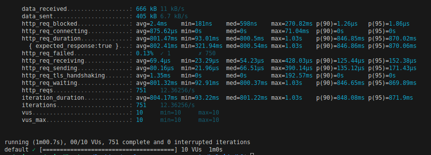

[Main page.](../../../README.md)

# k6 load testing tool

In this repository are `JavaScript` files for REST API load testing with [k6](https://k6.io/). 

Representational Stateless Transfer Application Programming Interface (REST API) is a web service that allows interaction with cloud resources using HTTP requests. We use `JavaScript` to write the test scripts and load our exposed REST API endpoints with `k6`. 

To run the [load files](../k6-linux/), you need to install `k6` on your machine. You can find the installation instructions [here](https://k6.io/docs/getting-started/installation/).

## Running the load tests

Run these commands in the terminal to run the load tests:

```bash
k6 run [file_name].js or 
```
or
```bash
k6 run --vus 10 --duration 60s [file_name].js
```
As seen in one sample in the picture below, K6 generates and presents a thorough summary of the aggregated results at the end of a test.



The `k6` load testing results are comprehensively compiled from end-of-test summary reports for each chaincode function. These reports detail aggregate statistics for the primary aspects of the test. As illustrated in the subsequent tables: 
* A single table represents the test results for a single region and 
* Three separate tables depict the test results for three distinct regions.

**Table 1** - Single region `end-of-the-test` summary (_SE - region_)
<table>
  <tr>
    <th align="center" rowspan="2">Chaincode</th>
    <th align="center"rowspan="2">Chaincode Definition</th>
    <th align="center"colspan="2">Data received</th>
    <th align="center"colspan="2">Data sent</th>
    <th align="center"colspan="1">Avg. Latency</th>
    <th align="center"colspan="1">Total requests</th>
    <th align="center"colspan="1">Requests rate</th>
    <th align="center"colspan="2">Failed</th>
    <th align="center"colspan="1">p(95)</th>
  </tr>
  <tr>
    <td align="center">[kB]</td>
    <td align="center">[kB/s]</td>
    <td align="center">[kB]</td>
    <td align="center">[kB/s]</td>
    <td align="center">[s]</td>
    <td align="center">[#]</td>
    <td align="center">[TPS rate]</td>
    <td align="center">[%]</td>
    <td align="center">[#]</td>
    <td align="center">[ms]</td>
  </tr>
  <tr>
    <td colspan="12"></td>
  </tr>
  <tr>
    <td align="left">Organisational Chaincode*</td>
    <td align="left">Adding a new employee to the organisation.</td>
    <td align="center">666</td>
    <td align="center">11</td>
    <td align="center">405</td>
    <td align="center">6.7</td>
    <td align="center">0.80</td>
    <td align="center">751</td>
    <td align="center">12.3626/s</td>
    <td align="center">0.13</td>
    <td align="center">1</td>
    <td align="center">870.02</td>
  </tr>
  <!-- Add rows here -->
</table>

___


What is REST API? [Read more](https://www.redhat.com/en/topics/api/what-is-a-rest-api).

[Back to the main page.](../../../README.md)
