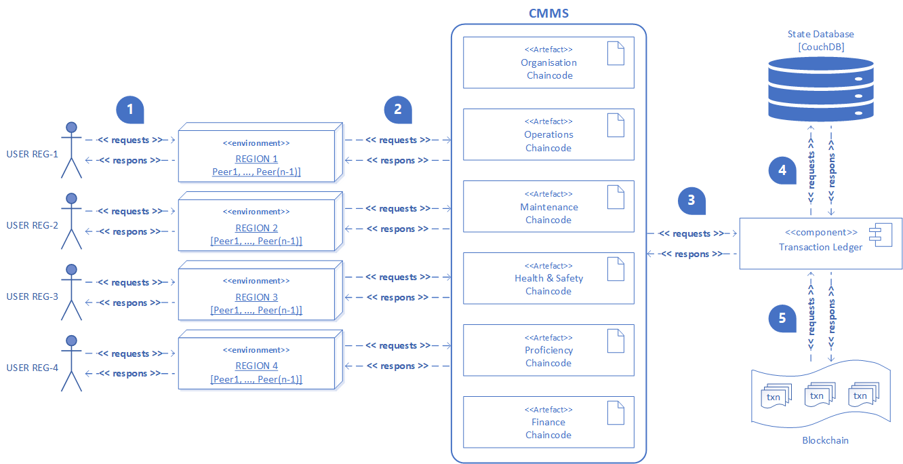

# **COMPUTERIZED MAINTENANCE MANAGEMENT SYSTEM FOR OPERATIONS & MAINTENANCE SERVICES OF AN URBAN CABLE CAR**  :aerial_tramway: :construction_worker: :wrench: :books: :moneybag:

A Computerized Maintenance Management System (CMMS) is a repository of research papers based on a [`Hyperledger Fabric`](https://www.hyperledger.org/use/fabric) protocol developed with the Hyperledger Fabric [`test-network`](https://github.com/hyperledger/fabric-samples/tree/main/test-network) and the [`Kaleido`](https://www.kaleido.io/) Web3 BaaS platform.
Operations and Maintenance services are represented by corresponding chaincodes as shown below:
* [Organization Services Chaincode](01-chaincodes/01-organisation/README.md).
* [Operations Services Chaincode](01-chaincodes/02-operations/README.md).
* [Maintenance Services Operations](01-chaincodes/03-maintenance/README.md).
* [Proficiency & Training Chaincode](01-chaincodes/04-proficiency/proficiancy/README.md).
* [Health and Safety Management Systems](01-chaincodes/05-safety-management/README.md).
* [Financial Services](01-chaincodes/06-finance/fin-chaincode/README.md).

## Abstract

This study pioneers the development of a Computerized Maintenance.
Management System (CMMS), anchored in the Hyperledger Fabric blockchain protocol, via a Design Science Research (DSR) methodology. It orchestrates an innovative use case for urban cable car services aimed at enhancing diverse business processes. The research meticulously dissects urban cable car operations, weaving these insights into the broader investigation. The
essence of the research technique is the creation of chaincodes that embody critical business functions such as operations, organisation, maintenance, health and safety, proficiency, and finance. Three experimental iterations were executed to assess benchmarking parameters on local computers, in addition to single and multi-region cloud-hosted Hyperledger Fabric
blockchain networks. The study's findings contribute significantly to the burgeoning field of blockchain-based CMMS, presenting promising avenues for further exploration.

We can illustrate an enterprise's business processes in the operational service of an urban cable car as shown in the UML diagram below.

